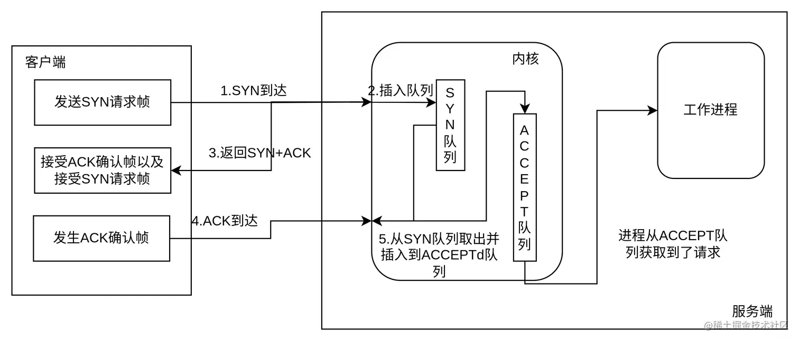
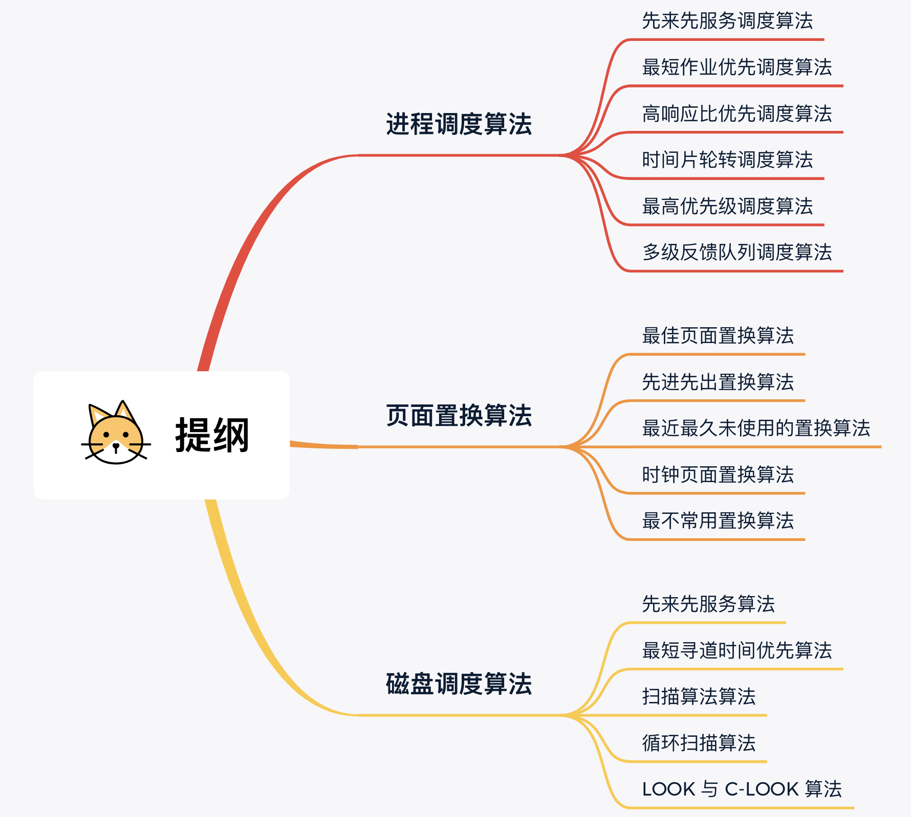
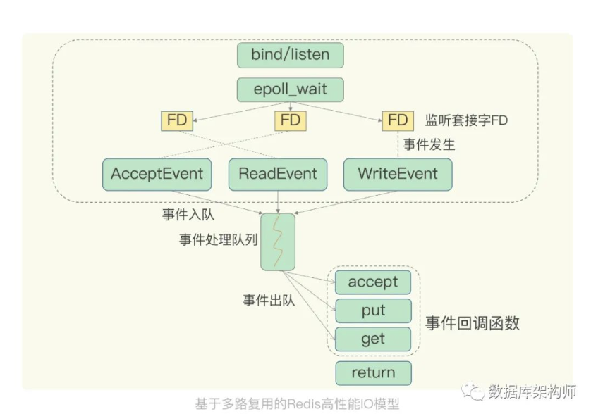

## 一、linux相关


### 1.1. 常用linux系统调用

系统调用（System Call）是操作系统为在用户态运行的进程与**硬件设备（如CPU、磁盘、打印机等）进行交互**提供的一组接口。当用户进程需要发生系统调用时，CPU 通过软中断切换到内核态开始执行内核系统调用函数

**系统调用在内核里的主要用途**。虽然给出了数种分类，不过总的概括来讲系统调用主要在系统中的用途无非以下几类：

- **控制硬件**——系统调用往往作为硬件资源和用户空间的抽象接口，比如读写文件时用到的write/read调用。

- **设置系统状态或读取内核数据**——因为系统调用是用户空间和内核的唯一通讯手段[2]，所以用户设置系统状态，比如开/关某项内核服务（设置某个内核变量），或读取内核数据都必须通过系统调用。比如getpgid、getpriority、setpriority、sethostname

- **进程管理**——一系列调用接口是用来保证系统中进程能以多任务，在虚拟内存环境下得以运行。比如 fork、clone、execve、exit等

**什么功能应该实现在内核而不是在用户空间**

- 服务必须获得内核数据，比如一些服务必须获得中断或系统时间等内核数据。

- 从安全角度考虑，在内核中提供的服务相比用户空间提供的毫无疑问更安全，很难被非法访问到。

- 从效率考虑，在内核实现服务避免了和用户空间来回传递数据以及保护现场等步骤，因此效率往往要比实现在用户空间高许多。比如,httpd等服务。

- 如果内核和用户空间都需要使用该服务，那么最好实现在内核空间，比如随机数产生。


信号：kill、signal/sigpending/sigsuspend/

管道：pipe

socket控制：socket/bind/connect/accept/send/listen/select/shutdown/setsockopt

用户管理：getuid/setuid/getgid/setgid/

网络管理：gethostname/sethostname/setdomainname/getdomainname/gethostid/sethostid

系统控制：reboot/time/uname/

文件系统控制：open/creat/close/read/write/readv/writev/pread/poll/truncate/access/stat/chown/chmod/chdir/rename/mkdir/mount/unmount/

进程控制：fork/clone/exit/execve/setpgid/getpid/getppid/nice/pause/ptrace/wait/wait3/waitpid/setsid/getsid

#### open

在用户态使用open()时，必须向该函数传入文件路径和打开权限。这两个参数传入内核后，内核首先检查这个文件路径存在的合法性，同时还需检查使用者是否有合法权限打开该文件。如果一切顺利，那么内核将对访问该文件的进程创建一个file结构。

在用户态，通常open()在操作成功时返回的是一个非负整数，即所谓的文件描述符（fd，file descriptor）；并且，用户态后续对文件的读写操作等都是通过fd来完成的。由此可见fd与file结构在内核中有一定的关联。

内核使用进程描述符task_struct来描述一个进程，而该进程所有已打开文件对应的file结构将形成一个数组files（其为files_struct结构），内核向用户返回的fd便是该数组中具体file结构的索引。默认情况下，每个进程创建后都已打开了标准输入文件、标准输出文件、标准错误文件，因此他们的文件描述符依次为0、1和2。


参考连接：https://www.cnblogs.com/shijiaqi1066/p/5749030.html


### 1.2. 进程、线程、协程、绿色线程


1. 进程：是一个正在执行的程序的实例。每个进程都有独立的内存空间，可以同时执行多个进程来完成不同的任务，进程是操作系统进行资源分配和调度的基本单位。
2. 线程：是进程中的一个执行路径，不同的线程可以同时执行在同一个进程内，共享该进程的内存资源。线程之间的切换开销比进程小，但线程需要考虑同步和互斥的问题。
3. 协程：是一种轻量级的线程，可以在单线程内实现多个任务的并发执行，也可以通过多进程来实现并发。协程之间的切换开销很小，通常使用非抢占式调度方式，需要手动控制任务的切换。


1. 进程之间通信需要IPC机制，线程之间通信可以使用共享内存，协程之间通信可以使用全局变量。不同的进程之间需要通过进程间通信（IPC）机制来进行数据交换；线程之间可以直接访问共享内存进行数据交换；协程之间可以使用全局变量等方式进行数据交换。
2. 进程切换开销较大，线程切换开销比进程小，协程切换开销最小。由于进程之间相互独立，因此进程切换的开销较大；线程切换的开销要比进程小，但需要考虑同步和互斥的问题；协程切换的开销最小，通常使用非抢占式调度方式，需要手动控制任务的切换。
3. 进程数受限于硬件资源，线程数受限于进程内存空间，协程数无限制。由于每个进程都有独立的内存空间，因此进程数量是受限于硬件资源的；线程共享进程内存空间，因此线程数量是受限于进程内存空间的，而协程数量没有限制。


绿色线程

通常使用第三方库（如gevent、eventlet等）来实现，因为Python标准库中没有原生支持绿色线程的机制。绿色线程使用的是替换调度器的方式，在一个线程内模拟多个线程之间的切换，实现异步非阻塞的目的。

协程

则是在Python标准库中有原生支持的概念，通常使用async/await语法结合asyncio库来实现。协程通过使用事件循环（Event Loop）和异步IO等机制来实现非阻塞的并发执行。


#### 1.2.1 进程间通信的方式

IPC（Inter-Process Communication，进程间通信）是指不同进程之间进行数据交换和协作的机制。在操作系统中，进程之间有时需要共享数据、资源或者通知对方做一些操作，这时就需要使用IPC机制。

常见的IPC机制包括：

1. 管道（Pipe）：是一种半双工的通信方式，可以实现父子进程或兄弟进程之间的通信。管道有两种，一种是匿名管道，只能用于父子进程间的内部通信；另一种是命名管道，可以在不同进程之间通信。
2. 信号量（Semaphore）：是一个计数器，用于多个进程之间的同步和互斥操作。通过对信号量的P操作和V操作来实现进程之间的同步和互斥。
3. 共享内存（Shared Memory）：是指多个进程共享同一块物理内存，并且可以相互访问。可以通过共享内存来提高进程间的通信效率。
4. 套接字（Socket）：是一种计算机之间网络通信的机制，不仅可以在同一台计算机上的进程之间通信，也可以在不同计算机之间通信。
5. 消息队列（Message Queue）：是一种存放消息的队列，被多个进程共享。每个消息都有一个类型，接收进程可以选择性地接收某一类型的消息。
6. 信号（Signal）：是异步通知的一种方式，可以在进程中发送软件中断信号，让接收进程进行相应的处理。

不同的IPC机制各有优劣，需要根据具体的应用场景来选择合适的机制。


直接开讲！


------

每个进程的用户地址空间都是独立的，一般而言是不能互相访问的，但内核空间是每个进程都共享的，所以进程之间要通信必须通过内核。


Linux 内核提供了不少进程间通信的机制，我们来一起瞧瞧有哪些？

##### 1.2.1.1 管道

如果你学过 Linux 命令，那你肯定很熟悉「`|`」这个竖线。

```bash
$ ps auxf | grep mysql
```

上面命令行里的「`|`」竖线就是一个**管道**，它的功能是将前一个命令（`ps auxf`）的输出，作为后一个命令（`grep mysql`）的输入，从这功能描述，可以看出**管道传输数据是单向的**，如果想相互通信，我们需要创建两个管道才行。

同时，我们得知上面这种管道是没有名字，所以「`|`」表示的管道称为**匿名管道**，用完了就销毁。

管道还有另外一个类型是**命名管道**，也被叫做 `FIFO`，因为数据是先进先出的传输方式。

在使用命名管道前，先需要通过 `mkfifo` 命令来创建，并且指定管道名字：

```bash
$ mkfifo myPipe
```

myPipe 就是这个管道的名称，基于 Linux 一切皆文件的理念，所以管道也是以文件的方式存在，我们可以用 ls 看一下，这个文件的类型是 p，也就是 pipe（管道） 的意思：

```bash
$ ls -l
prw-r--r--. 1 root    root         0 Jul 17 02:45 myPipe
```

接下来，我们往 myPipe 这个管道写入数据：

```bash
$ echo "hello" > myPipe  // 将数据写进管道
                         // 停住了 ...
```

你操作了后，你会发现命令执行后就停在这了，这是因为管道里的内容没有被读取，只有当管道里的数据被读完后，命令才可以正常退出。

于是，我们执行另外一个命令来读取这个管道里的数据：

```bash
$ cat < myPipe  // 读取管道里的数据
hello
```

可以看到，管道里的内容被读取出来了，并打印在了终端上，另外一方面，echo 那个命令也正常退出了。

我们可以看出，**管道这种通信方式效率低，不适合进程间频繁地交换数据**。当然，它的好处，自然就是简单，同时也我们很容易得知管道里的数据已经被另一个进程读取了。

> 那管道如何创建呢，背后原理是什么？

匿名管道的创建，需要通过下面这个系统调用：

```c
int pipe(int fd[2])
```

这里表示创建一个匿名管道，并返回了两个描述符，一个是管道的读取端描述符 `fd[0]`，另一个是管道的写入端描述符 `fd[1]`。注意，这个匿名管道是特殊的文件，只存在于内存，不存于文件系统中。


其实，**所谓的管道，就是内核里面的一串缓存**。从管道的一段写入的数据，实际上是缓存在内核中的，另一端读取，也就是从内核中读取这段数据。另外，管道传输的数据是无格式的流且大小受限。

看到这，你可能会有疑问了，这两个描述符都是在一个进程里面，并没有起到进程间通信的作用，怎么样才能使得管道是跨过两个进程的呢？

我们可以使用 `fork` 创建子进程，**创建的子进程会复制父进程的文件描述符**，这样就做到了两个进程各有两个「 `fd[0]` 与 `fd[1]`」，两个进程就可以通过各自的 fd 写入和读取同一个管道文件实现跨进程通信了。


管道只能一端写入，另一端读出，所以上面这种模式容易造成混乱，因为父进程和子进程都可以同时写入，也都可以读出。那么，为了避免这种情况，通常的做法是：

- 父进程关闭读取的 fd[0]，只保留写入的 fd[1]；
- 子进程关闭写入的 fd[1]，只保留读取的 fd[0]；


所以说如果需要双向通信，则应该创建两个管道。

到这里，我们仅仅解析了使用管道进行父进程与子进程之间的通信，但是在我们 shell 里面并不是这样的。

在 shell 里面执行 `A | B`命令的时候，A 进程和 B 进程都是 shell 创建出来的子进程，A 和 B 之间不存在父子关系，它俩的父进程都是 shell。


所以说，在 shell 里通过「`|`」匿名管道将多个命令连接在一起，实际上也就是创建了多个子进程，那么在我们编写 shell 脚本时，能使用一个管道搞定的事情，就不要多用一个管道，这样可以减少创建子进程的系统开销。

我们可以得知，**对于匿名管道，它的通信范围是存在父子关系的进程**。因为管道没有实体，也就是没有管道文件，只能通过 fork 来复制父进程 fd 文件描述符，来达到通信的目的。

另外，**对于命名管道，它可以在不相关的进程间也能相互通信**。因为命令管道，提前创建了一个类型为管道的设备文件，在进程里只要使用这个设备文件，就可以相互通信。

不管是匿名管道还是命名管道，进程写入的数据都是缓存在内核中，另一个进程读取数据时候自然也是从内核中获取，同时通信数据都遵循**先进先出**原则，不支持 lseek 之类的文件定位操作。


##### 1.2.1.2 消息队列

前面说到管道的通信方式是效率低的，因此管道不适合进程间频繁地交换数据。

对于这个问题，**消息队列**的通信模式就可以解决。比如，A 进程要给 B 进程发送消息，A 进程把数据放在对应的消息队列后就可以正常返回了，B 进程需要的时候再去读取数据就可以了。同理，B 进程要给 A 进程发送消息也是如此。

再来，**消息队列是保存在内核中的消息链表**，在发送数据时，会分成一个一个独立的数据单元，也就是消息体（数据块），消息体是用户自定义的数据类型，消息的发送方和接收方要约定好消息体的数据类型，所以每个消息体都是固定大小的存储块，不像管道是无格式的字节流数据。如果进程从消息队列中读取了消息体，内核就会把这个消息体删除。

消息队列生命周期随内核，如果没有释放消息队列或者没有关闭操作系统，消息队列会一直存在，而前面提到的匿名管道的生命周期，是随进程的创建而建立，随进程的结束而销毁。

消息这种模型，两个进程之间的通信就像平时发邮件一样，你来一封，我回一封，可以频繁沟通了。

但邮件的通信方式存在不足的地方有两点，**一是通信不及时，二是附件也有大小限制**，这同样也是消息队列通信不足的点。

**消息队列不适合比较大数据的传输**，因为在内核中每个消息体都有一个最大长度的限制，同时所有队列所包含的全部消息体的总长度也是有上限。在 Linux 内核中，会有两个宏定义 `MSGMAX` 和 `MSGMNB`，它们以字节为单位，分别定义了一条消息的最大长度和一个队列的最大长度。

**消息队列通信过程中，存在用户态与内核态之间的数据拷贝开销**，因为进程写入数据到内核中的消息队列时，会发生从用户态拷贝数据到内核态的过程，同理另一进程读取内核中的消息数据时，会发生从内核态拷贝数据到用户态的过程。

##### 1.2.1.3 共享内存

消息队列的读取和写入的过程，都会有发生用户态与内核态之间的消息拷贝过程。那**共享内存**的方式，就很好的解决了这一问题。

现代操作系统，对于内存管理，采用的是虚拟内存技术，也就是每个进程都有自己独立的虚拟内存空间，不同进程的虚拟内存映射到不同的物理内存中。所以，即使进程 A 和 进程 B 的虚拟地址是一样的，其实访问的是不同的物理内存地址，对于数据的增删查改互不影响。

**共享内存的机制，就是拿出一块虚拟地址空间来，映射到相同的物理内存中**。这样这个进程写入的东西，另外一个进程马上就能看到了，都不需要拷贝来拷贝去，传来传去，大大提高了进程间通信的速度。


------


##### 1.2.1.4 信号量


用了共享内存通信方式，带来新的问题，那就是如果多个进程同时修改同一个共享内存，很有可能就冲突了。例如两个进程都同时写一个地址，那先写的那个进程会发现内容被别人覆盖了。

为了防止多进程竞争共享资源，而造成的数据错乱，所以需要保护机制，使得共享的资源，在任意时刻只能被一个进程访问。正好，**信号量**就实现了这一保护机制。

**信号量其实是一个整型的计数器，主要用于实现进程间的互斥与同步，而不是用于缓存进程间通信的数据**。

信号量表示资源的数量，控制信号量的方式有两种原子操作：

- 一个是 **P 操作**，这个操作会把信号量减去 1，相减后如果信号量 < 0，则表明资源已被占用，进程需阻塞等待；相减后如果信号量 >= 0，则表明还有资源可使用，进程可正常继续执行。
- 另一个是 **V 操作**，这个操作会把信号量加上 1，相加后如果信号量 <= 0，则表明当前有阻塞中的进程，于是会将该进程唤醒运行；相加后如果信号量 > 0，则表明当前没有阻塞中的进程；

P 操作是用在进入共享资源之前，V 操作是用在离开共享资源之后，这两个操作是必须成对出现的。

接下来，举个例子，如果要使得两个进程互斥访问共享内存，我们可以初始化信号量为 `1`。


具体的过程如下：

- 进程 A 在访问共享内存前，先执行了 P 操作，由于信号量的初始值为 1，故在进程 A 执行 P 操作后信号量变为 0，表示共享资源可用，于是进程 A 就可以访问共享内存。
- 若此时，进程 B 也想访问共享内存，执行了 P 操作，结果信号量变为了 -1，这就意味着临界资源已被占用，因此进程 B 被阻塞。
- 直到进程 A 访问完共享内存，才会执行 V 操作，使得信号量恢复为 0，接着就会唤醒阻塞中的线程 B，使得进程 B 可以访问共享内存，最后完成共享内存的访问后，执行 V 操作，使信号量恢复到初始值 1。

可以发现，信号初始化为 `1`，就代表着是**互斥信号量**，它可以保证共享内存在任何时刻只有一个进程在访问，这就很好的保护了共享内存。

另外，在多进程里，每个进程并不一定是顺序执行的，它们基本是以各自独立的、不可预知的速度向前推进，但有时候我们又希望多个进程能密切合作，以实现一个共同的任务。

例如，进程 A 是负责生产数据，而进程 B 是负责读取数据，这两个进程是相互合作、相互依赖的，进程 A 必须先生产了数据，进程 B 才能读取到数据，所以执行是有前后顺序的。

那么这时候，就可以用信号量来实现多进程同步的方式，我们可以初始化信号量为 `0`。


具体过程：

- 如果进程 B 比进程 A 先执行了，那么执行到 P 操作时，由于信号量初始值为 0，故信号量会变为 -1，表示进程 A 还没生产数据，于是进程 B 就阻塞等待；
- 接着，当进程 A 生产完数据后，执行了 V 操作，就会使得信号量变为 0，于是就会唤醒阻塞在 P 操作的进程 B；
- 最后，进程 B 被唤醒后，意味着进程 A 已经生产了数据，于是进程 B 就可以正常读取数据了。

可以发现，信号初始化为 `0`，就代表着是**同步信号量**，它可以保证进程 A 应在进程 B 之前执行。

------


##### 1.2.1.5 信号

上面说的进程间通信，都是常规状态下的工作模式。**对于异常情况下的工作模式，就需要用「信号」的方式来通知进程。**

信号跟信号量虽然名字相似度 66.66%，但两者用途完全不一样，就好像 Java 和 JavaScript 的区别。

在 Linux 操作系统中， 为了响应各种各样的事件，提供了几十种信号，分别代表不同的意义。我们可以通过 `kill -l` 命令，查看所有的信号：

```shell
$ kill -l
 1) SIGHUP       2) SIGINT       3) SIGQUIT      4) SIGILL       5) SIGTRAP
 6) SIGABRT      7) SIGBUS       8) SIGFPE       9) SIGKILL     10) SIGUSR1
11) SIGSEGV     12) SIGUSR2     13) SIGPIPE     14) SIGALRM     15) SIGTERM
16) SIGSTKFLT   17) SIGCHLD     18) SIGCONT     19) SIGSTOP     20) SIGTSTP
21) SIGTTIN     22) SIGTTOU     23) SIGURG      24) SIGXCPU     25) SIGXFSZ
26) SIGVTALRM   27) SIGPROF     28) SIGWINCH    29) SIGIO       30) SIGPWR
31) SIGSYS      34) SIGRTMIN    35) SIGRTMIN+1  36) SIGRTMIN+2  37) SIGRTMIN+3
38) SIGRTMIN+4  39) SIGRTMIN+5  40) SIGRTMIN+6  41) SIGRTMIN+7  42) SIGRTMIN+8
43) SIGRTMIN+9  44) SIGRTMIN+10 45) SIGRTMIN+11 46) SIGRTMIN+12 47) SIGRTMIN+13
48) SIGRTMIN+14 49) SIGRTMIN+15 50) SIGRTMAX-14 51) SIGRTMAX-13 52) SIGRTMAX-12
53) SIGRTMAX-11 54) SIGRTMAX-10 55) SIGRTMAX-9  56) SIGRTMAX-8  57) SIGRTMAX-7
58) SIGRTMAX-6  59) SIGRTMAX-5  60) SIGRTMAX-4  61) SIGRTMAX-3  62) SIGRTMAX-2
63) SIGRTMAX-1  64) SIGRTMAX
```

运行在 shell 终端的进程，我们可以通过键盘输入某些组合键的时候，给进程发送信号。例如

- Ctrl+C 产生 `SIGINT` 信号，表示终止该进程；
- Ctrl+Z 产生 `SIGTSTP` 信号，表示停止该进程，但还未结束；

如果进程在后台运行，可以通过 `kill` 命令的方式给进程发送信号，但前提需要知道运行中的进程 PID 号，例如：

- kill -9 1050 ，表示给 PID 为 1050 的进程发送 `SIGKILL` 信号，用来立即结束该进程；

所以，信号事件的来源主要有硬件来源（如键盘 Cltr+C ）和软件来源（如 kill 命令）。

信号是进程间通信机制中**唯一的异步通信机制**，因为可以在任何时候发送信号给某一进程，一旦有信号产生，我们就有下面这几种，用户进程对信号的处理方式。

**1.执行默认操作**。Linux 对每种信号都规定了默认操作，例如，上面列表中的 SIGTERM 信号，就是终止进程的意思。

**2.捕捉信号**。我们可以为信号定义一个信号处理函数。当信号发生时，我们就执行相应的信号处理函数。

**3.忽略信号**。当我们不希望处理某些信号的时候，就可以忽略该信号，不做任何处理。有两个信号是应用进程无法捕捉和忽略的，即 `SIGKILL` 和 `SEGSTOP`，它们用于在任何时候中断或结束某一进程。

------


##### 1.2.1.6 socket

前面提到的管道、消息队列、共享内存、信号量和信号都是在同一台主机上进行进程间通信，那要想**跨网络与不同主机上的进程之间通信，就需要 Socket 通信了。**

实际上，Socket 通信不仅可以跨网络与不同主机的进程间通信，还可以在同主机上进程间通信。

我们来看看创建 socket 的系统调用：

```c
int socket(int domain, int type, int protocal)
```

三个参数分别代表：

- domain 参数用来指定协议族，比如 AF_INET 用于 IPV4、AF_INET6 用于 IPV6、AF_LOCAL/AF_UNIX 用于本机；
- type 参数用来指定通信特性，比如 SOCK_STREAM 表示的是字节流，对应 TCP、SOCK_DGRAM 表示的是数据报，对应 UDP、SOCK_RAW 表示的是原始套接字；
- protocal 参数原本是用来指定通信协议的，但现在基本废弃。因为协议已经通过前面两个参数指定完成，protocol 目前一般写成 0 即可；

根据创建 socket 类型的不同，通信的方式也就不同：

- 实现 TCP 字节流通信： socket 类型是 AF_INET 和 SOCK_STREAM；
- 实现 UDP 数据报通信：socket 类型是 AF_INET 和 SOCK_DGRAM；
- 实现本地进程间通信： 「本地字节流 socket 」类型是 AF_LOCAL 和 SOCK_STREAM，「本地数据报 socket 」类型是 AF_LOCAL 和 SOCK_DGRAM。另外，AF_UNIX 和 AF_LOCAL 是等价的，所以 AF_UNIX 也属于本地 socket；

接下来，简单说一下这三种通信的编程模式。

> 针对 TCP 协议通信的 socket 编程模型


- 服务端和客户端初始化 `socket`，得到文件描述符；
- 服务端调用 `bind`，将绑定在 IP 地址和端口;
- 服务端调用 `listen`，进行监听；
- 服务端调用 `accept`，等待客户端连接；
- 客户端调用 `connect`，向服务器端的地址和端口发起连接请求；
- 服务端 `accept` 返回用于传输的 `socket` 的文件描述符；
- 客户端调用 `write` 写入数据；服务端调用 `read` 读取数据；
- 客户端断开连接时，会调用 `close`，那么服务端 `read` 读取数据的时候，就会读取到了 `EOF`，待处理完数据后，服务端调用 `close`，表示连接关闭。

这里需要注意的是，服务端调用 `accept` 时，连接成功了会返回一个已完成连接的 socket，后续用来传输数据。

所以，监听的 socket 和真正用来传送数据的 socket，是「**两个**」 socket，一个叫作**监听 socket**，一个叫作**已完成连接 socket**。

成功连接建立之后，双方开始通过 read 和 write 函数来读写数据，就像往一个文件流里面写东西一样。

> 针对 UDP 协议通信的 socket 编程模型


UDP 是没有连接的，所以不需要三次握手，也就不需要像 TCP 调用 listen 和 connect，但是 UDP 的交互仍然需要 IP 地址和端口号，因此也需要 bind。

对于 UDP 来说，不需要要维护连接，那么也就没有所谓的发送方和接收方，甚至都不存在客户端和服务端的概念，只要有一个 socket 多台机器就可以任意通信，因此每一个 UDP 的 socket 都需要 bind。

另外，每次通信时，调用 sendto 和 recvfrom，都要传入目标主机的 IP 地址和端口。

> 针对本地进程间通信的 socket 编程模型

本地 socket 被用于在**同一台主机上进程间通信**的场景：

- 本地 socket 的编程接口和 IPv4 、IPv6 套接字编程接口是一致的，可以支持「字节流」和「数据报」两种协议；
- 本地 socket 的实现效率大大高于 IPv4 和 IPv6 的字节流、数据报 socket 实现；

对于本地字节流 socket，其 socket 类型是 AF_LOCAL 和 SOCK_STREAM。

对于本地数据报 socket，其 socket 类型是 AF_LOCAL 和 SOCK_DGRAM。

本地字节流 socket 和 本地数据报 socket 在 bind 的时候，不像 TCP 和 UDP 要绑定 IP 地址和端口，而是**绑定一个本地文件**，这也就是它们之间的最大区别。

------


##### 1.2.1.7 总结

由于每个进程的用户空间都是独立的，不能相互访问，这时就需要借助内核空间来实现进程间通信，原因很简单，每个进程都是共享一个内核空间。

Linux 内核提供了不少进程间通信的方式，其中最简单的方式就是管道，管道分为「匿名管道」和「命名管道」。

**匿名管道**顾名思义，它没有名字标识，匿名管道是特殊文件只存在于内存，没有存在于文件系统中，shell 命令中的「`|`」竖线就是匿名管道，通信的数据是**无格式的流并且大小受限**，通信的方式是**单向**的，数据只能在一个方向上流动，如果要双向通信，需要创建两个管道，再来**匿名管道是只能用于存在父子关系的进程间通信**，匿名管道的生命周期随着进程创建而建立，随着进程终止而消失。

**命名管道**突破了匿名管道只能在亲缘关系进程间的通信限制，因为使用命名管道的前提，需要在文件系统创建一个类型为 p 的设备文件，那么毫无关系的进程就可以通过这个设备文件进行通信。另外，不管是匿名管道还是命名管道，进程写入的数据都是**缓存在内核**中，另一个进程读取数据时候自然也是从内核中获取，同时通信数据都遵循**先进先出**原则，不支持 lseek 之类的文件定位操作。

**消息队列**克服了管道通信的数据是无格式的字节流的问题，消息队列实际上是保存在内核的「消息链表」，消息队列的消息体是可以用户自定义的数据类型，发送数据时，会被分成一个一个独立的消息体，当然接收数据时，也要与发送方发送的消息体的数据类型保持一致，这样才能保证读取的数据是正确的。消息队列通信的速度不是最及时的，毕竟**每次数据的写入和读取都需要经过用户态与内核态之间的拷贝过程。**

**共享内存**可以解决消息队列通信中用户态与内核态之间数据拷贝过程带来的开销，**它直接分配一个共享空间，每个进程都可以直接访问**，就像访问进程自己的空间一样快捷方便，不需要陷入内核态或者系统调用，大大提高了通信的速度，享有**最快**的进程间通信方式之名。但是便捷高效的共享内存通信，**带来新的问题，多进程竞争同个共享资源会造成数据的错乱。**

那么，就需要**信号量**来保护共享资源，以确保任何时刻只能有一个进程访问共享资源，这种方式就是互斥访问。**信号量不仅可以实现访问的互斥性，还可以实现进程间的同步**，信号量其实是一个计数器，表示的是资源个数，其值可以通过两个原子操作来控制，分别是 **P 操作和 V 操作**。

与信号量名字很相似的叫**信号**，它俩名字虽然相似，但功能一点儿都不一样。信号是**异步通信机制**，信号可以在应用进程和内核之间直接交互，内核也可以利用信号来通知用户空间的进程发生了哪些系统事件，信号事件的来源主要有硬件来源（如键盘 Cltr+C ）和软件来源（如 kill 命令），一旦有信号发生，**进程有三种方式响应信号 1. 执行默认操作、2. 捕捉信号、3. 忽略信号**。有两个信号是应用进程无法捕捉和忽略的，即 `SIGKILL` 和 `SIGSTOP`，这是为了方便我们能在任何时候结束或停止某个进程。

前面说到的通信机制，都是工作于同一台主机，如果**要与不同主机的进程间通信，那么就需要 Socket 通信了**。Socket 实际上不仅用于不同的主机进程间通信，还可以用于本地主机进程间通信，可根据创建 Socket 的类型不同，分为三种常见的通信方式，一个是基于 TCP 协议的通信方式，一个是基于 UDP 协议的通信方式，一个是本地进程间通信方式。

以上，就是进程间通信的主要机制了。你可能会问了，那线程通信间的方式呢？

同个进程下的线程之间都是共享进程的资源，只要是共享变量都可以做到线程间通信，比如全局变量，所以对于线程间关注的不是通信方式，而是关注多线程竞争共享资源的问题，信号量也同样可以在线程间实现互斥与同步：

- 互斥的方式，可保证任意时刻只有一个线程访问共享资源；
- 同步的方式，可保证线程 A 应在线程 B 之前执行；


参考链接：https://www.xiaolincoding.com/os/4_process/process_commu.html#%E7%AE%A1%E9%81%93

https://www.cnblogs.com/LUO77/p/5816326.html


### 1.3. poll/epoll/select


**不同操作系统中IO多路复用模型介绍**

 

#### 1.3.1 select机制

 IO多路复用模型得以实现得核心：就是操作系统 监控1个[sk......conn,]列表，不断轮询每1个sk/conn/是否可以accpet/revive，随着监控列表的增加，效率会递减；

select函数监视的文件描述符分为3类，分别是writefds、readfds和exceptfds。调用后select函数会被阻塞，直到有描述符就绪（有数据可读、可写或者有except）、或者超时(timeout可用于指定等待时间，如果想立即返回可设置为null)，函数返回。当select函数返回后，可以通过遍历fdset来找到就绪的描述符。

> 在网络编程中统一的操作顺序是创建socket－>绑定端口－>监听－>accept->write/read,当有客户端连接到来时,select会把该连接的文件描述符放到fd_set（一组文件描述符(fd)的集合）,然后select会循环遍历它所监测的fd_set内的所有文件描述符，当select循环遍历完所有fd_set内指定的文件描述符对应的poll函数后，如果没有一个资源可用(即没有一个文件可供操作)，则select让该进程睡眠，一直等到有资源可用为止，fd_set是一个类似于数组的数据结构，由于它每次都要遍历整个数组，所有她的效率会随着文件描述符的数量增多而明显的变慢，除此之外在每次遍历这些描述符之前，系统还需要把这些描述符集合从内核copy到用户空间，然后再copy回去，如果此时没有一个描述符有事件发生（例如：read和write）这些copy操作和便利操作都是无用功，可见slect随着连接数量的增多，效率大大降低。可见如果在高并发的场景下select并不适用，况且select默认的最大描述符为1024，如果想要更多还要做响应参数的配置。


1. **最大限制**：单个进程能够监视的文件描述符的数量存在最大限制。(基于数组存储的赶脚)一般来说这个数目和系统内存关系很大，具体数目可以cat /proc/sys/fs/file-max察看。它由FD_SETSIZE设置，32位机默认是1024个。64位机默认是2048.
2. **时间复杂度：** 对socket进行扫描时是线性扫描，即采用轮询的方法，效率较低，时间复杂度O(n)。
   当套接字比较多的时候，每次select()都要通过遍历FD_SETSIZE个Socket来完成调度，不管哪个Socket是活跃的，都遍历一遍。这会浪费很多CPU时间。
   它仅仅知道有I/O事件发生了，却并不知道是哪那几个流（可能有一个，多个，甚至全部），我们只能无差别轮询所有流，找出能读出数据，或者写入数据的流，对他们进行操作。所以**select具有O(n)的无差别轮询复杂度**，同时处理的流越多，无差别轮询时间就越长。
3. **内存拷贝：**需要维护一个用来存放大量fd的数据结构，这样会使得用户空间和内核空间在传递该结构时复制开销大。


**支持操作系统**：linux/windows

 

#### 1.3.2 poll机制

不同于select使用三个位图来表示三个fdset的方式，poll使用一个pollfd指针来实现。pollfd结构包含了要监视的event和发生的event，不再使用select的“参数-值”传递的方式。同时pollfd并没有最大数量限制（但是数量过大后其性能也会降低）。和select函数一样，poll返回后需要轮询pollfd来获取就绪的描述符。

**没有最大连接数的限制**。（基于链表来存储的）

**支持操作系统**：linux

 

#### 1.3.3 epoll机制

##### 1.3.3.1 epoll原理与流程

1.epoll很高级，epoll不会去再通过操作循环检查监控的socket列表中，那些socket出现了读操作，而是给需要监听的socket 1--1绑定1个回调函数；

2.检测的socket中 有1个soket出现了读操作，直接执行调用那个和该sk/con绑定的回调函数执行sk.accpet() 和conn.receve()

> ###### epoll基本流程
>
> **一棵红黑树，一张准备就绪句柄链表，少量的内核cache，就帮我们解决了大并发下的socket处理问题。**
>
> 1. 执行 epoll_create
>    内核在epoll文件系统中建了个file结点，（使用完，必须调用close()关闭，否则导致fd被耗尽）
>    在内核cache里建了红黑树存储epoll_ctl传来的socket，
>    在内核cache里建了rdllist双向链表存储准备就绪的事件。
> 2. 执行 epoll_ctl
>    如果增加socket句柄，检查红黑树中是否存在，存在立即返回，不存在则添加到树干上，然后向内核注册回调函数，告诉内核如果这个句柄的中断到了，就把它放到准备就绪list链表里。
>    ps：所有添加到epoll中的事件都会与设备（如网卡）驱动程序简历回调关系，相应的事件发生时，会调用回调方法。
> 3. 执行 epoll_wait
>    立刻返回准备就绪表里的数据即可（将内核cache里双向列表中存储的准备就绪的事件 复制到用户态内存）
>    当调用epoll_wait检查是否有事件发生时，只需要检查eventpoll对象中的rdlist双链表中是否有epitem元素即可。
>    如果rdlist不为空，则把发生的事件复制到用户态，同时将事件数量返回给用户。


##### 1.3.3.2 epoll基本特点

1. **边缘触发**，它只告诉进程哪些fd刚刚变为就绪态，并且只会通知一次。
2. **事件驱动，**每个事件关联上fd，使用事件就绪通知方式，通过 epoll_ctl 注册 fd，一旦该fd就绪，内核就会采用 callback 的回调机制来激活该fd，epoll_wait 便可以收到通知。

1. **没有最大连接数的限制**。（基于 红黑树+双链表 来存储的:1G的内存上能监听约10万个端口）
2. **时间复杂度低：** 边缘触发和事件驱动，监听回调，时间复杂度O(1)。
   只有活跃可用的fd才会调用callback函数；即epoll最大的优点就在于它只管“活跃”的连接，而跟连接总数无关，因此实际网络环境中，Epoll的效率就会远远高于select和poll。
3. **内存拷贝：**利用mmap()文件映射内存加速与内核空间的消息传递，减少拷贝开销。


##### 1.3.3.3 epoll两种模式(LT/ET)

epoll对文件描述符的操作有两种模式：LT(level trigger) 和 ET(edge trigger)。LT是默认的模式，ET是“高速”模式。

- LT（水平触发）模式下，只要有数据就触发，缓冲区剩余未读尽的数据会导致 epoll_wait都会返回它的事件；
- ET（边缘触发）模式下，只有新数据到来才触发，不管缓存区中是否还有数据，缓冲区剩余未读尽的数据不会导致epoll_wait返回


##### 1.3.3.4 适合用epoll的应用场景：

- 对于连接特别多，活跃的连接特别少(大量的idle-connection)
- 典型的应用场景为一个需要处理上万的连接服务器，例如各种app的入口服务器，例如qq

##### 1.3.3.5 不适合epoll的场景：

- 连接比较少，数据量比较大，例如ssh (没有大量的idle-connection或者dead-connection)
  epoll 的惊群问题：
  因为epoll 多用于多个连接，只有少数活跃的场景，但是万一某一时刻，epoll 等的上千个文件描述符都就绪了，这时候epoll 要进行大量的I/O，此时压力太大。


Python中的selectors模块就是帮我们自动选择最佳IO多路复用代理的；


#### 1.3.4 Event Loop的惊群效应

通过查阅资料发现`Linux`通过`WQ_FLAG_EXCLUSIVE`标记解决了`socket.accept`的惊群问题， 但是现在很多服务通过基于事件循环的方法来提供更高的并发能力。比如我线上运行的服务就是用到了**`Gevent`，而`Gevent`用到的核心事件循环则是`Epoll`**，它与`Select`, `Poll`并称为`Event Loop`。

对于任何工作模式来说， 使用`Event Loop`后，进程调用`socket.accept`后的行为逻辑就不一样了，具体的逻辑步骤如下：

- 1.进程在调用`socket.accept`时，`Event Loop`会把进程挂在`socket`对应的文件描述符的等待队列上。
- 2.当`socket`的文件描述符有事件产生时，对应的驱动就会将等待队列上对应的进程进行唤醒。
- 3.被唤醒的进程会通过`Event Loop`检查事件是否就绪，如果事件就绪就会返回对应的事件给刚才的进程。
- 4.检查`accept`事件是否可调用， 如果可以就执行`accept`操作，并取得该四元组的对应`socket`。

可以看到，之前进程是挂在网络驱动上等着被内核唤醒，而在使用`Event Loop`后进程是挂在对应文件描述符的等待队列上等待被`Event Loop`唤醒，对于`Pre-Worker`模型下的每个工作进程虽然都有自己专属的`Event Loop`，但是他们都是等待着同样的资源，于是当该文件描述符有事件产生时，就会唤醒所有工作进程对应的`Event Loop`来检查事件以及判断是否可以返回事件给工作进程, 而且由于是通过`Event Loop`的逻辑来执行`socket.accept`，这样会绕过上面所说的`WQ_FLAG_EXCLUSIVE`标记的限制，从而又产生了惊群效应。

可以看到，`Event Loop`产生惊群效应的原因跟进程直接调用`sock.accept`十分的像，所以他们的解决思路也很像，首先是给`Event Loop`增加一个名为`EPOLLEXCLUSIVE`的标记， 然后开发者在编程时可以在`Event Loop`实例化后注册对应的标记,当进程在调用`sock.accept`且系统检到`Event Loop`带有该标记时，就会把进程挂在文件描述符的队列尾部，等到事件产生时，**内核会只唤醒该队列的第一个进程来处理对应的事件。**

> 关于标记`EPOLLEXCLUSIVE`的具体内容可见:[Add epoll round robin wakeup mode](https://link.juejin.cn?target=https%3A%2F%2Flwn.net%2FArticles%2F632590%2F)， 通过内容还可以知道还有一个标记`EPOLLROUNDROBIN`用来解决唤醒不均衡的情况，但是在`Python`中似乎没办法使用。


☆☆☆参考连接：https://juejin.cn/post/7082005823328632839


### 1.4. pre-worker服务模型

包含nginx 、gunicorn/gevent/event loop/惊群现象及解决方法

tcp三种工作模式

#### 1.4.1 TCP服务的请求处理模式

大多数的TCP服务部署都是从单进程开始的，当请求数量逐渐变多后，单进程工作模型的服务就开始扛不住了， 这时就会想通过添加更多的进程来帮忙处理请求，于是就会诞生出另外两种基于多进程的工作模型， 这三种工作模型的特点如下（其中监听可以认为是调用`socket.listen`，处理可以认为调用`socket.accept`）：

- 1.单个进程监听和处理`socket`。

  这是最简单的工作模型， 只有单个进程同时监听和执行同一个`socket.accpet`调用来接受新连接以及处理请求。

- 2.单个进程监听`socket`，多个工作进程处理`socket`（`Nginx`和`Gunicorn`的工作模式）。

  这是最常用的工作模式，整个进程组中有且只有一个`socket`，主进程负责监听`socket`，工作进程负责执行`socket.accept`调用来接受新连接和处理请求。（工作进程的负载均衡由系统决定）

- 3.多个工作进程，每个工作进程都有单独监听和处理的`socket`。

  每个工作进程都有一个独立的`socket`，并且通过`SO_REUSEPORT`标记使这类`socket`都能监听和处理相同的ip端口的请求。(工作进程的负负载均衡是由每个请求的hash决定)

上面三种工作模式的主要不同点是监听和处理的方式不同，这是因为`Linux`采用`socket`对TCP， UDP进行了封装，并产生了一套独立的调用过程，而开发者在使用`socket`进行TCP的网络编程时一般有几个步骤：

- 1.调用`socket.bind`，给该`socket`实例绑定一个IP和端口，这样后续内核会把收到该IP端口的网络流量转发给该`socket`。

- 2.调用`socket.listen`，该调用对应着TCP的`listen`状态，当调用这个函数后，服务端就会进入到这个状态，意味着可以开始处理客户端的请求了。

  调用`socket.listen`函数后，内核为该`socket`维护两个队列，一个是已经建立连接的队列，代表客户端与服务端的连接已经三次握手完毕；另外一个是还没有完全建立连接的队列，代表客户端已经与服务端开始尝试连接，但三次握手还没完成。

- 3.调用`socket.accept`，从已经建立连接的队列获取连接来处理，如果获取不到连接，则会一直等待直到内核把建立的连接返回给该进程调用，需要注意的是这时候返回的是另外一个`socket`，也就是监听的是一个`socket`，`accept`后是另一个`socket`，然后服务端就会通过调用新返回的`socket`的`socket.read`和`socket.write`方法来与客户端进行交互。


第二第三步如图



https://p3-juejin.byteimg.com/tos-cn-i-k3u1fbpfcp/58ddc3323c8a480bb3eb91e99788b3d2~tplv-k3u1fbpfcp-zoom-in-crop-mark:1512:0:0:0.awebp

负载不均衡问题

（gevent/**asyncio**，）

由于之前一直在使用`Asyncio`，所以我知道`Event Loop`在收到对应文件描述符的事件时，它不是以雨露均沾的方式去唤醒进程/线程/协程，而是**会优先唤醒第一个注册的进程/线程/协程，只有第一个进程/线程/协程繁忙的情况下才会去唤醒后面的进程/线程/协程，造成了唤醒倾斜的问题**，所以我猜测是这个规则引发了负载不均衡的问题。


☆☆☆参考连接：https://juejin.cn/post/7082005823328632839


### 1.5. nginx的惊群现象

首先，我们先大概梳理一下 Nginx 的网络架构，几个关键步骤为：

1. Nginx 主进程解析配置文件，根据 listen 指令，将监听套接字初始化到全局变量 ngx_cycle 的 listening 数组之中。此时，监听套接字的创建、绑定工作早已完成。
2. Nginx 主进程 fork 出多个子进程。
3. 每个子进程在 ngx_worker_process_init 方法里依次调用各个 Nginx 模块的 init_process 钩子，其中当然也包括 NGX_EVENT_MODULE 类型的 ngx_event_core_module 模块，其 init_process 钩子为 ngx_event_process_init。
4. ngx_event_process_init 函数会初始化 Nginx 内部的连接池，并把 ngx_cycle 里的监听套接字数组通过连接池来获得相应的表示连接的 ngx_connection_t 数据结构，这里关于 Nginx 的连接池先略过。我们主要看 ngx_event_process_init 函数所做的另一个工作：如果在配置文件里**没有**开启 [accept_mutex 锁](http://nginx.org/en/docs/ngx_core_module.html#accept_mutex)，就通过 ngx_add_event 将所有的监听套接字添加到 epoll 中。
5. 每一个 Nginx 子进程在执行完 ngx_worker_process_init 后，会在一个死循环中执行 ngx_process_events_and_timers，这就进入到事件处理的核心逻辑了。
6. 在 ngx_process_events_and_timers 中，如果在配置文件里开启了 accept_mutext 锁，子进程就会去获取 accet_mutext 锁。如果获取成功，则通过 ngx_enable_accept_events 将监听套接字添加到 epoll 中，否则，不会将监听套接字添加到 epoll 中，甚至有可能会调用 ngx_disable_accept_events 将监听套接字从 epoll 中删除（如果在之前的连接中，本worker子进程已经获得过accept_mutex锁)。
7. ngx_process_events_and_timers 继续调用 ngx_process_events，在这个函数里面阻塞调用 epoll_wait。

至此，关于 Nginx 如何处理 fork 后的监听套接字，我们已经差不多理清楚了，当然还有一些细节略过了，比如在每个 Nginx 在获取 accept_mutex 锁前，还会根据当前负载来判断是否参与 accept_mutex 锁的争夺。

把这个过程理清了之后，Nginx 解决惊群问题的方法也就出来了，就是利用 accept_mutex 这把锁。

**如果配置文件中没有开启 accept_mutex，则所有的监听套接字不管三七二十一，都加入到每子个进程的 epoll 中，这样当一个新的连接来到时，所有的 worker 子进程都会惊醒。**

**如果配置文件中开启了 accept_mutex(<font color=red>应用层面上加的锁，和linux内核中的标记现象相同但是作用的位置和对象不同</font>)，则只有一个子进程会将监听套接字添加到 epoll 中，这样当一个新的连接来到时，当然就只有一个 worker 子进程会被唤醒了。**


### 1.6. ifconfig参数解释

```
ifconfig
ens33: flags=4163<UP,BROADCAST,RUNNING,MULTICAST> mtu 1500
inet 192.168.1.63 netmask 255.255.255.0 broadcast 192.168.1.255
inet6 fe80::c09d:975d:89cd:fd3f prefixlen 64 scopeid 0x20
ether 00:0c:29:02:83:db txqueuelen 1000 (Ethernet)
RX packets 3255 bytes 4458479 (4.2 MiB)
RX errors 0 dropped 26 overruns 0 frame 0
TX packets 1130 bytes 81645 (79.7 KiB)
TX errors 0 dropped 0 overruns 0 carrier 0 collisions 0

上图信息大概说明：
第一行：up–>网卡开启状态
RUNNING–>网线处理连接状态
MULTICAST–>支持组播
mtu 1500–>（Maximum Transmission Unit）最大传输单元大小为1500字节
第二行：该网卡的IP地址，子网掩码，广播地址
第三行：IPV6的配置信息
第四行：网卡的MAC地址
ether表示连接类型为以太网
txqueuelen 1000 --》传输队列的长度
第五六行：网卡接收数据包的统计信息和接收错误的统计信息
第七八行：网卡发送数据包的统计信息和发送错误的统计信息
```


### 1.7. 操作系统的调度机制




#### 1.7.1 进程调度算法


进程的生命周期状态通常可以分为五个主要状态，这是典型的进程状态模型，包括：

1. **创建状态（Created）**：当一个进程被创建时，它处于创建状态。在这个阶段，操作系统正在为进程分配必要的资源，例如内存空间、标识符等。
2. **就绪状态（Ready）**：在就绪状态下，进程已经准备好运行，但由于某些原因（例如其他进程正在执行），它暂时无法执行。进程在就绪队列中等待分配处理器资源。
3. **运行状态（Running）**：当进程获得处理器资源并正在执行时，它处于运行状态。在这个状态下，进程正在执行其指令，处理器正在执行进程的代码。
4. **阻塞状态（Blocked）**：在阻塞状态下，进程暂时无法继续执行，因为它正在等待某些事件发生（例如等待 I/O 操作完成）。一旦事件发生，进程将转移到就绪状态。
5. **终止状态（Terminated）**：当进程完成其执行或者由于某种原因被终止时，它进入终止状态。在终止状态下，进程的资源被释放，包括内存空间、文件描述符等。


进程调度算法也称 CPU 调度算法，毕竟进程是由 CPU 调度的。

当 CPU 空闲时，操作系统就选择内存中的某个「就绪状态」的进程，并给其分配 CPU。

什么时候会发生 CPU 调度呢？通常有以下情况：

1. 当进程从运行状态转到等待状态；
2. 当进程从运行状态转到就绪状态；
3. 当进程从等待状态转到就绪状态；
4. 当进程从运行状态转到终止状态；

其中发生在 1 和 4 两种情况下的调度称为「非抢占式调度」，2 和 3 两种情况下发生的调度称为「抢占式调度」。

非抢占式的意思就是，当进程正在运行时，它就会一直运行，直到该进程完成或发生某个事件而被阻塞时，才会把 CPU 让给其他进程。

而抢占式调度，顾名思义就是进程正在运行的时，可以被打断，使其把 CPU 让给其他进程。那抢占的原则一般有三种，分别是时间片原则、优先权原则、短作业优先原则。

你可能会好奇为什么第 3 种情况也会发生 CPU 调度呢？假设有一个进程是处于等待状态的，但是它的优先级比较高，如果该进程等待的事件发生了，它就会转到就绪状态，一旦它转到就绪状态，如果我们的调度算法是以优先级来进行调度的，那么它就会立马抢占正在运行的进程，所以这个时候就会发生 CPU 调度。

那第 2 种状态通常是时间片到的情况，因为时间片到了就会发生中断，于是就会抢占正在运行的进程，从而占用 CPU。

调度算法影响的是等待时间（进程在就绪队列中等待调度的时间总和），而不能影响进程真在使用 CPU 的时间和 I/O 时间。

接下来，说说常见的调度算法：

- 先来先服务调度算法
- 最短作业优先调度算法
- 高响应比优先调度算法
- 时间片轮转调度算法
- 最高优先级调度算法
- 多级反馈队列调度算法

##### 1.7.1.1 先来先服务调度算法

最简单的一个调度算法，就是非抢占式的**先来先服务（\*First Come First Severd, FCFS\*）算法**了。

FCFS 调度算法

顾名思义，先来后到，**每次从就绪队列选择最先进入队列的进程，然后一直运行，直到进程退出或被阻塞，才会继续从队列中选择第一个进程接着运行。**

这似乎很公平，但是当一个长作业先运行了，那么后面的短作业等待的时间就会很长，不利于短作业。

FCFS 对长作业有利，适用于 CPU 繁忙型作业的系统，而不适用于 I/O 繁忙型作业的系统。

##### 1.7.1.2 最短作业优先调度算法

**最短作业优先（\*Shortest Job First, SJF\*）调度算法**同样也是顾名思义，它会**优先选择运行时间最短的进程来运行**，这有助于提高系统的吞吐量。

SJF 调度算法

这显然对长作业不利，很容易造成一种极端现象。

比如，一个长作业在就绪队列等待运行，而这个就绪队列有非常多的短作业，那么就会使得长作业不断的往后推，周转时间变长，致使长作业长期不会被运行。

##### 1.7.1.3 高响应比优先调度算法

前面的「先来先服务调度算法」和「最短作业优先调度算法」都没有很好的权衡短作业和长作业。

那么，**高响应比优先 （\*Highest Response Ratio Next, HRRN\*）调度算法**主要是权衡了短作业和长作业。

**每次进行进程调度时，先计算「响应比优先级」，然后把「响应比优先级」最高的进程投入运行**，「响应比优先级」的计算公式：


从上面的公式，可以发现：

- 如果两个进程的「等待时间」相同时，「要求的服务时间」越短，「响应比」就越高，这样短作业的进程容易被选中运行；
- 如果两个进程「要求的服务时间」相同时，「等待时间」越长，「响应比」就越高，这就兼顾到了长作业进程，因为进程的响应比可以随时间等待的增加而提高，当其等待时间足够长时，其响应比便可以升到很高，从而获得运行的机会；

##### 1.7.1.4 时间片轮转调度算法

最古老、最简单、最公平且使用最广的算法就是**时间片轮转（\*Round Robin, RR\*）调度算法**。
。

RR 调度算法

**每个进程被分配一个时间段，称为时间片（\*Quantum\*），即允许该进程在该时间段中运行。**

- 如果时间片用完，进程还在运行，那么将会把此进程从 CPU 释放出来，并把 CPU 分配另外一个进程；
- 如果该进程在时间片结束前阻塞或结束，则 CPU 立即进行切换；

另外，时间片的长度就是一个很关键的点：

- 如果时间片设得太短会导致过多的进程上下文切换，降低了 CPU 效率；
- 如果设得太长又可能引起对短作业进程的响应时间变长。将

通常时间片设为 `20ms~50ms` 通常是一个比较合理的折中值。

##### 1.7.1.5 最高优先级调度算法

前面的「时间片轮转算法」做了个假设，即让所有的进程同等重要，也不偏袒谁，大家的运行时间都一样。

但是，对于多用户计算机系统就有不同的看法了，它们希望调度是有优先级的，即希望调度程序能**从就绪队列中选择最高优先级的进程进行运行，这称为最高优先级（\*Highest Priority First，HPF\*）调度算法**。

进程的优先级可以分为，静态优先级或动态优先级：

- 静态优先级：创建进程时候，就已经确定了优先级了，然后整个运行时间优先级都不会变化；
- 动态优先级：根据进程的动态变化调整优先级，比如如果进程运行时间增加，则降低其优先级，如果进程等待时间（就绪队列的等待时间）增加，则升高其优先级，也就是**随着时间的推移增加等待进程的优先级**。

该算法也有两种处理优先级高的方法，非抢占式和抢占式：

- 非抢占式：当就绪队列中出现优先级高的进程，运行完当前进程，再选择优先级高的进程。
- 抢占式：当就绪队列中出现优先级高的进程，当前进程挂起，调度优先级高的进程运行。

但是依然有缺点，可能会导致低优先级的进程永远不会运行。

##### 1.7.1.6 多级反馈队列调度算法

**多级反馈队列（\*Multilevel Feedback Queue\*）调度算法**是「时间片轮转算法」和「最高优先级算法」的综合和发展。

顾名思义：

- 「多级」表示有多个队列，每个队列优先级从高到低，同时优先级越高时间片越短。
- 「反馈」表示如果有新的进程加入优先级高的队列时，立刻停止当前正在运行的进程，转而去运行优先级高的队列；

多级反馈队列

来看看，它是如何工作的：

- 设置了多个队列，赋予每个队列不同的优先级，每个**队列优先级从高到低**，同时**优先级越高时间片越短**；
- 新的进程会被放入到第一级队列的末尾，按先来先服务的原则排队等待被调度，如果在第一级队列规定的时间片没运行完成，则将其转入到第二级队列的末尾，以此类推，直至完成；
- 当较高优先级的队列为空，才调度较低优先级的队列中的进程运行。如果进程运行时，有新进程进入较高优先级的队列，则停止当前运行的进程并将其移入到原队列末尾，接着让较高优先级的进程运行；

可以发现，对于短作业可能可以在第一级队列很快被处理完。对于长作业，如果在第一级队列处理不完，可以移入下次队列等待被执行，虽然等待的时间变长了，但是运行时间也会更长了，所以该算法很好的**兼顾了长短作业，同时有较好的响应时间。**

#### 1.7.2 内存页面置换算法

在了解内存页面置换算法前，我们得先谈一下**缺页异常（缺页中断）**。

当 CPU 访问的页面不在物理内存时，便会产生一个缺页中断，请求操作系统将所缺页调入到物理内存。那它与一般中断的主要区别在于：

- 缺页中断在指令执行「期间」产生和处理中断信号，而一般中断在一条指令执行「完成」后检查和处理中断信号。
- 缺页中断返回到该指令的开始重新执行「该指令」，而一般中断返回回到该指令的「下一个指令」执行。

我们来看一下缺页中断的处理流程，如下图：

缺页中断的处理流程

1. 在 CPU 里访问一条 Load M 指令，然后 CPU 会去找 M 所对应的页表项。
2. 如果该页表项的状态位是「有效的」，那 CPU 就可以直接去访问物理内存了，如果状态位是「无效的」，则 CPU 则会发送缺页中断请求。
3. 操作系统收到了缺页中断，则会执行缺页中断处理函数，先会查找该页面在磁盘中的页面的位置。
4. 找到磁盘中对应的页面后，需要把该页面换入到物理内存中，但是在换入前，需要在物理内存中找空闲页，如果找到空闲页，就把页面换入到物理内存中。
5. 页面从磁盘换入到物理内存完成后，则把页表项中的状态位修改为「有效的」。
6. 最后，CPU 重新执行导致缺页异常的指令。

上面所说的过程，第 4 步是能在物理内存找到空闲页的情况，那如果找不到呢？

找不到空闲页的话，就说明此时内存已满了，这时候，就需要「页面置换算法」选择一个物理页，如果该物理页有被修改过（脏页），则把它换出到磁盘，然后把该被置换出去的页表项的状态改成「无效的」，最后把正在访问的页面装入到这个物理页中。

这里提一下，页表项通常有如下图的字段：


那其中：

- *状态位*：用于表示该页是否有效，也就是说是否在物理内存中，供程序访问时参考。
- *访问字段*：用于记录该页在一段时间被访问的次数，供页面置换算法选择出页面时参考。
- *修改位*：表示该页在调入内存后是否有被修改过，由于内存中的每一页都在磁盘上保留一份副本，因此，如果没有修改，在置换该页时就不需要将该页写回到磁盘上，以减少系统的开销；如果已经被修改，则将该页重写到磁盘上，以保证磁盘中所保留的始终是最新的副本。
- *硬盘地址*：用于指出该页在硬盘上的地址，通常是物理块号，供调入该页时使用。

这里我整理了虚拟内存的管理整个流程，你可以从下面这张图看到：

虚拟内存的流程

所以，页面置换算法的功能是，**当出现缺页异常，需调入新页面而内存已满时，选择被置换的物理页面**，也就是说选择一个物理页面换出到磁盘，然后把需要访问的页面换入到物理页。

那其算法目标则是，尽可能减少页面的换入换出的次数，常见的页面置换算法有如下几种：

- 最佳页面置换算法（*OPT*）
- 先进先出置换算法（*FIFO*）
- 最近最久未使用的置换算法（*LRU*）
- 时钟页面置换算法（*Lock*）
- 最不常用置换算法（*LFU*）

##### 1.7.2.1 最佳页面置换算法

最佳页面置换算法基本思路是，**置换在「未来」最长时间不访问的页面**。

所以，该算法实现需要计算内存中每个逻辑页面的「下一次」访问时间，然后比较，选择未来最长时间不访问的页面。

我们举个例子，假设一开始有 3 个空闲的物理页，然后有请求的页面序列，那它的置换过程如下图：

最佳页面置换算法

在这个请求的页面序列中，缺页共发生了 `7` 次（空闲页换入 3 次 + 最优页面置换 4 次），页面置换共发生了 `4` 次。

这很理想，但是实际系统中无法实现，因为程序访问页面时是动态的，我们是无法预知每个页面在「下一次」访问前的等待时间。

所以，最佳页面置换算法作用是为了衡量你的算法的效率，你的算法效率越接近该算法的效率，那么说明你的算法是高效的。

##### 1.7.2.2 先进先出置换算法

既然我们无法预知页面在下一次访问前所需的等待时间，那我们可以**选择在内存驻留时间很长的页面进行中置换**，这个就是「先进先出置换」算法的思想。

还是以前面的请求的页面序列作为例子，假设使用先进先出置换算法，则过程如下图：

先进先出置换算法

在这个请求的页面序列中，缺页共发生了 `10` 次，页面置换共发生了 `7` 次，跟最佳页面置换算法比较起来，性能明显差了很多。

##### 1.7.2.3 最近最久未使用的置换算法

最近最久未使用（*LRU*）的置换算法的基本思路是，发生缺页时，**选择最长时间没有被访问的页面进行置换**，也就是说，该算法假设已经很久没有使用的页面很有可能在未来较长的一段时间内仍然不会被使用。

这种算法近似最优置换算法，最优置换算法是通过「未来」的使用情况来推测要淘汰的页面，而 LRU 则是通过「历史」的使用情况来推测要淘汰的页面。

还是以前面的请求的页面序列作为例子，假设使用最近最久未使用的置换算法，则过程如下图：

最近最久未使用的置换算法

在这个请求的页面序列中，缺页共发生了 `9` 次，页面置换共发生了 `6` 次，跟先进先出置换算法比较起来，性能提高了一些。

虽然 LRU 在理论上是可以实现的，但代价很高。为了完全实现 LRU，需要在内存中维护一个所有页面的链表，最近最多使用的页面在表头，最近最少使用的页面在表尾。

困难的是，在每次访问内存时都必须要更新「整个链表」。在链表中找到一个页面，删除它，然后把它移动到表头是一个非常费时的操作。

所以，LRU 虽然看上去不错，但是由于开销比较大，实际应用中比较少使用。

##### 1.7.2.4 时钟页面置换算法

那有没有一种即能优化置换的次数，也能方便实现的算法呢？

时钟页面置换算法就可以两者兼得，它跟 LRU 近似，又是对 FIFO 的一种改进。

该算法的思路是，把所有的页面都保存在一个类似钟面的「环形链表」中，一个表针指向最老的页面。

当发生缺页中断时，算法首先检查表针指向的页面：

- 如果它的访问位位是 0 就淘汰该页面，并把新的页面插入这个位置，然后把表针前移一个位置；
- 如果访问位是 1 就清除访问位，并把表针前移一个位置，重复这个过程直到找到了一个访问位为 0 的页面为止；

我画了一副时钟页面置换算法的工作流程图，你可以在下方看到：

时钟页面置换算法

了解了这个算法的工作方式，就明白为什么它被称为时钟（*Clock*）算法了。

##### 1.7.2.5 最不常用算法

最不常用（*LFU*）算法，这名字听起来很调皮，但是它的意思不是指这个算法不常用，而是**当发生缺页中断时，选择「访问次数」最少的那个页面，并将其淘汰**。

它的实现方式是，对每个页面设置一个「访问计数器」，每当一个页面被访问时，该页面的访问计数器就累加 1。在发生缺页中断时，淘汰计数器值最小的那个页面。

看起来很简单，每个页面加一个计数器就可以实现了，但是在操作系统中实现的时候，我们需要考虑效率和硬件成本的。

要增加一个计数器来实现，这个硬件成本是比较高的，另外如果要对这个计数器查找哪个页面访问次数最小，查找链表本身，如果链表长度很大，是非常耗时的，效率不高。

但还有个问题，LFU 算法只考虑了频率问题，没考虑时间的问题，比如有些页面在过去时间里访问的频率很高，但是现在已经没有访问了，而当前频繁访问的页面由于没有这些页面访问的次数高，在发生缺页中断时，就会可能会误伤当前刚开始频繁访问，但访问次数还不高的页面。

那这个问题的解决的办法还是有的，可以定期减少访问的次数，比如当发生时间中断时，把过去时间访问的页面的访问次数除以 2，也就说，随着时间的流失，以前的高访问次数的页面会慢慢减少，相当于加大了被置换的概率。

------

#### 1.7.3 磁盘调度算法

我们来看看磁盘的结构，如下图：

磁盘的结构

常见的机械磁盘是上图左边的样子，中间圆的部分是磁盘的盘片，一般会有多个盘片，每个盘面都有自己的磁头。右边的图就是一个盘片的结构，盘片中的每一层分为多个磁道，每个磁道分多个扇区，每个扇区是 `512` 字节。那么，多个具有相同编号的磁道形成一个圆柱，称之为磁盘的柱面，如上图里中间的样子。

磁盘调度算法的目的很简单，就是为了提高磁盘的访问性能，一般是通过优化磁盘的访问请求顺序来做到的。

寻道的时间是磁盘访问最耗时的部分，如果请求顺序优化的得当，必然可以节省一些不必要的寻道时间，从而提高磁盘的访问性能。

假设有下面一个请求序列，每个数字代表磁道的位置：

98，183，37，122，14，124，65，67

初始磁头当前的位置是在第 `53` 磁道。

接下来，分别对以上的序列，作为每个调度算法的例子，那常见的磁盘调度算法有：

- 先来先服务算法
- 最短寻道时间优先算法
- 扫描算法算法
- 循环扫描算法
- LOOK 与 C-LOOK 算法

##### 1.7.3.1 先来先服务

先来先服务（*First-Come，First-Served，FCFS*），顾名思义，先到来的请求，先被服务。

那按照这个序列的话：

98，183，37，122，14，124，65，67

那么，磁盘的写入顺序是从左到右，如下图：

先来先服务

先来先服务算法总共移动了 `640` 个磁道的距离，这么一看这种算法，比较简单粗暴，但是如果大量进程竞争使用磁盘，请求访问的磁道可能会很分散，那先来先服务算法在性能上就会显得很差，因为寻道时间过长。

##### 1.7.3.2 最短寻道时间优先

最短寻道时间优先（*Shortest Seek First，SSF*）算法的工作方式是，优先选择从当前磁头位置所需寻道时间最短的请求，还是以这个序列为例子：

98，183，37，122，14，124，65，67

那么，那么根据距离磁头（ 53 位置）最近的请求的算法，具体的请求则会是下列从左到右的顺序：

65，67，37，14，98，122，124，183

最短寻道时间优先

磁头移动的总距离是 `236` 磁道，相比先来先服务性能提高了不少。

但这个算法可能存在某些请求的**饥饿**，因为本次例子我们是静态的序列，看不出问题，假设是一个动态的请求，如果后续来的请求都是小于 183
磁道的，那么 183 磁道可能永远不会被响应，于是就产生了饥饿现象，这里**产生饥饿的原因是磁头在一小块区域来回移动**。

##### 1.7.3.3 扫描算法

最短寻道时间优先算法会产生饥饿的原因在于：磁头有可能再一个小区域内来回得移动。

为了防止这个问题，可以规定：**磁头在一个方向上移动，访问所有未完成的请求，直到磁头到达该方向上的最后的磁道，才调换方向，这就是扫描（\*Scan\*）算法**。

这种算法也叫做电梯算法，比如电梯保持按一个方向移动，直到在那个方向上没有请求为止，然后改变方向。

还是以这个序列为例子，磁头的初始位置是 53：

98，183，37，122，14，124，65，67

那么，假设扫描调度算先朝磁道号减少的方向移动，具体请求则会是下列从左到右的顺序：

37，14，`0`，65，67，98，122，124，183

扫描算法

磁头先响应左边的请求，直到到达最左端（ 0 磁道）后，才开始反向移动，响应右边的请求。

扫描调度算法性能较好，不会产生饥饿现象，但是存在这样的问题，中间部分的磁道会比较占便宜，中间部分相比其他部分响应的频率会比较多，也就是说每个磁道的响应频率存在差异。

##### 1.7.3.4 循环扫描算法

扫描算法使得每个磁道响应的频率存在差异，那么要优化这个问题的话，可以总是按相同的方向进行扫描，使得每个磁道的响应频率基本一致。

循环扫描（*Circular Scan, CSCAN* ）规定：只有磁头朝某个特定方向移动时，才处理磁道访问请求，而返回时直接快速移动至最靠边缘的磁道，也就是复位磁头，这个过程是很快的，并且**返回中途不处理任何请求**，该算法的特点，就是**磁道只响应一个方向上的请求**。

还是以这个序列为例子，磁头的初始位置是 53：

98，183，37，122，14，124，65，67

那么，假设循环扫描调度算先朝磁道增加的方向移动，具体请求会是下列从左到右的顺序：

65，67，98，122，124，183，`199`，`0`，14，37

循环扫描算法

磁头先响应了右边的请求，直到碰到了最右端的磁道 199，就立即回到磁盘的开始处（磁道 0），但这个返回的途中是不响应任何请求的，直到到达最开始的磁道后，才继续顺序响应右边的请求。

循环扫描算法相比于扫描算法，对于各个位置磁道响应频率相对比较平均。

##### 1.7.3.5 LOOK 与 C-LOOK算法

我们前面说到的扫描算法和循环扫描算法，都是磁头移动到磁盘「最始端或最末端」才开始调换方向。

那这其实是可以优化的，优化的思路就是**磁头在移动到「最远的请求」位置，然后立即反向移动。**

那针对 SCAN 算法的优化则叫 LOOK 算法，它的工作方式，磁头在每个方向上仅仅移动到最远的请求位置，然后立即反向移动，而不需要移动到磁盘的最始端或最末端，**反向移动的途中会响应请求**。

LOOK 算法

而针 C-SCAN 算法的优化则叫 C-LOOK，它的工作方式，磁头在每个方向上仅仅移动到最远的请求位置，然后立即反向移动，而不需要移动到磁盘的最始端或最末端，**反向移动的途中不会响应请求**。

C-LOOK 算法


参考链接：https://www.cnblogs.com/xiaolincoding/p/13631224.html


### 1.8. 操作系统如何申请及管理内存

- 内存的分配与回收：当作业或进程创建后系统会为他们分配内存空间，当结束后内存空间也会被回收。
- 地址转换：将程序中的逻辑地址转换成内存中的物理地址
- 内存空间的扩充：利用虚拟存储技术或自动覆盖技术，从逻辑上扩充内存
- 存储保护：保证个个作业在自己的内存空间内运行，互不干扰

详细信息：https://zhuanlan.zhihu.com/p/141602175


### 1.9. 同步、阻塞、异步、并发、非阻塞、并行

一个线程/进程经历的5个状态，创建，就绪，运行，阻塞，终止。各个状态的转换条件如上图，其中有个阻塞状态，就是说当线程中调用某个函数，需要IO请求，或者暂时得不到竞争资源的，操作系统会把该线程阻塞起来，避免浪费CPU资源，等到得到了资源，再变成就绪状态，等待CPU调度运行。

**阻塞**调用是指调用结果返回之前，调用者会进入阻塞状态等待。只有在得到结果之后才会返回。
**非阻塞**调用是指在不能立刻得到结果之前，该函数不会阻塞当前线程，而会立刻返回。
**同步**：在发出一个同步调用时，在没有得到结果之前，该调用就不返回。
**异步**：在发出一个异步调用后，调用者不会立刻得到结果，该调用就返回了。
同步阻塞调用：得不到结果不返回，线程进入阻塞态等待。
同步非阻塞调用：得不到结果不返回，线程不阻塞一直在CPU运行。
异步阻塞调用：去到别的线程，让别的线程阻塞起来等待结果，自己不阻塞。
异步非阻塞调用：去到别的线程，别的线程一直在运行，直到得出结果。
**并发**是指一个时间段内，有几个程序都在同一个CPU上运行，但任意一个时刻点上只有一个程序在处理机上运行。
**并行**是指一个时间段内，有几个程序都在几个CPU上运行，任意一个时刻点上，有多个程序在同时运行，并且多道程序之间互不干扰。 两者区别如下图


## 二、网络相关


### 2.1. 三次握手、四次挥手

**URG**：(**URG**ent)紧急
**ACK**：(**ACK**nowledgment)确认
**PSH**：(**P**u**SH**)推送
**RST**：(**R**e**S**e**T**)复位
**SYN**：(**SYN**chronization) 同步
**FIN**:（**FIN**ish）终止


#### 2.1.1 三次握手

  

一开始，客户端和服务端都处于CLOSED状态。先是服务端主动监听某个端口，处于LISTEN状态。然后客户端主动发起连接SYN，之后处于SYN-SENT状态。服务端收到发起的连接，返回SYN，并且ACK客户端的SYN，之后处于SYN-RCVD状态。客户端收到服务端发送的SYN和ACK之后，发送ACK的ACK，之后处于ESTABLISHED状态，因为它一发一收成功了。服务端收到ACK的ACK之后，处于ESTABLISHED状态，因为它也一发一收了。


TCP三次握手是建立一个TCP连接时使用的一种可靠的握手过程。以下是TCP三次握手的步骤：

1. 第一次握手（SYN）：客户端向服务器发送一个带有SYN（同步）标志的数据包，表明客户端请求建立连接。这个数据包包含客户端随机生成的初始序列号（ISN）。
2. 第二次握手（SYN-ACK）：服务器收到客户端的SYN数据包后，如果同意建立连接，则会向客户端发送一个带有SYN和ACK（确认）标志的数据包。该数据包中，SYN标志表示服务器已经收到了客户端的请求，ACK标志表示服务器确认了客户端的初始序列号，并且服务器也随机生成了自己的初始序列号。
3. 第三次握手（ACK）：客户端收到服务器的SYN-ACK数据包后，会向服务器发送一个带有ACK标志的数据包作为确认，表明客户端已经收到了服务器的确认，并且连接已经建立。

完成了三次握手后，TCP连接就建立起来了，双方可以开始进行数据传输了。

TCP三次握手的目的是确保客户端和服务器都能够相互发送和接收数据，并且双方都知道对方可靠地收到了数据。通过这个握手过程，双方能够确认彼此的初始序列号，并同步初始化各自的TCP缓冲区，建立可靠的连接。

需要注意的是，在网络中存在一些常见的问题，比如网络延迟、丢包等，可能导致握手过程的延迟或失败。为了解决这些问题，TCP实现中通常设置了一些超时和重传机制，确保握手过程的可靠性和稳定性。


#### 2.1.2 四次挥手

 


TCP四次挥手是用于关闭一个已建立的TCP连接的过程。以下是TCP四次挥手的步骤：

1. 第一次挥手（FIN）：当一方（通常是客户端）需要关闭连接时，发送一个带有FIN（终止）标志的数据包给另一方（通常是服务器），表示自己不再发送数据，但仍然可以接收数据。
2. 第二次挥手（ACK）：接收到关闭请求的一方（通常是服务器）对此发出确认，发送一个带有ACK（确认）标志的数据包给请求关闭的一方（通常是客户端），表示已收到关闭请求。
3. 第三次挥手（FIN）：关闭请求的一方（通常是服务器）同样也需要关闭连接，发送一个带有FIN标志的数据包给另一方（通常是客户端），表示自己不再发送数据。
4. 第四次挥手（ACK）：接收到关闭请求的一方（通常是客户端）对此发出确认，发送一个带有ACK标志的数据包给请求关闭的一方（通常是服务器），表示已收到关闭请求。

完成四次挥手后，TCP连接就被正常关闭了。这个过程确保了双方都能够停止发送数据，并且双方都知道对方已经关闭了连接。

需要注意的是，在挥手过程中可能会遇到延迟、丢包等网络问题，因此TCP实现中通常会设置一些超时和重传机制，以确保挥手过程的可靠性和稳定性。

另外，值得注意的是，关闭连接后，被动关闭的一方（通常是服务器）可能还需要一段时间来处理未完全接收的数据，这被称为"TIME_WAIT"状态。该状态的持续时间取决于实现，通常为几分钟，目的是确保在网络中所有延迟的或重复的分组都可以被丢弃，从而不会干扰到下一个连接的建立。


断开的时候，我们可以看到，当客户端主动发送断开请求后，就进入FIN_WAIT_1的状态，服务端收到消息后，回复ack，就进入CLOSE_WAIT的状态。
客户端收到服务端的ack，就进入FIN_WAIT_2的状态，如果这个时候服务端强制断开了，则客户端将永远在这个状态。TCP协议里面并没有对这个状态的处理，但是Linux有，可以调整tcp_fn_timeout这个参数，设置一个超时时间。
如果服务端没有断开，处理完所有数据后，发送了FIN ACK的请求到达客户端时，客户端收到后发送ACK后，从FIN_WAIT_2状态结束，按说客户端可以断开了，但是最后的这个ACK万一服务端收不到呢？则服务端会重新发一个FIN ACK，这个时候客户端已经断开了的话，服务端就再也收不到ACK了，因而TCP协议要求客户端最后等待一段时间TIME_WAIT，这个时间要足够长，长到如果服务端没收到ACK的话，“FIN ACK会重发的，客户端会重新发一个ACK并且足够时间到达服务端。
客户端直接断开还有一个问题是，客户端的端口就直接空出来了，但是服务端不知道，原来发过的很多包很可能还在路上，如果客户端的端口被一个新的应用占用了，这个新的应用会收到上个连接中服务端发过来的包，虽然序列号是重新生成的，但是这里要上一个双保险，防止产生混乱，因而也需要等足够长的时间，等到原来服务端发送的所有的包都死翘翘，再空出端口来。
等待的时间设为2MSL，MSL是Maximum Segment Lifetime，报文最大生存时间，它是任何报文在网络上存在的最长时间，超过这个时间报文将被丢弃。因为TCP报文基于是IP协议的，而IP头中有一个TTL域，是IP数据报可以经过的最大路由数，每经过一个处理他的路由器此值就减1，当此值为0则数据报将被丢弃，同时发送ICMP报文通知源主机。协议规定MSL为2分钟，实际应用中常用的是30秒，1分钟和2分钟等。
还有一个异常情况就是，服务端超过了2MSL的时间，依然没有收到它发的FIN的ACK，怎么办呢？按照TCP的原理，服务端当然还会重发FIN，这个时候客户端再收到这个包之后，就直接发送RST，服务端就知道客户端早断开连接了。

#### 2.1.3 TCP状态机

  

#### 2.1.4 为什么建立连接是三次握手，而关闭连接却是四次挥手呢？

这是因为服务端在LISTEN状态下，收到建立连接请求的SYN报文后，把ACK和SYN放在一个报文里发送给客户端。而关闭连接时，当收到对方的FIN报文时，仅仅表示对方不再发送数据了但是还能接收数据，己方也未必全部数据都发送给对方了，所以己方可以立即close，也可以发送一些数据给对方后，再发送FIN报文给对方来表示同意现在关闭连接，因此，己方ACK和FIN一般都会分开发送。


### 2.2 http与https

HTTP（Hypertext Transfer Protocol）和 HTTPS（Hypertext Transfer Protocol Secure）是用于在客户端和服务器之间传输数据的协议。

1. HTTP：HTTP是一种无状态的协议，用于在Web浏览器和Web服务器之间传输超文本数据。它使用明文传输数据，不提供数据加密和安全性保护。HTTP的默认端口是80，通过URL以"http://"开头来访问。HTTP适用于一些不涉及敏感信息的普通网页浏览、数据传输等场景。
2. HTTPS：HTTPS是基于HTTP的安全协议，使用SSL/TLS协议对传输的数据进行加密和身份验证。它通过在HTTP和TCP之间加入SSL/TLS层来实现数据加密和安全性保护。HTTPS的默认端口是443，通过URL以"https://"开头来访问。HTTPS适用于需要保护用户隐私、进行在线支付、登录账户等安全敏感操作的场景。

区别：

- 安全性：HTTPS通过加密传输数据，保护敏感信息免受窃听和篡改。而HTTP传输的数据是明文的，容易被拦截和篡改。
- 证书：HTTPS使用SSL/TLS证书进行身份验证，确保客户端与服务器的通信是可信的。而HTTP没有使用证书进行认证，可能存在中间人攻击的风险。
- 端口：HTTP的默认端口是80，而HTTPS的默认端口是443，用于区分两种协议。

选择使用HTTP还是HTTPS取决于具体的应用场景。对于需要保护数据安全和用户隐私的场景，特别是涉及敏感信息传输的情况下，应优先选择使用HTTPS。

#### 2.2.1 什么是http

超文本传输协议，是一个基于请求与响应，无状态的，应用层的协议，常基于TCP/IP协议传输数据，互联网上应用最为广泛的一种网络协议,所有的WWW文件都必须遵守这个标准。设计HTTP的初衷是为了提供一种发布和接收HTML页面的方法。

HTTP（Hypertext Transfer Protocol）是一种用于传输超媒体文档（如 HTML）的应用层协议。它是基于客户端-服务器模型的，通过请求-响应的方式进行通信。下面是关于 HTTP 协议的一些重要信息：

1. 请求和响应：HTTP 协议中的通信是通过请求和响应来完成的。客户端发送一个 HTTP 请求到服务器，并等待服务器返回一个 HTTP 响应。
2. URL（Uniform Resource Locator）：URL 是用于标识资源在互联网上位置的地址。在 HTTP 请求中，客户端通过 URL 来指定要请求的资源。
3. 方法（Method）：HTTP 定义了多种请求方法，其中最常见的是 GET 和 POST。GET 方法用于获取资源，而 POST 方法用于提交数据到服务器。
4. 状态码（Status Code）：HTTP 响应中包含一个状态码，用于表示服务器对请求的处理结果。常见的状态码有 200（成功）、404（未找到）、500（服务器内部错误）等。
5. 头部（Headers）：HTTP 请求和响应中都包含头部信息，用于传递额外的元数据。头部可以包含各种信息，如身份认证、内容类型、缓存控制等。
6. 实体主体（Entity Body）：在一些请求或响应中，可以包含一个实体主体，用于携带数据或资源。例如，在 POST 请求中，实体主体通常包含要提交的表单数据。
7. Cookie：Cookie 是一种在客户端存储数据的机制，用于在不同的请求之间保持会话状态。服务器可以通过 Set-Cookie 头部将一个 Cookie 发送给客户端，客户端在后续的请求中将该 Cookie 包含在 Cookie 头部中发送回服务器。
8. 缓存：HTTP 支持缓存机制，可以减少对服务器资源的请求。服务器可以通过 Cache-Control 头部指定缓存策略，例如缓存时间、是否允许缓存等。
9. 安全性：HTTP 可以通过使用 HTTPS（HTTP Secure）来提供安全的通信。HTTPS 使用 SSL/TLS 加密协议对通信进行加密，以保护敏感信息的安全性。
10. 无状态协议：HTTP 是一种无状态协议，即服务器不会保留之前请求的信息。每次请求都是独立的，服务器不能识别不同请求之间的关联性，因此需要使用 Cookie 或其他方式来维护会话状态。

HTTP 协议在互联网中被广泛使用，它是 Web 应用程序通信的基础。通过了解和使用 HTTP，开发人员可以构建出高效、可靠的网络应用程序。


#### 2.2.2 什么是https

https是身披SSL外壳的http。是一种通过计算机网络进行安全通信的传输协议，经由http进行通信，利用SSL/TLS建立全信通，加密数据包。主要的目的https是解决http网络请求中数据被篡改的问题，保护数据的隐私和完整性。

HTTPS（安全套接层超文本传输协议）提供了一种加密和身份验证的机制，以保证在网络中进行的数据传输的机密性和完整性。下面是HTTPS安全性的几个关键方面：

1. 数据加密：HTTPS使用传输层安全协议（TLS）或其前身-安全套接层（SSL）来对传输的数据进行加密。这意味着在数据从客户端发送到服务器的过程中，第三方无法轻易获取到明文数据。加密确保敏感信息（如登录凭据、支付详情等）在传输过程中不被窃取或篡改。
2. 身份验证：HTTPS使用数字证书来对服务器进行身份验证。证书由可信的第三方机构（称为证书颁发机构）颁发，用于证明网站的真实性和合法性。通过检查所收到的证书，用户可以确认他们连接的是合法的服务器，而不是恶意的伪装网站。
3. 安全连接建立：HTTPS在建立连接时使用握手协议来进行密钥的交换和身份验证。这个过程中，客户端和服务器会相互验证证书，并生成一个用于加密通信的共享密钥。这确保了双方之间的通信不会被窃听、篡改或伪造。
4. 完整性保护：HTTPS使用消息认证码（MAC）来验证传输的数据是否在传输过程中被篡改。当数据经过加密后，MAC会使用共享密钥对数据进行签名，接收方可以使用相同的密钥来验证签名，确保数据的完整性。
5. 浏览器安全标识：HTTPS连接会在浏览器地址栏显示一个锁形状的安全标识，并在访问使用HTTP的网站时给出警告。这帮助用户识别哪些网站是通过安全的HTTPS连接进行通信的，从而提高用户对网站的信任度。

综上所述，HTTPS通过数据加密、身份验证、安全连接建立、完整性保护和浏览器安全标识等机制，提供了更安全的数据传输方式，以保护用户的隐私和数据安全。

#### 2.2.3 http的缺点

客户端通过http请求服务器，中间经过很多中间商，例如路由器，局域网，网络运营商，而http请求又是明文传输的，所以中间任何一步都能捕获传输信息，并进行篡改。

#### 2.2.4 https解决了http的什么问题

https解决了http请求中传输信息被篡改的问题，因为https内容传输，全部是密文，即使被拦截，篡改也没用。

#### 2.2.5 https请求流程


1、客户端发起请求，例如在浏览器输入`https://www/baidu.com`，请求服务器443端口

2、服务器收到请求后将数字证书和公钥返给客户端

3、客户端收到证书和公钥之后，请求证书生成机构，验证证书有效性，主要验证：

- 证书是否过期
- 发行证书的机构是否可靠
- 返回的公钥是否能正确解开返回证书中的数字签名
- 证书域名和请求的域名是否匹配

4、证书无效浏览器提示证书验证不通过，风险提示。
 证书有效，客户端生成一个随机秘钥

5、客户端将生成的随机秘钥，通过上面的公钥加密，发给服务器

6、服务器收到客户端用公钥加密过的随机秘钥之后，用私钥解密出秘钥

7、服务器用解出来的客户端秘钥，将要响应的内容用秘钥对称加密，响应给客户端

8、客户端将得到的内容，用刚刚自己生成的秘钥解密出内容


### 2.3 https里加密相关

#### 2.3.1 对称加密

简单说就是有一个密钥，它可以加密一段信息，也可以对加密后的信息进行解密，和我们日常生活中用的钥匙作用差不多。非对称加密算法非常耗时，而对称加密快很多。

#### 2.3.2 非对称加密

简单说就是有两把密钥，通常一把叫做公钥、一把叫私钥，用公钥加密的内容必须用私钥才能解开，同样，私钥加密的内容只有公钥能解开。非对称加密算法非常耗时，而对称加密快很多。

大概流程：

服务器先把公钥以明文方式传输给浏览器，之后浏览器向服务器传数据前都先用这个公钥加密好再传，这条数据的安全似乎可以保障了！**因为只有服务器有相应的私钥能解开公钥加密的数据**。

如果服务器用它的私钥加密数据传给浏览器，那么浏览器用公钥可以解密它，而这个公钥是一开始通过明文传输给浏览器的，若这个公钥被中间人劫持到了，那他也能用该公钥解密服务器传来的信息了。所以**目前似乎只能保证由浏览器向服务器传输数据的安全性**


#### 2.3.3 非对称加密+对称加密

既然非对称加密耗时，那非对称加密+对称加密结合可以吗？而且得尽量减少非对称加密的次数。当然是可以的，且非对称加密、解密各只需用一次即可。

过程：

1. 某网站拥有用于非对称加密的公钥A、私钥A’。
2. 浏览器向网站服务器请求，服务器把公钥A明文给传输浏览器。
3. 浏览器随机生成一个用于对称加密的密钥X，用公钥A加密后传给服务器。
4. 服务器拿到后用私钥A’解密得到密钥X。
5. 这样双方就都拥有密钥X了，且别人无法知道它。之后双方所有数据都通过密钥X加密解密即可。

弊端：

根本原因是浏览器无法确认收到的公钥是不是网站自己的。

如果在数据传输过程中，中间人劫持到了数据，此时他的确无法得到浏览器生成的密钥X，这个密钥本身被公钥A加密了，只有服务器才有私钥A’解开它，然而中间人却完全不需要拿到私钥A’就能干坏事了。请看：

1. 某网站有用于非对称加密的公钥A、私钥A’。
2. 浏览器向网站服务器请求，服务器把公钥A明文给传输浏览器。
3. **中间人劫持到公钥A，保存下来，把数据包中的公钥A替换成自己伪造的公钥B（它当然也拥有公钥B对应的私钥B’）**。
4. 浏览器生成一个用于对称加密的密钥X，用**公钥B**（浏览器无法得知公钥被替换了）加密后传给服务器。
5. **中间人劫持后用私钥B’解密得到密钥X，再用公钥A加密后传给服务器**。
6. 服务器拿到后用私钥A’解密得到密钥X。

#### 2.3.4 数字证书

网站在使用HTTPS前，需要向**CA机构**申领一份**数字证书**，数字证书里含有证书持有者信息、公钥信息等。服务器把证书传输给浏览器，浏览器从证书里获取公钥就行了，证书就如身份证，证明“该公钥对应该网站”。

**如何放防止数字证书被篡改？**

我们把证书原本的内容生成一份“签名”，比对证书内容和签名是否一致就能判别是否被篡改。这就是数字证书的“防伪技术”，这里的“签名”就叫`数字签名`：

#### 2.3.5 数字签名

这部分内容建议看下图并结合后面的文字理解，图中左侧是数字签名的制作过程，右侧是验证过程：


数字签名的生成与验证（https://cheapsslsecurity.com/blog/digital-signature-vs-digital-certificate-the-difference-explained/）


数字签名的制作过程：

1. CA机构拥有非对称加密的私钥和公钥。
2. CA机构对证书明文数据T进行hash。
3. 对hash后的值用私钥加密，得到数字签名S。

明文和数字签名共同组成了数字证书，这样一份数字证书就可以颁发给网站了。
那浏览器拿到服务器传来的数字证书后，如何验证它是不是真的？（有没有被篡改、掉包）


浏览器验证过程：

1. 拿到证书，得到明文T，签名S。
2. 用CA机构的公钥对S解密（由于是浏览器信任的机构，所以浏览器保有它的公钥。详情见下文），得到S’。
3. 用证书里指明的hash算法对明文T进行hash得到T’。
4. 显然通过以上步骤，T’应当等于S‘，除非明文或签名被篡改。所以此时比较S’是否等于T’，等于则表明证书可信。


#### 2.3.6 中间人有可能把证书掉包吗？

假设有另一个网站B也拿到了CA机构认证的证书，它想劫持网站A的信息。于是它成为中间人拦截到了A传给浏览器的证书，然后替换成自己的证书，传给浏览器，之后浏览器就会错误地拿到B的证书里的公钥了，这确实会导致上文“中间人攻击”那里提到的漏洞？

其实这并不会发生，因为证书里包含了网站A的信息，包括域名，浏览器把证书里的域名与自己请求的域名比对一下就知道有没有被掉包了。

#### 2.3.7 为什么制作数字签名时需要hash一次？

我初识HTTPS的时候就有这个疑问，因为似乎那里的hash有点多余，把hash过程去掉也能保证证书没有被篡改。

最显然的是性能问题，前面我们已经说了非对称加密效率较差，证书信息一般较长，比较耗时。而hash后得到的是固定长度的信息（比如用md5算法hash后可以得到固定的128位的值），这样加解密就快很多。


#### 2.3.8 怎么证明CA机构的公钥是可信的？

你们可能会发现上文中说到CA机构的公钥，我几乎一笔带过，“浏览器保有它的公钥”，这是个什么保有法？怎么证明这个公钥是否可信？

让我们回想一下数字证书到底是干啥的？没错，为了证明某公钥是可信的，即“该公钥是否对应该网站”，那CA机构的公钥是否也可以用数字证书来证明？没错，操作系统、浏览器本身会预装一些它们信任的根证书，如果其中会有CA机构的根证书，这样就可以拿到它对应的可信公钥了。

实际上证书之间的认证也可以不止一层，可以A信任B，B信任C，以此类推，我们把它叫做`信任链`或`数字证书链`。也就是一连串的数字证书，由根证书为起点，透过层层信任，使终端实体证书的持有者可以获得转授的信任，以证明身份。

另外，不知你们是否遇到过网站访问不了、提示需安装证书的情况？这里安装的就是根证书。说明浏览器不认给这个网站颁发证书的机构，那么你就得手动下载安装该机构的根证书（风险自己承担XD）。安装后，你就有了它的公钥，就可以用它验证服务器发来的证书是否可信了。


#### 2.3.9 每次进行HTTPS请求时都必须在SSL/TLS层进行握手传输密钥吗？

这也是我当时的困惑之一，显然每次请求都经历一次密钥传输过程非常耗时，那怎么达到只传输一次呢？

服务器会为每个浏览器（或客户端软件）维护一个session ID，在TLS握手阶段传给浏览器，浏览器生成好密钥传给服务器后，服务器会把该密钥存到相应的session ID下，之后浏览器每次请求都会携带session ID，服务器会根据session ID找到相应的密钥并进行解密加密操作，这样就不必要每次重新制作、传输密钥了！


参考链接：https://zhuanlan.zhihu.com/p/43789231


### 2.4 tcp与udp特点，区别

- 链路层：负责封装和解封装IP报文，发送和接受ARP/RARP报文等。
- 网络层：负责路由以及把分组报文发送给目标网络或主机。
- 传输层：负责对报文进行分组和重组，并以TCP或UDP协议格式封装报文。
- 应用层：负责向用户提供应用程序，比如HTTP、FTP、Telnet、DNS、SMTP等。

#### 2.4.1 UDP

UDP协议全称是用户数据报协议，在网络中它与TCP协议一样用于处理数据包，是一种无连接的协议。在OSI模型中，在第四层——传输层，处于IP协议的上一层。UDP有不提供数据包分组、组装和不能对数据包进行排序的缺点，也就是说，当报文发送之后，是无法得知其是否安全完整到达的。

它有以下几个特点：

##### 1. 面向无连接

首先 UDP想发数据就可以开始发送了。并且也只是数据报文的搬运工，不会对数据报文进行任何拆分和拼接操作。

具体来说就是：

- 在发送端，应用层将数据传递给传输层的 UDP 协议，UDP 只会给数据增加一个 UDP 头标识下是 UDP 协议，然后就传递给网络层了
- 在接收端，网络层将数据传递给传输层，UDP 只去除 IP 报文头就传递给应用层，不会任何拼接操作

##### 2. 有单播，多播，广播的功能

UDP 不止支持一对一的传输方式，同样支持一对多，多对多，多对一的方式，也就是说 UDP 提供了单播，多播，广播的功能。

##### 3. UDP是面向报文的

发送方的UDP对应用程序交下来的报文，在添加首部后就向下交付IP层。UDP对应用层交下来的报文，既不合并，也不拆分，而是保留这些报文的边界。因此，应用程序必须选择合适大小的报文

##### 4. 不可靠性

首先不可靠性体现在无连接上，通信都不需要建立连接，想发就发，这样的情况肯定不可靠。

并且收到什么数据就传递什么数据，并且也不会备份数据，发送数据也不会关心对方是否已经正确接收到数据了。

再者网络环境时好时坏，但是 UDP 因为没有拥塞控制，一直会以恒定的速度发送数据。即使网络条件不好，也不会对发送速率进行调整。这样实现的弊端就是在网络条件不好的情况下可能会导致丢包，但是优点也很明显，在某些实时性要求高的场景（比如电话会议）就需要使用 UDP 而不是 TCP。

##### 5. 头部开销小，传输数据报文时是很高效的。


UDP 头部包含了以下几个数据：

- 两个十六位的端口号，分别为源端口（可选字段）和目标端口
- 整个数据报文的长度
- 整个数据报文的检验和（IPv4 可选 字段），该字段用于发现头部信息和数据中的错误

因此 UDP 的头部开销小，只有八字节，相比 TCP 的至少二十字节要少得多，在传输数据报文时是很高效的


#### 2.4.2 TCP

TCP协议全称是传输控制协议是一种面向连接的、可靠的、基于字节流的传输层通信协议，由 IETF 的RFC 793定义。TCP 是面向连接的、可靠的流协议。流就是指不间断的数据结构，你可以把它想象成排水管中的水流。

##### 1. 面向连接

面向连接，是指发送数据之前必须在两端建立连接。建立连接的方法是“三次握手”，这样能建立可靠的连接。建立连接，是为数据的可靠传输打下了基础。

##### 2. 仅支持单播传输

每条TCP传输连接只能有两个端点，只能进行点对点的数据传输，不支持多播和广播传输方式。

##### 3. 面向字节流

TCP不像UDP一样那样一个个报文独立地传输，而是在不保留报文边界的情况下以字节流方式进行传输。

##### 4. 可靠传输

对于可靠传输，判断丢包，误码靠的是TCP的段编号以及确认号。TCP为了保证报文传输的可靠，就给每个包一个序号，同时序号也保证了传送到接收端实体的包的按序接收。然后接收端实体对已成功收到的字节发回一个相应的确认(ACK)；如果发送端实体在合理的往返时延(RTT)内未收到确认，那么对应的数据（假设丢失了）将会被重传。

##### 5. 提供拥塞控制

当网络出现拥塞的时候，TCP能够减小向网络注入数据的速率和数量，缓解拥塞

##### 6. TCP提供全双工通信

TCP允许通信双方的应用程序在任何时候都能发送数据，因为TCP连接的两端都设有缓存，用来临时存放双向通信的数据。当然，TCP可以立即发送一个数据段，也可以缓存一段时间以便一次发送更多的数据段（最大的数据段大小取决于MSS）

参考链接：https://www.cnblogs.com/fundebug/p/differences-of-tcp-and-udp.html


### 2.5 http网页，从请求到响应

- 1、输入地址
- 2、浏览器查找域名的 IP 地址
- 3、浏览器向 web 服务器发送一个 HTTP 请求
- 4、服务器的永久重定向响应
- 6、服务器处理请求
- 7、服务器返回一个 HTTP 响应
- 8、浏览器显示 HTML
- 9、浏览器发送请求获取嵌入在 HTML 中的资源（如图片、音频、视频、CSS、JS等等）

#### 2.5.1 dns知识

##### 1. 查询详细过程

1、请求一旦发起，浏览器首先要做的事情就是解析这个域名，一般来说，浏览器会首先查看本地硬盘的 hosts 文件，看看其中有没有和这个域名对应的规则，如果有的话就直接使用 hosts 文件里面的 ip 地址。

2、如果在本地的 hosts 文件没有能够找到对应的 ip 地址，浏览器会发出一个 DNS请求到本地DNS服务器 。本地DNS服务器一般都是你的网络接入服务器商提供，比如中国电信，中国移动。

3、查询你输入的网址的DNS请求到达本地DNS服务器之后，本地DNS服务器会首先查询它的缓存记录，如果缓存中有此条记录，就可以直接返回结果，此过程是递归的方式进行查询。如果没有，本地DNS服务器还要向DNS根服务器进行查询。

4、根DNS服务器没有记录具体的域名和IP地址的对应关系，而是告诉本地DNS服务器，你可以到域服务器上去继续查询，并给出域服务器的地址。这种过程是迭代的过程。

5、本地DNS服务器继续向域服务器发出请求，在这个例子中，请求的对象是.com域服务器。.com域服务器收到请求之后，也不会直接返回域名和IP地址的对应关系，而是告诉本地DNS服务器，你的域名的解析服务器的地址。

6、最后，本地DNS服务器向域名的解析服务器发出请求，这时就能收到一个域名和IP地址对应关系，本地DNS服务器不仅要把IP地址返回给用户电脑，还要把这个对应关系保存在缓存中，以备下次别的用户查询时，可以直接返回结果，加快网络访问。 


##### 2. dns两种查询方式

**1、递归解析**

当局部DNS服务器自己不能回答客户机的DNS查询时，它就需要向其他DNS服务器进行查询。此时有两种方式，如图所示的是递归方式。局部DNS服务器自己负责向其他DNS服务器进行查询，一般是先向该域名的根域服务器查询，再由根域名服务器一级级向下查询。最后得到的查询结果返回给局部DNS服务器，再由局部DNS服务器返回给客户端。


**2、迭代解析**

当局部DNS服务器自己不能回答客户机的DNS查询时，也可以通过迭代查询的方式进行解析，如图所示。局部DNS服务器不是自己向其他DNS服务器进行查询，而是把能解析该域名的其他DNS服务器的IP地址返回给客户端DNS程序，客户端DNS程序再继续向这些DNS服务器进行查询，直到得到查询结果为止。也就是说，迭代解析只是帮你找到相关的服务器而已，而不会帮你去查。比如说：[http://baidu.com](https://link.zhihu.com/?target=http%3A//baidu.com)的服务器ip地址在192.168.4.5这里，你自己去查吧，本人比较忙，只能帮你到这里了。


#### 2.5.2 重定向

服务器给浏览器响应一个301永久重定向响应，这样浏览器就会访问`http://www.google.com/`而非`http://google.com/`。

为什么服务器一定要重定向而不是直接发送用户想看的网页内容呢？其中一个原因跟搜索引擎排名有关。如果一个页面有两个地址，就像[http://www.yy.com/](https://link.zhihu.com/?target=http%3A//www.yy.com/)和[http://yy.com/](https://link.zhihu.com/?target=http%3A//yy.com/)，搜索引擎会认为它们是两个网站，结果造成每个搜索链接都减少从而降低排名。而搜索引擎知道301永久重定向是什么意思，这样就会把访问带www的和不带www的地址归到同一个网站排名下。还有就是用不同的地址会造成缓存友好性变差，当一个页面有好几个名字时，它可能会在缓存里出现好几次。

301和302状态码都表示重定向，就是说浏览器在拿到服务器返回的这个状态码后会自动跳转到一个新的URL地址，这个地址可以从响应的Location首部中获取（用户看到的效果就是他输入的地址A瞬间变成了另一个地址B）——这是它们的共同点。

他们的不同在于：301表示旧地址A的资源已经被永久地移除了（这个资源不可访问了），搜索引擎在抓取新内容的同时也将旧的网址交换为重定向之后的网址；

302表示旧地址A的资源还在（仍然可以访问），这个重定向只是临时地从旧地址A跳转到地址B，搜索引擎会抓取新的内容而保存旧的网址。SEO302好于301

 重定向原因：

- 网站调整（如改变网页目录结构）；
- 网页被移到一个新地址；
- 网页扩展名改变(如应用需要把.php改成.Html或.shtml)。


使用场景：

当一个网站或者网页24—48小时内临时移动到一个新的位置，这时候就要进行302跳转，而使用301跳转的场景就是之前的网站因为某种原因需要移除掉，然后要到新的地址访问，是永久性的。

清晰明确而言：使用301跳转的大概场景如下：

- 域名到期不想续费（或者发现了更适合网站的域名），想换个域名。
- 在搜索引擎的搜索结果中出现了不带www的域名，而带www的域名却没有收录，这个时候可以用301重定向来告诉搜索引擎我们目标的域名是哪一个。
- 空间服务器不稳定，换空间的时候。


#### 2.5.3 响应

经过前面的6个步骤，服务器收到了我们的请求，也处理我们的请求，到这一步，它会把它的处理结果返回，也就是返回一个HTPP响应。

HTTP响应与HTTP请求相似，HTTP响应也由3个部分构成，分别是：

- 状态行
- 响应头(Response Header)
- 响应正文

```text
HTTP/1.1 200 OK
Date: Sat, 31 Dec 2005 23:59:59 GMT
Content-Type: text/html;charset=ISO-8859-1
Content-Length: 122

＜html＞
＜head＞
＜title＞http＜/title＞
＜/head＞
＜body＞
＜!-- body goes here --＞
＜/body＞
＜/html＞
```

**状态行：**

状态行由协议版本、数字形式的状态代码、及相应的状态描述，各元素之间以空格分隔。

> 格式: `HTTP-Version Status-Code Reason-Phrase CRLF`例如: `HTTP/1.1 200 OK`

**协议版本：** 是用http1.0还是其他版本

**状态描述：** 状态描述给出了关于状态代码的简短的文字描述。比如状态代码为200时的描述为 ok

**状态码：** 状态代码由三位数字组成，第一个数字定义了响应的类别，且有五种可能取值，如下：

1xx：信息性状态码，表示服务器已接收了客户端请求，客户端可继续发送请求。

- 100 Continue
- 101 Switching Protocols
- 2xx：成功状态码，表示服务器已成功接收到请求并进行处理。

200 OK 表示客户端请求成功

- 204 No Content 成功，但不返回任何实体的主体部分
- 206 Partial Content 成功执行了一个范围（Range）请求

3xx：重定向状态码，表示服务器要求客户端重定向。

- 301 Moved Permanently 永久性重定向，响应报文的Location首部应该有该资源的新URL
- 302 Found 临时性重定向，响应报文的Location首部给出的URL用来临时定位资源
- 303 See Other 请求的资源存在着另一个URI，客户端应使用GET方法定向获取请求的资源
- 304 Not Modified 服务器内容没有更新，可以直接读取浏览器缓存
- 307 Temporary Redirect 临时重定向。与302 Found含义一样。302禁止POST变换为GET，但实际使用时并不一定，307则更多浏览器可能会遵循这一标准，但也依赖于浏览器具体实现

4xx：客户端错误状态码，表示客户端的请求有非法内容。

- 400 Bad Request 表示客户端请求有语法错误，不能被服务器所理解
- 401 Unauthonzed 表示请求未经授权，该状态代码必须与 WWW-Authenticate 报头域一起使用
- 403 Forbidden 表示服务器收到请求，但是拒绝提供服务，通常会在响应正文中给出不提供服务的原因
- 404 Not Found 请求的资源不存在，例如，输入了错误的URL

5xx：服务器错误状态码，表示服务器未能正常处理客户端的请求而出现意外错误。

- 500 Internel Server Error 表示服务器发生不可预期的错误，导致无法完成客户端的请求
- 503 Service Unavailable 表示服务器当前不能够处理客户端的请求，在一段时间之后，服务器可能会恢复正常


### 2.6 http keep-alive 和 tcp  keepalive


HTTP中是keep-alive，TCP中是keepalive，HTTP中是带中划线的。大小写无所谓。

**HTTP协议**是Hyper Text Transfer Protocol（超文本传输协议）的缩写。HTTP是万维网的数据通信的基础。HTTP是一个应用层协议，**通常**运行在TCP协议之上。它由请求和响应构成，是一个标准的客户端服务器模型（C/S模型）。HTTP是一个**无状态**的协议。

**TCP协议**也叫传输控制协议（TCP，Transmission Control Protocol）是一种面向连接的、可靠的、基于字节流的传输层通信协议。使用TCP的两个程序（客户端和服务端）在交换数据前，通过三次握手来建立TCP连接，建立连接后就可以进行基于字节流的双工通讯，由TCP内部实现保证通讯的可靠性，完全通讯完成后，通过四次挥手断开连接。


#### 2.6.1 http的keep-alive

在早期的http1.0中，默认就是上述介绍的这种“请求-应答”模式。这种方式频繁的创建连接和销毁连接无疑是有一定性能损耗的。

所以引入了**keep-alive**机制。http1.0默认是关闭的，**在HTTP/1.0中，默认使用的是短连接**。通过http请求头设置“connection: keep-alive”进行开启；http1.1中默认开启，通过http请求头设置“connection: close”关闭，**HTTP/1.1起，默认使用长连接**，。

**keep-alive**机制：若开启后，在一次http请求中，服务器进行响应后，不再直接断开TCP连接，而是将TCP连接维持一段时间。在这段时间内，如果同一客户端再次向服务端发起http请求，便可以复用此TCP连接，向服务端发起请求，并重置timeout时间计数器，在接下来一段时间内还可以继续复用。这样无疑省略了反复创建和销毁TCP连接的损耗。


#### 2.6.2 tcp的keepalive

TCP的保活机制就是用来解决此类问题，这个机制我们也可以称作：keepalive。保活机制默认是关闭的，TCP连接的任何一方都可打开此功能。有三个主要配置参数用来控制保活功能。

如果在一段时间（**保活时间：tcp_keepalive_time**）内此连接都不活跃，开启保活功能的一端会向对端发送一个保活探测报文。

- 若对端正常存活，且连接有效，对端必然能收到探测报文并进行响应。此时，发送端收到响应报文则证明TCP连接正常，重置保活时间计数器即可。
- 若由于网络原因或其他原因导致，发送端无法正常收到保活探测报文的响应。那么在一定**探测时间间隔（tcp_keepalive_intvl）**后，将继续发送保活探测报文。直到收到对端的响应，或者达到配置的**探测循环次数上限（tcp_keepalive_probes）**都没有收到对端响应，这时对端会被认为不可达，TCP连接随存在但已失效，需要将连接做中断处理。

在探测过程中，对端主机会处于以下四种状态之一：


这三个参数，在linux上可以在`/proc/sys/net/ipv4/`路径下找到，或者通过`sysctl -a | grep keepalive`命令查看当前内核运行参数。

```bash
[root@vm01 ~]# cd /proc/sys/net/ipv4
[root@vm01 ipv4]# pwd
/proc/sys/net/ipv4
[root@vm01 ipv4]# cat /proc/sys/net/ipv4/tcp_keepalive_time
7200
[root@vm01 ipv4]# cat /proc/sys/net/ipv4/tcp_keepalive_probes
9
[root@vm01 ipv4]# cat /proc/sys/net/ipv4/tcp_keepalive_intvl
75
[root@vm01 ipv4]# sysctl -a | grep keepalive
net.ipv4.tcp_keepalive_time = 7200
net.ipv4.tcp_keepalive_probes = 9
net.ipv4.tcp_keepalive_intvl = 75
```

- 保活时间（tcp_keepalive_time）默认：7200秒
- 保活时间间隔（tcp_keepalive_intvl）默认：75秒
- 探测循环次数（tcp_keepalive_probes）默认：9次

也就是默认情况下一条TCP连接在2小时（7200秒）都没有报文交换后，会开始进行保活探测，若再经过9*75秒=11分钟15秒的循环探测都未收到探测响应，即共计：2小时11分钟15秒后会自动断开TCP连接。


上面介绍的三个参数**tcp_keepalive_time、tcp_keepalive_intvl、tcp_keepalive_probes**都是系统级别的，针对整个系统生效。下面介绍针对单条Socket连接细粒度设置的三个选项参数：**保活时间：TCP_KEEPIDLE、保活探测时间间隔：TCP_KEEPINTVL、探测循环次数：TCP_KEEPCNT**

参考链接：https://zhuanlan.zhihu.com/p/224595048


### 2.7 0.0.0.0地址

是的，"0.0.0.0" 是一个合法的 IP 地址，它通常被用作一个通配符地址。在网络编程中，"0.0.0.0" 表示所有可能的 IP 地址或任何可用的网络接口。

具体而言，"0.0.0.0" 被称为“未指定地址”或“通配地址”。当服务器程序绑定到 "0.0.0.0" 时，表示该服务器会监听所有可用的网络接口上的请求，使得可以通过任意可用的 IP 地址访问该服务器。

使用 "0.0.0.0" 作为目标地址时，数据包会被路由到本地网络中的某个特定主机或者广播到本地网络上的所有主机，这取决于具体的网络配置和路由规则。

需要注意的是，虽然 "0.0.0.0" 是一个合法的 IP 地址，但一般情况下并不用作主机的实际 IP 地址。它更多地被用于网络编程、服务器配置和网络设备的配置等方面。


参考链接：https://juejin.cn/post/6996959281312432136


### 2.8 syn攻击、半连接

#### 2.8.1 半连接队列

服务器第一次收到客户端的SYN之后，就会处于**SYN_RCVD**（同步已接收）状态，此时双方还没有完全建立连接，服务器会把此种状态下请求连接放在一队列里，我们把这种队列称为半连接队列。

#### 2.8.2 SYN FLood 攻击

客户大量伪造 IP 发送 SYN 包，服务端回复的 ACK+SYN 去到了一个 【未知】的地址，势必造成服务端大量的链接处于 SYN_RCVD 状态，而服务端的半链接队列大小也是有限的，如果半链接队列满了，就会导致出现无法处理正常请求的情况。

这种利用TCP建立连接时3次握手的“漏洞”，通过原始套接字发送源地址虚假的SYN报文，使目标主机永远无法完成3次握手，占满了系统的协议栈队列，资源得不到释放，进而拒绝服务，是互联网中最主要的DDOS攻击形式之一。

如下图所示:


#### 2.8.3 抵御 SYN Flood 攻击

##### 1. 增大半连接队列

不能只增大tcp_max_syn_backlog,还需要一同增大somaconn和backlog，也就是增大全连接队列

##### 2. 开启tcp_syncookies功能

开启tcp_syncookies就可以在不使用syn半连接队列的情况下建立连接（自己理解是这样的请求不进入半连接队列）

syncookies在接收到客户端的syn报文时，计算出一个值，放到syn+ack报文中发出。当客户端返回ack报文时，取出该值验证，成功则建立连接，如下图：


##### 3. 减少ack+syn报文的重传次数

因为我们在收到syn攻击时，服务端会重传syn+ack报文到最大次数，才会断开连接。针对syn攻击的场景，我们可以减少ack+syn报文的重传次数，使处于syn_recv状态的它们更快断开连接

参考链接：https://juejin.cn/post/7152170421788344351


### 2.9 OSI七层协议

```
应用层：HTTP, FTP, NFS
表示层：Telnet, SNMP
会话层：SMTP, DNS
传输层：TCP, UDP
网络层：IP, ICMP, ARP
数据链路层：Ethernet, PPP, PDN, SLIP, FDDI
物理层: IEEE 802.1A, IEEE 802.11

```


## 三、mysql数据库


### 3.1 mysql引擎

#### 3.1.1 介绍

**1）MyISAM存储引擎**

MyISAM存储引擎不支持事务，不支持行级锁，只支持并发插入的表锁，主要用于高负载的select。

MyISAM：它是基于传统的ISAM类型，ISAM是Indexed Sequential Access Method (有索引的顺序访问方法) 的缩写，它是存储记录和文件的标准方法。不是事务安全的，而且不支持外键，如果执行大量的select，insert MyISAM比较适合。

myisam类型的表支持三种不同的存储结构：静态型、动态型、压缩型。

（1）静态型：就是定义的表列的大小是固定（即不含有：xblob、xtext、varchar等长度可变的数据类型），这样mysql就会自动使用静态myisam格式。

使用静态格式的表的性能比较高，因为在维护和访问的时候以预定格式存储数据时需要的开销很低。但是这高性能是有空间换来的，因为在定义的时候是固定的，所以不管列中的值有多大，都会以最大值为准，占据了整个空间。

（2）动态型：如果列（即使只有一列）定义为动态的（xblob, xtext, varchar等数据类型），这时myisam就自动使用动态型，虽然动态型的表占用了比静态型表较少的空间，但带来了性能的降低，因为如果某个字段的内容发生改变则其位置很可能需要移动，这样就会导致碎片的产生。随着数据变化的怎多，碎片就会增加，数据访问性能就会相应的降低。

（3）压缩型：如果在这个数据库中创建的是在整个生命周期内只读的表，则这种情况就是用myisam的压缩型表来减少空间的占用。

**2）MEMORY存储引擎：**

（1）memory存储引擎相比前面的一些存储引擎，有点不一样，其使用存储在内从中的数据来创建表，而且所有的数据也都存储在内存中。

（2）每个基于memory存储引擎的表实际对应一个磁盘文件，该文件的文件名和表名是相同的，类型为.frm。该文件只存储表的结构，而其数据文件，都是存储在内存中，这样有利于对数据的快速处理，提高整个表的处理能力。

（3）memory存储引擎默认使用哈希（HASH）索引，其速度比使用B-+Tree型要快，如果读者希望使用B树型，则在创建的时候可以引用。

（4）memory存储引擎文件数据都存储在内存中，如果mysqld进程发生异常，重启或关闭机器这些数据都会消失。所以memory存储引擎中的表的生命周期很短，一般只使用一次。

**3）innoDB存储引擎：**

InnoDB：支持事务安全的引擎，支持外键、行锁、事务是他的最大特点。如果有大量的update和insert，建议使用InnoDB，特别是针对多个并发和QPS较高的情况。

（1） innodb存储引擎该mysql表提供了事务，回滚以及系统崩溃修复能力和多版本迸发控制的事务的安全。

（2）innodb支持自增长列（auto_increment）,自增长列的值不能为空，如果在使用的时候为空的话怎会进行自动存现有的值开始增值，如果有但是比现在的还大，则就保存这个值。

（3）innodb存储引擎支持外键（foreign key） ,外键所在的表称为子表而所依赖的表称为父表。

（4）innodb存储引擎最重要的是支持事务，以及事务相关联功能。

（5）innodb存储引擎支持mvcc的行级锁。


#### 3.1.2 主要区别:

**1、区别：**

1） MyISAM管理非事务表。提供高速存储和检索，以及全文搜索能力。MyISAM在所有MySQL配置里被支持，是默认的存储引擎，除非配置MySQL默认使用另外一个引擎。

2）MEMORY存储引擎提供“内存中”表。MERGE存储引擎允许集合将被处理同样的MyISAM表作为一个单独的表。就像MyISAM一样，MEMORY和MERGE存储引擎处理非事务表，这两个引擎也都被默认包含在MySQL中。

注释：MEMORY存储引擎正式地被确定为HEAP引擎。

3）InnoDB和存储引擎提供事务安全表，默认被包括在所 有MySQL 5.1二进制分发版里，可以按照喜好通过配置MySQL来允许或禁止任一引擎。

以下是详细对比：

1. 存储结构

   MyISAM：每个MyISAM在磁盘上存储成三个文件。1）.frm 用于存储表的定义。2）.MYD 用于存放数据。 3）.MYI 用于存放表索引

   InnoDB：所有的表都保存在同一个数据文件中（也可能是多个文件，或者是独立的表空间文件），InnoDB表的大小只受限于操作系统文件的大小，一般为2GB。

2. 存储空间

   MyISAM：可被压缩，存储空间较小。支持三种不同的存储格式：静态表(默认，但是注意数据末尾不能有空格，会被去掉)、动态表、压缩表。

   InnoDB：需要更多的内存和存储，它会在主内存中建立其专用的缓冲池用于高速缓冲数据和索引。

3. 可移植性、备份及恢复

   MyISAM：数据是以文件的形式存储，所以在跨平台的数据转移中会很方便。在备份和恢复时可单独针对某个表进行操作。

   InnoDB：免费的方案可以是拷贝数据文件、备份 binlog，或者用 mysqldump，在数据量达到几十G的时候就相对痛苦了。

4. 事务支持

   MyISAM：强调的是性能，每次查询具有原子性,其执行数度比InnoDB类型更快，但是不提供事务支持。不支持行级锁。
   InnoDB：提供事务支持事务，外部键等高级数据库功能。 具有事务(commit)、回滚(rollback)和崩溃修复能力(crash recovery capabilities)的事务安全(transaction-safe (ACID compliant))型表。

5. AUTO_INCREMENT

   MyISAM：可以和其他字段一起建立联合索引。引擎的自动增长列必须是索引，如果是组合索引，自动增长可以不是第一列，他可以根据前面几列进行排序后递增。
   InnoDB：InnoDB中必须包含只有该字段的索引。引擎的自动增长列必须是索引，如果是组合索引也必须是组合索引的第一列。

6. 表锁差异

   MyISAM：只支持表级锁，用户在操作myisam表时，select，update，delete，insert语句都会给表自动加锁，如果加锁以后的表满足insert并发的情况下，可以在表的尾部插入新的数据。

   InnoDB：

   1. 支持事务和行级锁，是innodb的最大特色。行锁大幅度提高了多用户并发操作的新能。但是InnoDB的行锁，只是在WHERE的主键是有效的，非主键的WHERE都会锁全表的。
   2. 事务的ACID属性：atomicity,consistent,isolation,durable。
   3. 并发事务带来的几个问题：更新丢失，脏读，不可重复读，幻读。
   4. 事务隔离级别：未提交读(Read uncommitted)，已提交读(Read committed)，可重复读(Repeatable read)，可序列化(Serializable)

   | 读数据一致性及并发副作用   | 读数据一致性                   | 脏读 | 不可重复读 | 幻读 |
   | -------------------------- | ------------------------------ | ---- | ---------- | ---- |
   | 为提交读(read uncommitted) | 最低级别，不读物理上顺坏的数据 | 是   | 是         | 是   |
   | 已提交读(read committed)   | 语句级                         | 否   | 是         | 是   |
   | 可重复读(Repeatable red)   | 事务级                         | 否   | 否         | 是   |
   | 可序列化(Serializable)     | 最高级别，事务级               | 否   | 否         | 否   |

1. 全文索引

   MyISAM：支持 FULLTEXT类型的全文索引
   InnoDB：不支持FULLTEXT类型的全文索引，但是innodb可以使用sphinx插件支持全文索引，并且效果更好。

2. 表主键

   MyISAM：允许没有任何索引和主键的表存在，索引都是保存行的地址。
   InnoDB：如果没有设定主键或者非空唯一索引，就会自动生成一个6字节的主键(用户不可见)，数据是主索引的一部分，附加索引保存的是主索引的值。

3. 表的具体行数

   MyISAM：保存有表的总行数，如果select count( * ) from table;会直接取出出该值。
   InnoDB：没有保存表的总行数，如果使用select count( * ) from table；就会遍历整个表，消耗相当大，但是在加了wehre条件后，myisam和innodb处理的方式都一样。

4. CURD操作

   MyISAM：如果执行大量的SELECT，MyISAM是更好的选择。
   InnoDB：如果你的数据执行大量的INSERT或UPDATE，出于性能方面的考虑，应该使用InnoDB表。DELETE 从性能上InnoDB更优，但DELETE FROM table时，InnoDB不会重新建立表，而是一行一行的删除，在innodb上如果要清空保存有大量数据的表，最好使用truncate table这个命令。

5. 外键

   MyISAM：不支持
   InnoDB：支持
   通过上述的分析，基本上可以考虑使用InnoDB来替代MyISAM引擎了，原因是InnoDB自身很多良好的特点，比如事务支持、存储 过程、视图、行级锁定等等，在并发很多的情况下，相信InnoDB的表现肯定要比MyISAM强很多。另外，任何一种表都不是万能的，只用恰当的针对业务类型来选择合适的表类型，才能最大的发挥MySQL的性能优势。如果不是很复杂的Web应用，非关键应用，还是可以继续考虑MyISAM的，这个具体情况可以自己斟酌。


#### 3.1.3 应用场景

1. MyISAM管理非事务表。它提供高速存储和检索，以及全文搜索能力。如果应用中需要执行大量的SELECT查询，那么MyISAM是更好的选择。
2. InnoDB用于事务处理应用程序，具有众多特性，包括ACID事务支持。如果应用中需要执行大量的INSERT或UPDATE操作，则应该使用InnoDB，这样可以提高多用户并发操作的性能。

#### 3.1.4 开发的注意事项

1. 可以用 show create table tablename 命令看表的引擎类型。
2. 对不支持事务的表做start/commit操作没有任何效果，在执行commit前已经提交。
3. 可以执行以下命令来切换非事务表到事务（数据不会丢失），innodb表比myisam表更安全：alter table tablename type=innodb;或者使用 alter table tablename engine = innodb;
4. 默认innodb是开启自动提交的，如果你按照myisam的使用方法来编写代码页不会存在错误，只是性能会很低。如何在编写代码时候提高数据库性能呢？
5. 尽量将多个语句绑到一个事务中，进行提交，避免多次提交导致的数据库开销。
6. 在一个事务获得排他锁或者意向排他锁以后，如果后面还有需要处理的sql语句，在这两条或者多条sql语句之间程序应尽量少的进行逻辑运算和处理，减少锁的时间。
7. 尽量避免死锁
8. sql语句如果有where子句一定要使用索引，尽量避免获取意向排他锁。
9. 针对我们自己的数据库环境，日志系统是直插入，不修改的，所以我们使用混合引擎方式，ZION_LOG_DB照旧使用myisam存储引擎，只有ZION_GAME_DB，ZION_LOGIN_DB，DAUM_BILLING使用Innodb引擎。

#### 3.1.5 总结

在大数据量，高并发量的互联网业务场景下，对于MyISAM和InnoDB

有where条件，count(*)两个存储引擎性能差不多
不要使用全文索引，应当使用《索引外置》的设计方案
事务影响性能，强一致性要求才使用事务
不用外键，由应用程序来保证完整性
不命中索引，InnoDB也不能用行锁

在大数据量，高并发量的互联网业务场景下，请使用InnoDB:

行锁，对提高并发帮助很大
事务，对数据一致性帮助很大
这两个点，是InnoDB最吸引人的地方。

参考链接：https://fanlv.fun/2018/10/26/mysql-engine/

参考连接：https://worktile.com/kb/p/21362


### 3.2 索引

#### 3.2.1 索引的原理

**索引是一种用于快速查询和检索数据的数据结构，其本质可以看成是一种排序好的数据结构。**

索引底层数据结构存在很多种类型，常见的索引结构有: B 树， B+树 和 Hash、红黑树。在 MySQL 中，无论是 Innodb 还是 MyIsam，都使用了 B+树作为索引结构。

考虑到磁盘IO是非常高昂的操作，计算机操作系统做了一些优化，当一次IO时，不光把当前磁盘地址的数据，而是把相邻的数据也都读取到内存缓冲区内，因为局部预读性原理告诉我们，当计算机访问一个地址的数据的时候，与其相邻的数据也会很快被访问到。每一次IO读取的数据我们称之为一页(page)。具体一页有多大数据跟操作系统有关，一般为4k或8k，也就是我们读取一页内的数据时候，实际上才发生了一次IO，这个理论对于索引的数据结构设计非常有帮助。

#### 3.2.2 索引的数据结构

前面讲了生活中索引的例子，索引的基本原理，数据库的复杂性，又讲了操作系统的相关知识，目的就是让大家了解，任何一种数据结构都不是凭空产生的，一定会有它的背景和使用场景，我们现在总结一下，我们需要这种数据结构能够做些什么，其实很简单，那就是：每次查找数据时把磁盘IO次数控制在一个很小的数量级，最好是常数数量级。那么我们就想到如果一个高度可控的多路搜索树是否能满足需求呢？就这样，b+树应运而生。

##### 3.2.2.1 详解b+树


b+树


如上图，是一颗b+树，关于b+树的定义可以参见[B+树](http://zh.wikipedia.org/wiki/B%2B树)，这里只说一些重点，浅蓝色的块我们称之为一个磁盘块，可以看到每个磁盘块包含几个数据项（深蓝色所示）和指针（黄色所示），如磁盘块1包含数据项17和35，包含指针P1、P2、P3，P1表示小于17的磁盘块，P2表示在17和35之间的磁盘块，P3表示大于35的磁盘块。真实的数据存在于叶子节点即3、5、9、10、13、15、28、29、36、60、75、79、90、99。非叶子节点只不存储真实的数据，只存储指引搜索方向的数据项，如17、35并不真实存在于数据表中。

##### 3.2.2.2 b+树的查找过程

如图所示，如果要查找数据项29，那么首先会把磁盘块1由磁盘加载到内存，此时发生一次IO，在内存中用二分查找确定29在17和35之间，锁定磁盘块1的P2指针，内存时间因为非常短（相比磁盘的IO）可以忽略不计，通过磁盘块1的P2指针的磁盘地址把磁盘块3由磁盘加载到内存，发生第二次IO，29在26和30之间，锁定磁盘块3的P2指针，通过指针加载磁盘块8到内存，发生第三次IO，同时内存中做二分查找找到29，结束查询，总计三次IO。真实的情况是，3层的b+树可以表示上百万的数据，如果上百万的数据查找只需要三次IO，性能提高将是巨大的，如果没有索引，每个数据项都要发生一次IO，那么总共需要百万次的IO，显然成本非常非常高。

##### 3.2.2.3 b+树性质

1.通过上面的分析，我们知道IO次数取决于b+数的高度h，假设当前数据表的数据为N，每个磁盘块的数据项的数量是m，则有h=㏒(m+1)N，当数据量N一定的情况下，m越大，h越小；而m = 磁盘块的大小 / 数据项的大小，磁盘块的大小也就是一个数据页的大小，是固定的，如果数据项占的空间越小，数据项的数量越多，树的高度越低。这就是为什么每个数据项，即索引字段要尽量的小，比如int占4字节，要比bigint8字节少一半。这也是为什么b+树要求把真实的数据放到叶子节点而不是内层节点，一旦放到内层节点，磁盘块的数据项会大幅度下降，导致树增高。当数据项等于1时将会退化成线性表。

2.当b+树的数据项是复合的数据结构，比如(name,age,sex)的时候，b+数是按照从左到右的顺序来建立搜索树的，比如当(张三,20,F)这样的数据来检索的时候，b+树会优先比较name来确定下一步的所搜方向，如果name相同再依次比较age和sex，最后得到检索的数据；但当(20,F)这样的没有name的数据来的时候，b+树就不知道下一步该查哪个节点，因为建立搜索树的时候name就是第一个比较因子，必须要先根据name来搜索才能知道下一步去哪里查询。比如当(张三,F)这样的数据来检索时，b+树可以用name来指定搜索方向，但下一个字段age的缺失，所以只能把名字等于张三的数据都找到，然后再匹配性别是F的数据了， 这个是非常重要的性质，即**索引的最左匹配特性**。


##### 3.2.2.4 B树与B+树区别

B 树也称 B-树,全称为 **多路平衡查找树** ，B+ 树是 B 树的一种变体。B 树和 B+树中的 B 是 `Balanced` （平衡）的意思。

目前大部分数据库系统及文件系统都采用 B-Tree 或其变种 B+Tree 作为索引结构。

**B 树& B+树两者有何异同呢？**

- B 树的所有节点既存放键(key) 也存放数据(data)，而 B+树只有叶子节点存放 key 和 data，其他内节点只存放 key。
- B 树的叶子节点都是独立的;B+树的叶子节点有一条引用链指向与它相邻的叶子节点。
- B 树的检索的过程相当于对范围内的每个节点的关键字做二分查找，可能还没有到达叶子节点，检索就结束了。而 B+树的检索效率就很稳定了，任何查找都是从根节点到叶子节点的过程，叶子节点的顺序检索很明显。
- 在 B 树中进行范围查询时，首先找到要查找的下限，然后对 B 树进行中序遍历，直到找到查找的上限；而 B+树的范围查询，只需要对链表进行遍历即可。

综上，B+树与 B 树相比，具备更少的 IO 次数、更稳定的查询效率和更适于范围查询这些优势。

在 MySQL 中，MyISAM 引擎和 InnoDB 引擎都是使用 B+Tree 作为索引结构，但是，两者的实现方式不太一样。（下面的内容整理自《Java 工程师修炼之道》）

>MyISAM 引擎中，B+Tree 叶节点的 data 域存放的是数据记录的地址。在索引检索的时候，首先按照 B+Tree 搜索算法搜索索引，如果指定的 Key 存在，则取出其 data 域的值，然后以 data 域的值为地址读取相应的数据记录。这被称为“**非聚簇索引（非聚集索引）**”。
>
>InnoDB 引擎中，其数据文件本身就是索引文件。相比 MyISAM，索引文件和数据文件是分离的，其表数据文件本身就是按 B+Tree 组织的一个索引结构，树的叶节点 data 域保存了完整的数据记录。这个索引的 key 是数据表的主键，因此 InnoDB 表数据文件本身就是主索引。这被称为“**聚簇索引（聚集索引）**”，而其余的索引都作为 **辅助索引** ，辅助索引的 data 域存储相应记录主键的值而不是地址，这也是和 MyISAM 不同的地方。在根据主索引搜索时，直接找到 key 所在的节点即可取出数据；在根据辅助索引查找时，则需要先取出主键的值，再走一遍主索引。 因此，在设计表的时候，不建议使用过长的字段作为主键，也不建议使用非单调的字段作为主键，这样会造成主索引频繁分裂。


#### 3.2.3 建索引的几大原则

1.**最左前缀匹配原则**，非常重要的原则，mysql会一直向右匹配直到遇到范围查询(>、<、between、like)就停止匹配，比如a = 1 and b = 2 and c > 3 and d = 4 如果建立(a,b,c,d)顺序的索引，d是用不到索引的，如果建立(a,b,d,c)的索引则都可以用到，a,b,d的顺序可以任意调整。

最左前缀匹配原则指的是，在使用联合索引时，**MySQL** 会根据联合索引中的字段顺序，从左到右依次到查询条件中去匹配，如果查询条件中存在与联合索引中最左侧字段相匹配的字段，则就会使用该字段过滤一批数据，直至联合索引中全部字段匹配完成，或者在执行过程中遇到范围查询（如 **`>`**、**`<`** ）才会停止匹配。对于 **`>=`**、**`<=`**、**`BETWEEN`**、**`like`** 前缀匹配的范围查询，并不会停止匹配。所以，我们在使用联合索引时，可以将区分度高的字段放在最左边，这也可以过滤更多数据。

2.=和in可以乱序，比如a = 1 and b = 2 and c = 3 建立(a,b,c)索引可以任意顺序，mysql的查询优化器会帮你优化成索引可以识别的形式。

3.尽量选择区分度高的列作为索引，区分度的公式是count(distinct col)/count(*)，表示字段不重复的比例，比例越大我们扫描的记录数越少，唯一键的区分度是1，而一些状态、性别字段可能在大数据面前区分度就是0，那可能有人会问，这个比例有什么经验值吗？使用场景不同，这个值也很难确定，一般需要join的字段我们都要求是0.1以上，即平均1条扫描10条记录。

4.索引列不能参与计算，保持列“干净”，比如from_unixtime(create_time) = ’2014-05-29’就不能使用到索引，原因很简单，b+树中存的都是数据表中的字段值，但进行检索时，需要把所有元素都应用函数才能比较，显然成本太大。所以语句应该写成create_time = unix_timestamp(’2014-05-29’)。

5.尽量的扩展索引，不要新建索引。比如表中已经有a的索引，现在要加(a,b)的索引，那么只需要修改原来的索引即可。


索引的创建原则（实践）

1. 索引并非越多越好，一个表中如果有大量的索引，不仅占用磁盘空间，而且会影响INSERT、DELETE、UPDATE等语句的性能，因为在表中的数据更改的同时，索引也会进行调整和更新
2. 避免对经常更新的表进行过多的索引，并且索引中的列尽可能少。而对经常用于查询的字段应该创建索引，但要避免添加不必要的字段。
3. 数据量小（小于1000条）的表最好不要使用索引，由于数据较少，查询花费的时间可能比遍历索引的时间还要短，索引可能不会产生优化效果。
4. 在条件表达式中经常用到的不同值较多的列上建立索引，在不同值很少的列上不要建立索引。比如在学生表的“性别”字段上只有“男”与“女”两个不同值，因此就无须建立索引。如果建立索引，不但不会提高查询效率，反而会严重降低数据更新速度。
5. 当唯一性是某种数据本身的特征时，指定唯一索引。使用唯一索引需能确保定义的列的数据完整性，以提高查询速度。
6. 在频繁进行排序或分组（即进行group by或order by操作）的列上建立索引，如果待排序的列有多个，可以在这些列上建立组合索引。
7. 搜索的索引列，不一定是所要选择的列。换句话说，最适合索引的列是出现在WHERE子句中的列，或连接子句中指定的列，而不是出现在SELECT关键字后的选择列表中的列。
8. 使用短索引。如果对字符串列进行索引，应该指定一个前缀长度，只要有可能就应该这样做。例如，有一个CHAR(200)列，如果在前10个或20个字符内，多数值是唯一的，那么就不要对整个列进行索引。对前10个或20个字符进行索引能够节省大量索引空间，也可能会使查询更快。较小的索引涉及的磁盘 IO 较少，较短的值比较起来更快。更为重要的是，对于较短的键值，索引高速缓存中的块能容纳更多的键值，因此，MySQL 也可以在内存中容纳更多的值。这样就增加了找到行而不用读取索引中较多块的可能性。
9. 利用最左前缀。在创建一个n列的索引时，实际是创建了MySQL可利用的n个索引。多列索引可起几个索引的作用，因为可利用索引中最左边的列集来匹配行。这样的列集称为最左前缀。
10. 对于InnoDB存储引擎的表，记录默认会按照一定的顺序保存，如果有明确定义的主键，则按照主键顺序保存。如果没有主键，但是有唯一索引，那么就是按照唯一索引的顺序保存。如果既没有主键又没有唯一索引，那么表中会自动生成一个内部列，按照这个列的顺序保存。按照主键或者内部列进行的访问是最快的，所以InnoDB表尽量自己指定主键，当表中同时有几个列都是唯一的，都可以作为主键的时候，要选择最常作为访问条件的列作为主键，提高查询的效率。另外，还需要注意，InnoDB 表的普通索引都会保存主键的键值，所以主键要尽可能选择较短的数据类型，可以有效地减少索引的磁盘占用，提高索引的缓存效果
11. 索引并不是越多越好，建议单张表索引不超过 5 个！索引可以提高效率同样可以降低效率。


#### 3.2.4 索引类别

 由于本文是基于mysql的InnoDB存储引擎，索引我们主要看第一个表格，其他的表格可以自行的观看，都不难，从表格我们可以看出来，InnoDB存储引擎索引只支持BTREE类型的索引，索引的类别有Primary Key，Unique，Key，FULLTEXT和SPATIAL。当然也有其他的分法，按照索引列的数量分为单列索引和组合索引。

1. **Primary Key（聚集索引）**：InnoDB存储引擎的表会存在主键（唯一非null），如果建表的时候没有指定主键，则会使用第一非空的唯一索引作为聚集索引，否则InnoDB会自动帮你创建一个不可见的、长度为6字节的row_id用来作为聚集索引。
2. **单列索引**：单列索引即一个索引只包含单个列
3. **组合索引**：组合索引指在表的多个字段组合上创建的索引，只有在查询条件中使用了这些字段的左边字段时，索引才会被使用。使用组合索引时**遵循最左前缀集合**。联合索引，多个字段在一个索引上，那么将会节约很大磁盘空间，且修改数据的操作效率也会提升。
4. **Unique（唯一索引）**：索引列的值必须唯一，但允许有空值。若是组合索引，则列值的组合必须唯一。主键索引是一种特殊的唯一索引，不允许有空值
5. **Key（普通索引）**：是MySQL中的基本索引类型，允许在定义索引的列中插入重复值和空值
6. **FULLTEXT（全文索引）**：全文索引类型为FULLTEXT，在定义索引的列上支持值的全文查找，允许在这些索引列中插入重复值和空值。全文索引可以在CHAR、VARCHAR或者TEXT类型的列上创建（应用搜索引擎等场景）
7. **SPATIAL（空间索引）**：空间索引是对空间数据类型的字段建立的索引，MySQL中的空间数据类型有4种，分别是GEOMETRY、POINT、LINESTRING和POLYGON。MySQL使用SPATIAL关键字进行扩展，使得能够用于创建正规索引类似的语法创建空间索引。创建空间索引的列必须声明为NOT NUL


**聚簇索引和非聚簇索引的区别**

聚簇索引和非聚簇索引的主要区别在于数据行的存储方式。聚簇索引将索引和数据行存储在一起，而非聚簇索引将索引和数据行分开存储。

1. **聚簇索引**：
   - **定义**：聚簇索引指的是将数据行的物理顺序与索引的逻辑顺序一致地存储在一起的索引。在聚簇索引中，索引本身就是数据表，数据行的存储顺序与索引键的顺序一致。
   - **存储方式**：聚簇索引的数据行存储在叶子节点上，因此查询索引键也就直接找到了对应的数据行。
   - **主键索引**：在大多数数据库系统中，主键索引通常是一个聚簇索引。通过主键索引来查询数据时，数据库系统会直接定位到数据行所在的位置，效率较高。
   - **InnoDB引擎**：在 MySQL 中，InnoDB 存储引擎的主键索引就是一个聚簇索引。
2. **非聚簇索引**：
   - **定义**：非聚簇索引指的是将索引与数据行的物理存储分开的索引结构。在非聚簇索引中，索引和数据行是分开存储的，索引中保存的是指向对应数据行的指针。
   - **存储方式**：非聚簇索引的叶子节点并不包含实际的数据行，而是包含指向数据行的引用或指针。
   - **辅助索引**：除了主键索引外，其他索引通常是非聚簇索引。当使用非主键索引进行查询时，数据库首先定位到索引，然后再根据索引中的指针找到对应的数据行。
   - **MyISAM引擎**：在 MySQL 中，MyISAM 存储引擎使用的索引就是非聚簇索引。


主键索引和唯一索引区别

- 主键索引要求值唯一且不为空，一张表只能有一个主键索引；唯一索引要求值唯一但可以为空，一张表可以有多个唯一索引。
- 主键索引通常用于唯一标识每行数据，而唯一索引用于确保某些列的值的唯一性。


主键索引和自增索引的区别

- 主键索引是用于唯一标识表中每行数据的索引，确保数据的唯一性和完整性。
- 自增索引通常是指用于自动生成唯一值的索引，常与自增主键结合使用，为表中的每行数据分配唯一标识符。


#### 3.2.5 索引失效问题

索引在某些情况下可能会失效，导致查询性能下降。以下是一些常见的索引失效情况：

1. 非选择性索引：如果索引的选择性很低，即索引列上具有相同或接近相同的值，那么数据库优化器可能会认为使用全表扫描比使用索引更高效。这种情况下，索引就会失效。
2. 不匹配的查询条件：当查询中的条件与索引定义不匹配时，索引也会失效。例如，如果索引是在字段A上创建的，但查询中使用了字段B的条件，那么索引将无法使用。
3. 隐式数据类型转换：如果查询中涉及到的字段类型与索引列的数据类型不同，数据库可能会进行隐式的数据类型转换。在这种情况下，索引也可能会失效，因为对索引列进行数据类型转换后无法使用索引。
4. 函数或表达式的使用：如果查询中使用了函数、表达式或计算，这可能导致索引失效。因为数据库引擎通常无法直接使用索引来评估复杂的函数或表达式。
5. OR条件的使用：对于含有OR条件的查询，如果其中一个条件无法使用索引，那么整个查询可能无法使用索引。
6. 排序和分组：如果查询需要进行排序或分组操作，但查询中的索引不涵盖排序或分组的字段，那么索引可能会失效。
7. 更新和删除操作：当对索引列进行大量的更新或删除操作时，索引可能会失效，因为数据库引擎需要维护索引的一致性并更新索引结构。

为了避免索引失效，建议在设计索引时考虑查询的常见模式和条件，并选择合适的索引策略。此外，定期检查和维护索引的统计信息也是保持索引性能的重要步骤。


联合索引失效问题

最左前缀匹配原则指的是，在使用联合索引时，**MySQL** 会根据联合索引中的字段顺序，从左到右依次到查询条件中去匹配，如果查询条件中存在与联合索引中最左侧字段相匹配的字段，则就会使用该字段过滤一批数据，直至联合索引中全部字段匹配完成，或者在执行过程中遇到范围查询（如 **`>`**、**`<`** ）才会停止匹配。对于 **`>=`**、**`<=`**、**`BETWEEN`**、**`like`** 前缀匹配的范围查询，并不会停止匹配。所以，我们在使用联合索引时，可以将区分度高的字段放在最左边，这也可以过滤更多数据。（参考链接：https://mp.weixin.qq.com/s/8qemhRg5MgXs1So5YCv0fQ）

#### 3.2.6 索引是否被使用

我们可以使用 `EXPLAIN` 命令来分析 SQL 的 **执行计划** ，这样就知道语句是否命中索引了。执行计划是指一条 SQL 语句在经过 MySQL 查询优化器的优化会后，具体的执行方式。

`EXPLAIN` 并不会真的去执行相关的语句，而是通过 **查询优化器** 对语句进行分析，找出最优的查询方案，并显示对应的信息。

`EXPLAIN` 的输出格式如下：

```
mysql> EXPLAIN SELECT `score`,`name` FROM `cus_order` ORDER BY `score` DESC;

```

各个字段的含义如下：

| **列名**      | **含义**                                     |
| ------------- | -------------------------------------------- |
| id            | SELECT 查询的序列标识符                      |
| select_type   | SELECT 关键字对应的查询类型                  |
| table         | 用到的表名                                   |
| partitions    | 匹配的分区，对于未分区的表，值为 NULL        |
| type          | 表的访问方法                                 |
| possible_keys | 可能用到的索引                               |
| key           | 实际用到的索引                               |
| key_len       | 所选索引的长度                               |
| ref           | 当使用索引等值查询时，与索引作比较的列或常量 |
| rows          | 预计要读取的行数                             |
| filtered      | 按表条件过滤后，留存的记录数的百分比         |
| Extra         | 附加信息                                     |

参考链接： https://www.cnblogs.com/zsql/p/13808417.html；https://tech.meituan.com/2014/06/30/mysql-index.html；https://javaguide.cn/database/mysql/mysql-index.html#%E9%9D%9E%E8%81%9A%E7%B0%87%E7%B4%A2%E5%BC%95-%E9%9D%9E%E8%81%9A%E9%9B%86%E7%B4%A2%E5%BC%95


### 3.3 数据库事务及其特性

 ACID，是用来声明数据库事务的四大特性，即`原子性 (Atomicity)、 一致性(Consistency)、隔离性(Isolation) 和 持久性(Durability)`。 


#### 3.3.1 ACID特性

- **原子性(Atomicity)**

 `单个事务，为一个不可分割的最小工作单元`，整个事务中的所有操作要么全部commit成功，要么全部失败rollback，对于一个事务来说，不可能只执行其中的一部分SQL操作，这就是事务的原子性。

- **一致性(Consistency)**

  数据库总是从一个一致性的状态转换到另外一个一致性的状态。在前面的例子中， 一致性确保了，即使在执行第三、四条语句之间时系统崩潰，信用卡账户也不会损 失100块，因为事务最终没有提交，所以事务中所做的修改也不会保存到数据库中，保证数据一致性。

- **隔离性(Isolation)**

  通常来说，一个事务所做的修改在最终提交以前，对其他事务是不可见的。在前面 的例子中，当执行完第三条语句、第四条语句还未开始时，此时有另外一个账户查询余额SQL开始运行，则其看到的信用卡账户的余额并没有被减去100元。后面我们讨论隔离级别(Isolation level)的时候，会发现为什么我们要说`事务通常来说是不可见的`。

- **持久性(Durability)**

  一旦事务提交，则其所做的修改就会永久保存到数据库中。此时即使系统崩溃，修改的数据也不会丢失。

  事务的ACID特性可以确保银行不会弄丢你的钱。而在应用逻辑中，要实现这一点非常难, 甚至可以说是不可能完成的任务。一个兼容ACID的数据库系统，需要做很多复杂但可能用户并没有觉察到的工作，才能确保ACID的实现。

#### 3.3.2 ACID具体实现

  对MySQL来说，`逻辑备份日志（binlog）、重做日志（redolog）、回滚日志（undolog）、锁技术 + MVCC就是MySQL实现事务的基础`。

- 原子性：通过undolog来实现。
- 持久性：通过binlog、redolog来实现。
- 隔离性：通过(读写锁+MVCC)来实现。
- 一致性：`MySQL通过原子性，持久性，隔离性最终实现（或者说定义）数据一致性。`

>  学习MySQL日志可参考[《听我讲完redo log、binlog原理，面试官老脸一红》](https://cloud.tencent.com/developer/tools/blog-entry?target=https%3A%2F%2Fblog.csdn.net%2Fqq_39390545%2Farticle%2Fdetails%2F115214802&source=article&objectId=1888427) 学习MySQL锁机制可参考 [《面试让HR都能听懂的MySQL锁机制，欢声笑语中搞懂MySQL锁》](https://cloud.tencent.com/developer/tools/blog-entry?target=https%3A%2F%2Fblog.csdn.net%2Fqq_39390545%2Farticle%2Fdetails%2F115864190&source=article&objectId=1888427) 

##### 3.3.2.1 原子性原理

事务通常是以BEGIN TRANSACTION 开始，以 COMMIT 或 ROLLBACK 结束。

- `COMMIT 表示提交`，即提交事务的所有操作并持久化到数据库中。
- `ROLLBACK表示回滚`，即在事务中运行的过程中发生了某种故障，事务不能继续执行，系统将事务中对数据库所有已完成的操作全部撤销，回滚到事务开始时的状态，这里的操作指对数据库的更新操作，已执行的查询操作不用管。这时候也就需要用到 undolog 来进行回滚。

**undolog：**

1. 每条数据变更（INSERT/UPDATE/DELETE/REPLACE）等操作都会生成一条undolog记录，在SQL执行前先于数据持久化到磁盘。
2. 当事务需要回滚时，MySQL会根据回滚日志对事务中已执行的SQL做逆向操作，比如 DELETE 掉一行数据的逆向操作就是再把这行数据 INSERT回去，其他操作同理。

##### 3.3.2.2 持久性原理

  先了解一下MySQL的[数据存储](https://cloud.tencent.com/product/cdcs?from_column=20065&from=20065)机制，MySQL的表数据是存放在磁盘上的，因此想要存取的时候都要经历磁盘 IO,然而即使是使用 SSD 磁盘 IO 也是非常消耗性能的。为此，为了提升性能 InnoDB 提供了缓冲池(Buffer Pool)，Buffer Pool 中包含了磁盘数据页的映射，可以当做缓存来使用：

- 读数据：会首先从缓冲池中读取，如果缓冲池中没有，则从磁盘读取在放入缓冲池；
- 写数据：会首先写入缓冲池，缓冲池中的数据会定期同步到磁盘中；

  我们知道，MySQL表数据是持久化到磁盘中的，但如果所有操作都去操作磁盘，等并发上来了，那处理速度谁都吃不消，因此引入了`缓冲池(Buffer Pool)`的概念，Buffer Pool 中包含了磁盘中部分数据页的映射，可以当做缓存来用；这样当修改表数据时，我们把操作记录先写到Buffer Pool中，并标记事务已完成，等MySQL空闲时，再把更新操作持久化到磁盘里（`你可能会问，到底什么时候执行持久化呢？1、MySQL线程低于高水位；2、当有其他查询、更新语句操作该数据页时`），从而大大缓解了MySQL并发压力。

  但是它也带来了新的问题，当MySQL系统宕机，断电时Buffer Pool数据不就丢了？

  因为我们的数据已经提交了，但此时是在缓冲池里头，还没来得及在磁盘持久化，所以我们急需一种机制需要存一下已提交事务的数据，为恢复数据使用。

  于是 redo log + binlog的经典组合就登场了，这里不在扩展赘述。可参考[《听我讲完redo log、binlog原理，面试官老脸一红》](https://cloud.tencent.com/developer/tools/blog-entry?target=https%3A%2F%2Fblog.csdn.net%2Fqq_39390545%2Farticle%2Fdetails%2F115214802&source=article&objectId=1888427)

##### 3.3.2.3 隔离性原理

  隔离性是事务ACID特性里最复杂的一个。在SQL标准里定义了四种隔离级别，每一种级别都规定一个事务中的修改，哪些是事务之间可见的，哪些是不可见的。

  级别越低的隔离级别可以执行越高的并发，但同时实现复杂度以及开销也越大。

>  搞懂MySQL事务隔离级别请参考[《上个厕所的功夫，搞懂MySQL事务隔离级别》](https://cloud.tencent.com/developer/tools/blog-entry?target=https%3A%2F%2Fblog.csdn.net%2Fqq_39390545%2Farticle%2Fdetails%2F107343711&source=article&objectId=1888427) 

Mysql 隔离级别有以下四种（级别由低到高）：

| 隔离级别                        | 效果                                                         |
| :------------------------------ | :----------------------------------------------------------- |
| 读未提交(RU (READ UNCOMMITTED)) | 一个事务还没提交时，它做的变更就能被别的事务看到。(别的事务指同一时间进行的增删改查操作)(可能出现脏读、幻读、幻行等并发问题。) |
| 读提交(RC (READ COMMITTED))     | 一个事务提交（commit）之后，它做的变更才会被其他事务看到。(可能出现非重复读和幻读。) |
| 可重复读(RR (REPEATABLE READ))  | 保证在同一事务内多次读取相同数据时结果保持一致，即不会出现非重复读。当然在可重复读隔离级别下，未提交变更对其他事务也是不可见的。(可能出现幻读) |
| 串行化(S (SERIALIZABLE))        | 同一时刻只允许单个事务执行，“写”会加“写锁”，“读”会加“读锁”。提供最高的隔离级别，确保事务之间完全隔离，避免脏读、幻读和幻行等并发问题。事务串行执行，确保数据的一致性。 |

  搞懂了隔离级别以及实现原理其实就可以理解ACID里的隔离性了。前面说过原子性，隔离性，持久性的目的都是为了要做到一致性，但隔离型跟其他两个有所区别，原子性和持久性是为了要实现数据的正确、可用，比如要做到宕机后的恢复、事务的回滚等，保证数据是正确可用的！

  那么隔离性是要做到什么呢？

  隔离性要管理的是：多个并发读写请求（事务）过来时的执行顺序。像交警在马路口儿指挥交通一样，`当并发处理多个DML更新操作时，如何让事务操作他该看到的数据，出现多个事务处理同一条数据时，让事务该排队的排队，别插队捣乱，保证数据和事务的相对隔离，这就是隔离性要干的事儿。` 

  所以，从隔离性的实现原理上，我们可以看出这是一场`数据的可靠性与性能之间的权衡。`

##### 3.3.2.4 一致性原理

  一致性，我们要保障的是`数据一致性`，数据库中的增删改操作，`使数据库不断从一个一致性的状态转移到另一个一致性的状态`。

 `事务该回滚的回滚，该提交的提交，提交后该持久化磁盘的持久化磁盘，该写缓冲池的写缓冲池+写日志；对于数据可见性，通过四种隔离级别进行控制，使得库表中的有效数据范围可控，保证业务数据的正确性的前提下，进而提高并发程度，支撑服务高QPS的稳定运行，保证数据的一致性`，这就是咱们叨叨叨说的清楚想不明白的数据库ACID四大特性。


### 3.4 mysql锁

#### 3.4.1 MySQL锁概述

相对其他数据库而言，MySQL的锁机制比较简单，其最显著的特点是不同的存储引擎支持不同的锁机制。

比如：

1. MyISAM和MEMORY存储引擎采用的是表级锁（table-level locking）；
2. InnoDB存储引擎既支持行级锁（ row-level locking），也支持表级锁，但默认情况下是采用行级锁。

MySQL主要的两种锁的特性可大致归纳如下:


- 表级锁：开销小，加锁快；不会出现死锁(因为MyISAM会一次性获得SQL所需的全部锁)；锁定粒度大，发生锁冲突的概率最高,并发度最低。
- 行级锁：开销大，加锁慢；会出现死锁；锁定粒度最小，发生锁冲突的概率最低,并发度也最高。
- 页锁：开销和加锁速度介于表锁和行锁之间；会出现死锁；锁定粒度介于表锁和行锁之间，并发度一般。


#### 3.4.2 行锁和表锁

1.主要是针对锁粒度划分的，一般分为：行锁、表锁、库锁

（1）行锁：访问数据库的时候，锁定整个行数据，防止并发错误。

（2）表锁：访问数据库的时候，锁定整个表数据，防止并发错误。

2.行锁 和 表锁 的区别：

- 表锁：开销小，加锁快，不会出现死锁；锁定力度大，发生锁冲突概率高，并发度最低
- 行锁：开销大，加锁慢，会出现死锁；锁定粒度小，发生锁冲突的概率低，并发度高 

#### 3.4.3 悲观锁和乐观锁

（1）悲观锁：顾名思义，就是很悲观，每次去拿数据的时候都认为别人会修改，所以每次在拿数据的时候都会上锁，这样别人想拿这个数据就会block直到它拿到锁。

传统的关系型数据库里边就用到了很多这种锁机制，比如行锁，表锁等，读锁，写锁等，都是在做操作之前先上锁。

（2）乐观锁： 顾名思义，就是很乐观，每次去拿数据的时候都认为别人不会修改，所以不会上锁，但是在更新的时候会判断一下在此期间别人有没有去更新这个数据，可以使用版本号等机制。

乐观锁适用于多读的应用类型，这样可以提高吞吐量，像数据库如果提供类似于write_condition机制的其实都是提供的乐观锁。

（3）悲观锁 和 乐观锁的区别：

两种锁各有优缺点，不可认为一种好于另一种，像乐观锁适用于写比较少的情况下，即冲突真的很少发生的时候，这样可以省去了锁的开销，加大了系统的整个吞吐量。但如果经常产生冲突，上层应用会不断的进行retry，这样反倒是降低了性能，所以这种情况下用悲观锁就比较合适。

#### 3.4.4 共享锁

共享锁指的就是对于多个不同的事务，对同一个资源共享同一个锁。相当于对于同一把门，它拥有多个钥匙一样。就像这样，你家有一个大门，大门的钥匙有好几把，你有一把，你女朋友有一把，你们都可能通过这把钥匙进入你们家，这个就是所谓的共享锁。

刚刚说了，对于悲观锁，一般数据库已经实现了，共享锁也属于悲观锁的一种，那么共享锁在mysql中是通过什么命令来调用呢。通过查询资料，了解到通过在执行语句后面加上lock in share mode就代表对某些资源加上共享锁了。

05 什么时候使用表锁

对于InnoDB表，在绝大部分情况下都应该使用行级锁，因为事务和行锁往往是我们之所以选择InnoDB表的理由。但在个别特殊事务中，也可以考虑使用表级锁。

- 第一种情况是：事务需要更新大部分或全部数据，表又比较大，如果使用默认的行锁，不仅这个事务执行效率低，而且可能造成其他事务长时间锁等待和锁冲突，这种情况下可以考虑使用表锁来提高该事务的执行速度。
- 第二种情况是：事务涉及多个表，比较复杂，很可能引起死锁，造成大量事务回滚。这种情况也可以考虑一次性锁定事务涉及的表，从而避免死锁、减少数据库因事务回滚带来的开销。

当然，应用中这两种事务不能太多，否则，就应该考虑使用MyISAM表了。

06 表锁和行锁应用场景

- 表级锁使用与并发性不高，以查询为主，少量更新的应用，比如小型的web应用； 
- 而行级锁适用于高并发环境下，对事务完整性要求较高的系统，如在线事务处理系统。

 

转载自:https://blog.csdn.net/qq_40378034/article/details/90904573

#### 3.4.5 死锁和死锁检测

**在并发系统中不同线程出现循环资源依赖，涉及的线程都在等待别的线程释放资源时，就会导致这几个线程都进入无限等待的状态，称为死锁。**

　　

 

 

事务A在等待事务B释放id=2的行锁，而事务B在等待事务A释放id=1的行锁。事务A和事务B在互相等待对方的资源释放，就是进入了死锁状态。当出现死锁以后，有两种策略：

**一种策略是，直接进入等待，直到超时。这个超时时间可以通过参数innodb_lock_wait_timeout来设置**
**另一种策略是，发起死锁检测，发现死锁后，主动回滚死锁链条中的某一个事务，让其他事务得以继续执行。将参数innodb_deadlock_detect设置为on，表示开启这个逻辑**
**在InnoDB中，innodb_lock_wait_timeout的默认值是50s，意味着如果采用第一个策略，当出现死锁以后，第一个被锁住的线程要过50s才会超时退出，然后其他线程才有可能继续执行。对于在线服务来说，这个等待时间往往是无法接受的**

**正常情况下还是要采用主动死锁检查策略，**而且innodb_deadlock_detect的默认值本身就是on。主动死锁监测在发生死锁的时候，是能够快速发现并进行处理的，但是它有额外负担的。每当一个事务被锁的时候，就要看看它所依赖的线程有没有被别人锁住，如此循环，最后判断是否出现了循环等待，也就是死锁

如果所有事务都要更新同一行的场景，每个新来的被堵住的线程都要判断会不会由于自己的加入导致死锁，这是一个时间复杂度是O(n)的操作

怎么解决由这种热点行更新导致的性能问题？

**1.如果确保这个业务一定不会出现死锁，可以临时把死锁检测关掉**

**2.控制并发度**

3.将一行改成逻辑上的多行来减少锁冲突。以影院账户为例，可以考虑放在多条记录上，比如10个记录，影院的账户总额等于这10个记录的值的总和。这样每次要给影院账户加金额的时候，随机选其中一条记录来加。这样每次冲突概率变成员原来的1/10，可以减少锁等待个数，也就减少了死锁检测的CPU消耗

参考链接： https://www.cnblogs.com/controller666/p/11985341.html


表大小限制


### 3.5 mysql主从同步机制


#### 3.5.1 基础知识

随着业务复杂度的增加，单台 MySQL 数据库服务器已不能满足实际的需求，取而代之的是数据库服务器集群。MySQL 具有支持分布式的特性，能轻松搭建一个支持高并发的 MySQL 数据库服务器集群。在集群中我们必须保证各个 MySQL 节点的数据是同步的。主从同步就是一种最为常见的同步方式。

主从同步是指，在数据同步过程中，一台服务器充当主服务器（Master），接收来自用户的内容更新，另一个或多个其它的服务器充当从服务器（Slave），接收来自主服务器的 binlog 内容，解析出 SQL 语句，更新到从数据库，使得主从服务器的数据达到一致。

#### 3.5.2 应用场景

- 从服务器作为主服务器的备份节点，防止单点灾难；
- 后续，可以在主从同步的基础上，通过一些数据库中间件实现读写分离，从而大幅提高数据库的并发性能；
- 根据业务将多个从服务器进行拆分，实现专库专用。

从 MySQL5.6 版本开始，实现主从数据同步有两种方式：基于日志（binlog）和基于 GTID（全局事务标示符）。

#### 3.5.3 原理

要实现 MySQL 主从同步，首先必须打开 Master 端的 binlog 记录功能，否则就无法实现。因为整个同步过程实际上就是 Slave 端从 Master 端获取 binlog 日志，然后再在 Slave 上以相同的顺序执行从 binlog 日志中所记录的各种 SQL，如下图所示。


主从同步原理：

1. 主数据库中对数据的各种操作，都会自动写入 Binary Log 中；
2. 从数据库会在一定时间间隔内探测主数据库的 Binary Log 是否发生变化，如有变化，则开始一个 IO 线程，请求访问主数据库的二进制日志文件并保存到从数据库的中继日志（Relay Log）中；
3. 从数据库启动 SQL 线程从中继日志中读取二进制日志，在本地重放，使其数据与主数据库保持一致，完成后相关线程会陷入休眠，等待下一次唤醒。

#### 3.5.4 主从同步前提

1. 主库和从库的版本保持一致；
2. 主从同步集群中每个数据库实例的 server-id 值不能重复；


### 3.6 sql慢查询

#### 3.6.1 开启慢查询

在MySQL中开启慢查询日志，可以按照以下步骤操作：

1. **登录MySQL**：首先使用合适的MySQL客户端登录到MySQL数据库服务器。
2. **检查慢查询日志是否已开启**：可以通过执行以下命令检查慢查询日志的当前状态：

```sql
SHOW VARIABLES LIKE 'slow_query_log';
```

如果返回结果中的值为OFF，则表示慢查询日志当前处于关闭状态。

1. **开启慢查询日志**：执行以下命令来开启慢查询日志：

```sql
SET GLOBAL slow_query_log = 'ON';
```

1. **指定慢查询阈值**（可选）：可以设置慢查询的阈值时间，单位为秒。默认阈值为10秒。可以使用以下命令设置不同的阈值，例如设置为5秒：

```sql
SET GLOBAL long_query_time = 5;
```

1. **指定慢查询日志文件路径**（可选）：可以指定慢查询日志文件的路径和文件名。如果不指定，默认情况下，慢查询日志会被记录在MySQL的数据目录中。可以使用以下命令指定日志文件路径：

```sql
SET GLOBAL slow_query_log_file = '/path/to/slow_query.log';
```

1. **重新加载配置**：为了使更改生效，需要重新加载MySQL配置。可以执行以下命令重新加载配置：

```sql
FLUSH PRIVILEGES;
FLUSH LOGS;
```

现在，慢查询日志已经开启并配置完成。MySQL会记录执行时间超过指定阈值的查询语句到慢查询日志文件中。您可以通过查看慢查询日志来分析和优化慢查询语句，以提高数据库的性能。

#### 3.6.2 查询慢的原因

查询结果长时间不返回，使用show processlist命令，查看当前语句处于什么状态

1）、等MDL锁

2）、等flush

3）、等行锁

当SQL查询变慢时，可以采取以下步骤来定位问题：

1. 确认问题：首先确定SQL查询确实存在性能问题，并与预期结果相比较。可以使用数据库性能监控工具或日志来分析查询的执行时间和资源消耗。
2. 检查索引：检查查询所涉及的表是否有适当的索引。确保索引覆盖了查询条件和连接条件，并且统计信息是最新的。缺少或无效的索引可能导致全表扫描或索引失效，从而导致查询变慢。
3. 分析执行计划：使用数据库的执行计划工具，例如EXPLAIN或执行计划分析器，来获取查询的执行计划。分析执行计划可以帮助您理解查询是如何执行的，以及是否存在潜在的性能瓶颈，如全表扫描、排序操作、连接操作等。
4. 优化查询语句：检查查询语句是否能够进行优化。可能通过重写查询语句、调整连接顺序、使用更有效的操作符或子查询等方式来改进查询性能。
5. 监控资源利用：查看查询执行期间的系统资源利用情况，例如CPU使用率、内存消耗、磁盘I/O等。如果系统资源过载或瓶颈，可能会导致查询变慢。可以使用性能监控工具来检查系统资源的使用情况。
6. 数据库服务器配置：检查数据库服务器的配置参数是否合理，例如内存分配、并发连接数、查询缓存等。调整这些参数可能有助于提升查询性能。
7. 慢查询日志：开启数据库的慢查询日志，并分析其中记录的查询语句。慢查询日志可以帮助您识别最耗时的查询，并找出需要优化的部分。
8. 数据库统计信息：确保数据库的统计信息是最新的。统计信息用于查询优化器生成执行计划，如果统计信息不准确或过期，可能导致选择不正确的执行计划。

通过以上步骤，您可以逐步定位和解决SQL查询性能问题。在每个步骤中，可以使用相应的工具、日志和监控来帮助您进行分析和优化。


### 3.7 脏读、幻读、幻行

脏读、幻读和幻行是数据库中常见的并发问题，它们可能会导致数据不一致性和错误的结果。以下是它们的原理、发生场景以及解决方式：

1. **脏读（Dirty Read）**：
   - **原理**：脏读指一个事务读取了另一个事务未提交的数据，当另一个事务回滚时，读取的数据就是无效的。
   - **发生场景**：一个事务读取了另一个事务未提交的数据，而另一个事务后来回滚了。
   - **解决方式**：在数据库中可以通过事务隔离级别来解决脏读问题。使用较高的隔离级别（如可重复读或串行化）可以避免脏读。
2. **幻读（Phantom Read）**：
   - **原理**：幻读指在同一事务内的两次查询中，由于其他事务插入了新的数据，第二次查询返回了不一致的结果。
   - **发生场景**：一个事务在两次查询之间，另一个事务插入了新的数据，导致第二次查询返回了额外的数据（"幻行"）。
   - **解决方式**：幻读可以通过设置合适的事务隔离级别和使用锁来解决。在某些情况下，使用范围锁或写锁可以避免幻读问题。
3. **幻行（Phantom Row）**：
   - **原理**：幻行是指在一个事务中，同一查询在不同时间点返回了不同数量的行，这可能是由于其他事务插入或删除了数据。
   - **发生场景**：一个事务内的同一查询在不同时间点返回了不同数量的行，这可能是由于其他事务的并发操作。
   - **解决方式**：幻行问题通常可以通过设置合适的事务隔离级别和使用锁来解决。另外，使用一致性读取（consistent read）可以减少幻行的发生。

解决并发问题的一般方法包括使用合适的事务隔离级别、使用锁来保护数据的一致性、合理设计数据库结构以减少并发冲突等。在实际应用中，需要根据具体情况选择合适的解决方案来确保数据库的数据一致性和并发性。


### 3.8 sql注入原理

SQL注入（SQL Injection）是一种常见的Web应用程序安全漏洞，攻击者通过对Web应用程序的输入参数或其他可控制的变量注入恶意的SQL代码，从而达到非法获取、篡改、删除敏感数据等目的。

具体来说，SQL注入是指攻击者在提交的请求中，通过构造特定的字符串，欺骗服务器，使其将命令当作SQL语句来执行。比如，攻击者可以通过在表单中输入特殊字符，从而改变SQL查询的含义，使查询返回所有用户信息，而不仅仅是当前用户的信息。

```
假设有一个简单的网站，用户可以通过输入用户名和密码登录。网站后台使用以下SQL查询语句来验证用户：
SELECT * FROM Users WHERE username = '输入的用户名' AND password = '输入的密码';

现在，假设用户输入的用户名是 Alice，密码是 123456。正常情况下，查询语句会是这样的：
SELECT * FROM Users WHERE username = 'Alice' AND password = '123456';

但是，如果攻击者在用户名处输入了恶意代码，比如在用户名框中输入 admin' OR '1'='1，那么查询语句就会变成：
SELECT * FROM Users WHERE username = 'admin' OR '1'='1' AND password = '输入的密码';
在这个恶意构造的查询中，'1'='1' 这个条件始终为真，因此整个条件变成了 WHERE username = 'admin' OR true，这样就会绕过密码验证，允许攻击者以 admin 的身份登录，即使他们没有正确的密码。
```

在 Python 中使用特殊的函数将用户输入值进行转义或对用户输入值中的引号等进行转义作为字符串而不是符号达到要求，可以使用一些库的方法，如 MySQLdb 库的 `escape_string()` 方法或 psycopg2 库的 `sql.Identifier()` 和 `sql.Literal()` 方法。


### 3.9 CAS

CAS（Compare and Set）操作是一种并发控制机制，常用于多线程或分布式系统中，用于确保在读取和修改共享资源之间的原子性操作。CAS操作包括三个步骤：比较、交换和判断。

1. 比较：首先，系统会比较共享资源的当前值与预期值是否相等。
2. 交换：如果比较结果相等，则将共享资源的值替换为新的值，否则不进行任何操作。
3. 判断：无论是否执行了交换操作，最后都会返回当前共享资源的值。

CAS操作具有原子性，因为它在执行时会先检查共享资源的当前值是否符合预期，如果符合预期则进行更新，否则不更新。这样可以避免多个线程同时修改同一共享资源导致的数据不一致问题。

在分布式系统中，CAS操作也可以用于实现乐观锁机制。每个节点在修改共享资源之前，先检查共享资源的版本号或时间戳，并将自己的修改操作与当前版本进行比较。如果一致，则进行修改，否则认为版本冲突并进行相应的处理。

在编程中，CAS操作是一种低级别的原子操作，可以通过硬件指令或特定的API来支持。在Java中，比较常见的CAS操作是利用`java.util.concurrent.atomic`包下的原子类，如`AtomicInteger`、`AtomicLong`等。

需要注意的是，CAS操作并不适用于所有场景，特别是在高并发环境下，可能存在ABA问题（即共享资源被修改两次，但比较时值恰好相等），需要结合具体情况进行评估和使用。


### 3.10 数据库的优化

数据库大量应用程序开发项目中，大多数情况下，数据库的操作性能成为整个应用的性能瓶颈。数据库的性能是程序员需要去关注的事情，当设计数据库表结构以及操作数据库(尤其是查询数据时)，都需要注意数据操作的性能。本文我们以MySQL数据库为例进行讨论。

#### 3.10.1 优化目标

##### 1. 减少 IO 次数

IO永远是数据库最容易瓶颈的地方，这是由数据库的职责所决定的，大部分数据库操作中超过90%的时间都是 IO 操作所占用的，减少 IO 次数是 SQL 优化中需要第一优先考虑，当然，也是收效最明显的优化手段。

##### 2. 降低 CPU 计算

除了 IO 瓶颈之外，SQL优化中需要考虑的就是 CPU 运算量的优化了。order by,group by,distinct … 都是消耗 CPU 的大户(这些操作基本上都是 CPU 处理内存中的数据比较运算)。当我们的 IO 优化做到一定阶段之后，降低 CPU计算也就成为了我们 SQL 优化的重要目标。


MySql查询过程

#### 3.10.2 数据库优化方法

##### 1. SQL语句优化

明确了优化目标之后，我们需要确定达到我们目标的方法。对于SQL语句来说，达到上述2个优化目标的方法其实只有一个，那就是改变SQL的执行计划，让他尽量“少走弯路”，尽量通过各种“捷径”来找到我们需要的数据，以达到“减少IO次数”和“降低CPU计算”的目标。

(1) 尽量少 join。MySQL 的优势在于简单，但这在某些方面其实也是其劣势。MySQL优化器效率高，但是由于其统计信息的量有限，优化器工作过程出现偏差的可能性也就更多。对于复杂的多表 Join，一方面由于其优化器受限，再者在Join这方面所下的功夫还不够，所以性能表现离Oracle等关系型数据库前辈还是有一定距离。但如果是简单的单表查询，这一差距就会极小甚至在有些场景下要优于这些数据库前辈。

(2) 尽量少排序

排序操作会消耗较多的 CPU 资源，所以减少排序可以在缓存命中率高等 IO 能力足够的场景下会较大影响 SQL的响应时间。

(4) 尽量避免 select *，并尽量用join代替子查询

(5) 尽量少使用“or”关键字

当 where 子句中存在多个条件以“或”并存的时候，MySQL 的优化器并没有很好的解决其执行计划优化问题，再加上 MySQL 特有的 SQL 与 Storage 分层架构方式，造成了其性能比较低下，很多时候使用 union all 或者是union(必要的时候)的方式来代替“or”会得到更好的效果。

(6) 尽量用 union all 代替 union

union 和 union all 的差异主要是前者需要将两个(或者多个)结果集合并后再进行唯一性过滤操作，这就会涉及到排序，增加大量的 CPU 运算，加大资源消耗及延迟。所以当我们可以确认不可能出现重复结果集或者不在乎重复结果集的时候，尽量使用 union all 而不是 union。

(7) 避免类型转换

(8) 能用DISTINCT的就不用GROUP BY

(9) 尽量不要用SELECT INTO语句 ?

(10) 从全局出发优化，而不是片面调整

SQL 优化不能是单独针对某一个进行，而应充分考虑系统中所有的 SQL，尤其是在通过调整索引优化 SQL的执行计划的时候，千万不能顾此失彼，因小失大。

##### 2. 表结构优化

MySQL数据库是基于行(Row)存储的数据库，而数据库操作 IO 的时候是以 page(block)的方式，也就是说，如果我们每条记录所占用的空间量减小，就会使每个page中可存放的数据行数增大，那么每次 IO 可访问的行数也就增多了。反过来说，处理相同行数的数据，需要访问的 page 就会减少，也就是 IO 操作次数降低，直接提升性能。

(1) 数据类型选择

原则是：数据行的长度不要超过8020字节，如果超过这个长度的话在物理页中这条数据会占用两行从而造成存储碎片，降低查询效率;字段的长度在最大限度的满足可能的需要的前提下，应该尽可能的设得短一些，这样可以提高查询的效率，而且在建立索引的时候也可以减少资源的消耗。

- 数字类型：非万不得已不要使用DOUBLE，不仅仅只是存储长度的问题，同时还会存在精确性的问题。同样，固定精度的小数，也不建议使用DECIMAL，建议乘以固定倍数转换成整数存储，可以大大节省存储空间，且不会带来任何附加维护成本。
- 字符类型：定长字段，建议使用 CHAR 类型(char查询快，但是耗存储空间，可用于用户名、密码等长度变化不大的字段)，不定长字段尽量使用VARCHAR(varchar查询相对慢一些但是节省存储空间，可用于评论等长度变化大的字段)，且仅仅设定适当的最大长度，而不是非常随意的给一个很大的最大长度限定，因为不同的长度范围，MySQL也会有不一样的存储处理。
- 时间类型：尽量使用TIMESTAMP类型，因为其存储空间只需要DATETIME 类型的一半。对于只需要精确到某一天的数据类型，建议使用DATE类型，因为他的存储空间只需要3个字节，比TIMESTAMP还少。不建议通过INT类型类存储一个unix timestamp 的值，因为这太不直观，会给维护带来不必要的麻烦，同时还不会带来任何好处。
- ENUM &SET：对于状态字段，可以尝试使用 ENUM 来存放，因为可以极大的降低存储空间，而且即使需要增加新的类型，只要增加于末尾，修改结构也不需要重建表数据。

(2) 字符编码

字符集直接决定了数据在MySQL中的存储编码方式，由于同样的内容使用不同字符集表示所占用的空间大小会有较大的差异，所以通过使用合适的字符集，可以帮助我们尽可能减少数据量，进而减少IO操作次数。

(3) 尽量使用 NOT NULL

NULL 类型比较特殊，SQL 难优化。虽然 MySQL NULL类型和 Oracle 的NULL有差异，会进入索引中，但如果是一个组合索引，那么这个NULL 类型的字段会极大影响整个索引的效率。虽然 NULL空间上可能确实有一定节省，倒是带来了很多其他的优化问题，不但没有将IO量省下来，反而加大了SQL的IO量。所以尽量确保 DEFAULT 值不是 NULL，也是一个很好的表结构设计优化习惯。

##### 3. 数据库架构优化

分布式和集群化：

- 负载均衡。负载均衡集群是由一组相互独立的计算机系统构成，通过常规网络或专用网络进行连接，由路由器衔接在一起，各节点相互协作、共同负载、均衡压力，对客户端来说，整个群集可以视为一台具有超高性能的独立服务器。MySQL一般部署的是高可用性负载均衡集群，具备读写分离，一般只对读进行负载均衡。
- 读写分离。读写分离简单的说是把对数据库读和写的操作分开对应不同的数据库服务器，这样能有效地减轻数据库压力，也能减轻io压力。主数据库提供写操作，从数据库提供读操作，其实在很多系统中，主要是读的操作。当主数据库进行写操作时，数据要同步到从的数据库，这样才能有效保证数据库完整性。
- 数据切分。通过某种特定的条件，将存放在同一个数据库中的数据分散存放到多个数据库上，实现分布存储，通过路由规则路由访问特定的数据库，这样一来每次访问面对的就不是单台服务器了，而是N台服务器，这样就可以降低单台机器的负载压力。

##### 4. 其他优化

(1) 适当使用视图加速查询。

把表的一个子集进行排序并创建视图，有时能加速查询(特别是要被多次执行的查询)。它有助于避免多重排序操作，而且在其他方面还能简化优化器的工作。视图中的行要比主表中的行少，而且物理顺序就是所要求的顺序，减少了磁盘I/O，所以查询工作量可以得到大幅减少。

(2) 算法优化。

尽量避免使用游标，因为游标的效率较差，如果游标操作的数据超过1万行，那么就应该考虑改写。使用基于游标的方法或临时表方法之前，应先寻找基于集的解决方案来解决问题，基于集的方法通常更有效。与临时表一样，游标并不是不可使用。对小型数据集使用 FAST_FORWARD 游标通常要优于其他逐行处理方法，尤其是在必须引用几个表才能获得所需的数据时。

(3)封装存储过程。

经编译和优化后存储在数据库服务器中，运行效率高，可以降低客户机和服务器之间的通信量，有利于集中控制，易于维护。


## 四、redis数据库


### 4.1 redis单线程

Redis采用单线程，那么它是如何处理多个客户端连接请求呢？

Linux 中的 IO 多路复用机制是指一个线程处理多个 IO 流，就是我们经常听到的 select/epoll 机制。简单来说，在 Redis 只运行单线程的情况下，该机制允许内核中，同时存在多个监听套接字和已连接套接字。内核会一直监听这些套接字上的连接请求或数据请求。一旦有请求到达，就会交给 Redis 线程处理，这就实现了一个 Redis 线程处理多个 IO 流的效果。

下图就是基于多路复用的 Redis IO 模型。图中的多个 FD 就是刚才所说的多个套接字。Redis 网络框架调用 epoll 机制，让内核监听这些套接字。此时，Redis 线程不会阻塞在某一个特定的监听或已连接套接字上，也就是说，不会阻塞在某一个特定的客户端请求处理上。正因为此，Redis 可以同时和多个客户端连接并处理请求，从而提升并发性。



参考链接：https://www.cnblogs.com/databasepub/p/16691115.html


Redis使用单线程模型，没有了线程上下文切换和访问共享资源加锁的性能损耗，配合IO多路复用技术，可以完成多个连接的请求处理。而且正是由于它的使用定位是内存数据库，这样几乎所有的操作都在内存中完成，它的性能可以达到非常之高。

**Redis 6.0 版本为什么又引入了多线程，这里也解释下。**

Redis 的性能瓶颈不在 CPU ，而在内存和网络，内存不够可以增加内存或通过数据结构等进行优化；但 Redis 的网络 IO 的读写占用了大部分 CPU 的时间，如果可以把网络处理改成多线程的方式，性能会有很大提升。所以总结下 Redis 6.0 版本引入多线程有两个原因：1.充分利用服务器的多核资源 2.多线程分摊 Redis 同步 IO 读写负荷

**注意：执行命令还是由单线程顺序执行，只是处理网络数据读写采用了多线程，而且 IO 线程要么同时读 Socket ，要么同时写 Socket ，不会同时读写。**


### 4.2 数据结构

Redis（Remote Dictionary Server）是一种高性能键值存储系统，支持多种数据结构。下面是 Redis 中常用的数据结构：

1. 字符串（String）：在 Redis 中，字符串是最基本的数据结构。它可以存储任意类型的二进制数据，例如文本、JSON 数据等。字符串还支持一些操作，如设置和获取值、计数器操作、对字符串进行拼接等。

2. 哈希（Hash）：哈希是一个键值对的集合，类似于字典或关联数组。在 Redis 中，哈希适用于存储和操作对象。每个哈希可以包含多个字段，每个字段都有一个对应的值。哈希支持设置和获取单个字段的值，以及获取所有字段的值等操作。

3. 列表（List）：列表是一个有序的字符串集合，可以在列表的头部或尾部添加、删除元素。在 Redis 中，列表可以用于实现队列、栈等数据结构。列表还提供了按索引访问元素、获取子列表、插入和移除元素等操作。

4. 集合（Set）：集合是一组唯一且无序的元素的集合。在 Redis 中，集合可以用于存储和操作无序的标签、标识符等数据。集合提供了判断元素是否存在、添加和删除元素、求交集、并集、差集等操作。

5. 有序集合（Sorted Set）：有序集合是一个有序的字符串集合，每个元素都关联一个分数，用于排序。在 Redis 中，有序集合可以用于存储和操作排行榜、计分系统等数据。有序集合支持添加和删除元素，按分数范围获取元素，以及求交集、并集、差集等操作。

   - 有序集合（Sorted Set）是Redis中的一种数据结构，它类似于集合（Set），但每个元素都会关联一个分数（score）。这个分数用来对集合中的元素进行排序，并且确保集合中的元素是唯一的。

     有序集合在Redis中使用跳跃表（Skip List）和哈希表（Hash Table）两种数据结构实现。跳跃表用于提供元素的有序性，并支持快速的插入、删除和查找操作。而哈希表则用于存储元素与分数的映射关系，以便根据分数进行排序。

     有序集合可以进行以下操作：

     1. 添加元素：添加一个带有分数的元素到有序集合中，如果元素已经存在，则更新它的分数。
     2. 删除元素：根据元素的值从有序集合中删除一个或多个元素。
     3. 获取元素：根据元素的排名（从小到大）或者分数的范围，获取有序集合中的一个或多个元素。
     4. 获取排名：根据元素的值，获取元素在有序集合中的排名（从小到大）。
     5. 获取分数：根据元素的值，获取元素在有序集合中的分数。
     6. 增减分数：给有序集合中的一个元素增加或减少分数。

     有序集合的应用场景非常广泛。它可以用于排行榜、范围查找、任务调度等需要排序和按照分数进行筛选的场景。Redis提供了丰富的有序集合操作命令，方便对有序集合进行操作和利用其特性。  

6. 地理空间索引（Geospatial Index）：Redis 还提供了地理空间索引的数据结构，通过经度和纬度来存储和查询位置信息。这使得 Redis 在地理空间应用中具有很强的功能，例如查找附近的商家、计算距离等。

Redis 的数据结构非常灵活和高效，可以根据应用的需求选择适合的数据结构。开发人员可以利用这些数据结构构建各种复杂的应用程序。


### 4.3 缓存异常情况

#### 4.3.1 缓存雪崩

缓存雪崩（Cache Avalanche）：

- 定义：缓存雪崩指的是在某个时间点，大量缓存同时失效（或过期），导致大量的请求直接访问后端数据库，造成数据库压力过大或系统崩溃。
- 原因：缓存雪崩通常是由于多个缓存键的过期时间相同或非常接近，并且在同一时间同时失效。
- 解决方案：为了避免缓存雪崩，可以采取以下措施：
  - 为每个缓存键设置随机的过期时间，避免同一时间大量缓存失效。
  - 使用分布式锁或互斥锁来保证只有一个线程能够重新生成缓存，避免多个线程同时重建缓存。
  - 实施多级缓存架构，将热门数据缓存在内存中的Redis等作为一级缓存，将持久化存储（如数据库）作为二级缓存，确保即使一级缓存失效，仍有备用数据可供使用。

#### 4.3.2  缓存击穿

缓存击穿（Cache Miss）：
- 定义：缓存击穿指的是某个缓存键失效，并发请求同时访问该缓存键，导致大量请求绕过缓存直接访问后端数据库，造成数据库压力过大或系统崩溃。
- 原因：缓存击穿通常是由于热点数据的缓存失效，而此时有大量并发请求同时访问该热点数据。
- 解决方案：为了避免缓存击穿，可以采取以下措施：
  - 使用互斥锁（Mutex Lock）或分布式锁，在缓存失效时，只允许一个线程去加载数据库中的数据。
  - 缓存空对象（Cache Null Object），即使数据库查询为空，也将空结果缓存一段时间，避免直接查询数据库，减轻数据库负载。
  - 预先加载缓存，例如在系统启动或低峰期，预先将热门数据加载到缓存中，以减少缓存失效时的访问压力。
  - 使用限流和熔断机制来控制并发请求量，防止过多请求压垮系统。

#### 4.3.3  缓存穿透

**缓存穿透（Cache Penetration）**：

- **定义**：缓存穿透是指恶意请求访问不存在于缓存中的数据，导致请求直接穿透缓存访问数据库。这种情况下，由于缓存中不包含被请求的数据，请求直接访问数据库，增加了数据库负担。
- 解决方法
  - 使用布隆过滤器（Bloom Filter）：布隆过滤器是一种数据结构，可以快速判断一个元素是否存在于一个集合中，可以用来过滤掉不存在的数据请求。
  - 缓存空对象（Null Object Cache）：将数据库中不存在的数据也缓存起来，设置一个较短的过期时间，避免频繁请求。
  - 对请求进行合法性验证：在接收到请求时，先进行合法性校验，只有合法的请求才会进入缓存查询流程


### 4.4 缓存淘汰策略

缓存淘汰策略是在缓存空间不足时用来确定哪些缓存数据应该被清除的一种策略。不同的淘汰策略适用于不同的场景，以下是一些常见的缓存淘汰策略及其详细解释和应用场景：

1. **LRU（Least Recently Used，最近最少使用）**：
   - **定义**：LRU策略基于数据的访问历史，当缓存空间不足时，淘汰最近最少被访问的数据。
   - **应用场景**：适用于缓存中存在一些热点数据，对于长时间未被访问的数据进行淘汰，保留经常被访问的数据，提高缓存命中率。
2. **LFU（Least Frequently Used，最不经常使用）**：
   - **定义**：LFU策略基于数据的访问频率，当缓存空间不足时，淘汰访问频率最低的数据。
   - **应用场景**：适用于需要保留热点数据的场景，可以确保频繁被访问的数据不会被淘汰，提高缓存命中率。
3. **FIFO（First In, First Out，先进先出）**：
   - **定义**：FIFO策略按照数据最早进入缓存的顺序进行淘汰，即最先进入缓存的数据最先被淘汰。
   - **应用场景**：适用于需要简单、快速的淘汰策略的场景，不考虑数据的访问频率或使用情况。
4. **Random（随机淘汰）**：
   - **定义**：随机淘汰策略随机选择要淘汰的缓存数据，没有明确的规则或依据。
   - **应用场景**：适用于对缓存淘汰策略没有特定要求的场景，或者用于一些特定的测试场景。
5. **LFU-K（Least Frequently Used with Counters，带计数器的LFU）**：
   - **定义**：LFU-K策略在LFU的基础上增加了计数器，用于记录数据被访问的次数，当计数器达到一定阈值时才会被淘汰。
   - **应用场景**：适用于需要更精细控制数据淘汰的场景，可以根据访问频率和次数来决定数据的淘汰顺序。

选择合适的缓存淘汰策略取决于具体的应用场景和需求。根据数据的访问模式、访问频率以及对数据的重要性进行评估，选择最适合的淘汰策略可以提高缓存的效率和命中率，同时保证系统的性能和稳定性。


### 4.5 分布式锁

Redis可以被用作分布式锁的实现，以下是使用Redis实现分布式锁的一般步骤：

1. 获取锁：客户端尝试在Redis中创建一个特定的键（即锁），可以使用`SETNX`命令（如果键不存在则设置键值对）来实现。通过设置合适的过期时间，确保即使锁未被显式释放，也能在一段时间后自动过期。另外，为了确保多个客户端同时争抢同一个锁时不会导致死锁，可以为每个客户端生成一个唯一的标识符，将其作为锁的值存储。
2. 判断锁是否获取成功：使用`SETNX`命令返回的结果来判断锁是否获取成功。如果返回1，则表示锁已经获取成功；如果返回0，则表示锁已经被其他客户端占用，当前客户端需要等待或执行其他逻辑。
3. 释放锁：当需要释放锁时，客户端可以使用`DEL`命令将锁从Redis中删除，以释放资源。为了确保只有锁的拥有者才能释放锁，可以将锁的值与客户端标识符进行比对，只有匹配时才执行删除操作。

需要注意的是，在使用Redis实现分布式锁时可能会面临一些挑战，例如：

- 死锁：如果某个持有锁的客户端崩溃或由于其他原因没有正确释放锁，可能会导致其他客户端无法获取锁而进入死锁状态。为了解决这个问题，可以使用适当的超时机制来确保即使锁的持有者无法显式释放锁，也能在一定时间内自动释放。
- 锁的超时：为了避免某个客户端在执行时间过长时占用锁资源，可以为锁设置一个合理的超时时间。如果某个客户端未能在规定时间内完成任务，锁会自动过期，其他客户端有机会获取该锁。
- 高并发场景下的竞争：在高并发环境中，多个客户端同时请求获取锁时可能引发竞争。可以考虑使用分布式锁算法（如Redlock、Mutex等）或者利用Redis提供的lua脚本来实现更复杂的锁逻辑，以确保在竞争情况下仅有一个客户端能够成功获取锁。
- **锁续约**：
  - **问题**：获取锁后，处理时间较长的情况下，可能会因为锁过期而被其他客户端抢占。
  - **解决方法**：在获取锁后，定时更新锁的过期时间，即锁续约。可以使用SET命令结合EXPIRE命令来实现锁的续约，确保锁在处理时间较长时不会被意外释放。
- **锁释放**：
  - **问题**：客户端在处理完业务逻辑后可能忘记释放锁，导致锁一直占用。
  - **解决方法**：在释放锁时，可以使用Lua脚本来确保释放锁的原子性，避免出现误操作。另外，可以结合使用SET命令和DEL命令来释放锁。
- **锁粒度**：
  - **问题**：锁的粒度过大可能导致锁的争用增加，影响系统性能；锁的粒度过小可能导致频繁获取锁和释放锁，增加系统开销。
  - **解决方法**：根据业务需求和操作的原子性，合理划分锁的粒度，避免锁的争用和系统开销过大。

综上所述，Redis作为一个高性能的键值存储数据库，提供了一种简单而有效的方式来实现分布式锁，但在使用过程中需要注意以上挑战，并结合具体场景选择适合的实现方式。


### 4.6 redis和mysql底层实现

Redis和MySQL是两种不同类型的数据库，它们的底层实现原理和架构也有所不同。

Redis的底层实现采用了基于内存的**键值存储结构**。它使用一个**单线程**的**事件循环模型**来处理客户端请求，并通过异步I/O和非阻塞的方式与客户端进行通信。Redis将**数据存储在内存**中，因此具有快速的读写性能。为了保证数据的持久性，Redis可以将数据异步地写入磁盘上的持久化文件（RDB文件）或者通过写日志（AOF日志）的方式记录每个写操作，以便在重启后恢复数据。

MySQL则采用了传统的**关系型数据库**的架构，使用了**多线程模型**。它将数据以表格的形式**存储在磁盘**上，通过索引等技术来提高查询性能。MySQL**支持事务**，具有强大的ACID特性，适用于需要严格数据一致性和复杂查询的场景。MySQL还支持多种存储引擎，如InnoDB、MyISAM等，不同的存储引擎有着不同的实现方式和特点。

总结来说，Redis是一种基于内存的键值存储系统，适用于高速读写和对性能要求较高的场景，常用作缓存、消息队列等。而MySQL是一种传统的关系型数据库，适用于需要复杂查询和严格数据一致性要求的场景，常用于存储结构化数据。它们的底层实现原理和架构设计都是为了满足不同的使用需求和性能要求。


### 4.7 redis持久化

在Redis中，有两种主要的持久化方案：RDB（Redis DataBase）和AOF（Append Only File）。这两种方案各有优缺点，下面是它们的主要特点：

#### 4.7.1 RDB 

**优点：**

1. **性能高**：RDB 是将内存数据快照保存到磁盘上，因此在恢复数据时速度较快，适合大规模数据的恢复。
2. **文件紧凑**：RDB 文件是一个紧凑的二进制文件，适合用于备份和迁移数据。
3. **适合数据恢复**：RDB 文件适合用于数据库的备份和恢复操作。

**缺点：**

1. **数据丢失**：RDB 方案在保存数据时是定期进行的，如果发生故障，可能会导致最后一次保存后的数据丢失。
2. **不适合实时性要求高的场景**：由于 RDB 是定期保存，可能会导致数据丢失，不适合对数据实时性要求高的场景。

#### 4.7.2 AOF

**优点：**

1. **数据安全**：AOF 记录了每次写操作的日志，因此可以保证数据的完整性和安全性。
2. **故障恢复更精确**：AOF 文件记录了每次写操作，可以更精确地恢复数据。
3. **适合对数据完整性要求高的场景**：适合对数据完整性要求高的场景，如金融、电商等领域。

**缺点：**

1. **文件较大**：AOF 文件相对来说会比较大，可能会占用较多磁盘空间。
2. **恢复速度慢**：AOF 恢复数据的速度相对较慢，因为需要重新执行所有写操作。
3. **对于大规模数据恢复不够高效**：AOF 在大规模数据恢复时可能会比较耗时。

#### 4.7.3 总结

- **RDB 适用于需要较高性能、可以容忍少量数据丢失的场景。**
- **AOF 适用于对数据完整性要求高、可以容忍一定性能损失的场景。**

在实际应用中，可以根据业务需求和对数据安全性、恢复速度等方面的要求来选择合适的持久化方案，甚至可以同时使用 RDB 和 AOF 来兼顾性能和数据完整性。


redis集群


## 五、python相关


### 5.1 交集差集并集

```
python
list1 = [1, 2, 3, 4, 5]
list2 = [4, 5, 6, 7, 8]


# 求交集
set1 = set(list1)
set2 = set(list2)
intersection = set1 & set2  # 或者使用 set1.intersection(set2)
print(intersection)  # 输出 {4, 5}


# 求差集
difference = set1 - set2  # 或者使用 set1.difference(set2)
print(difference)  # 输出 {1, 2, 3}


# 求对称差集
result = set1 ^ set2
print(result)  # {1, 2, 3, 6, 7, 8}
# 使用 symmetric_difference() 方法
# result = set1.symmetric_difference(set2)


# 求并集
union = set1 | set2  # 或者使用 set1.union(set2)
print(union)  # 输出 {1, 2, 3, 4, 5, 6, 7, 8}
```


### 5.2 python垃圾回收机制

Python 的垃圾回收机制主要是基于引用计数和循环垃圾收集两种方式。

#### 5.2.1 引用计数

 在 Python 中，每个对象都有一个整数计数器，表示该对象的引用数。当对象被引用时，引用数加1；当引用被删除时，引用数减1。当引用数归零时，Python 会自动回收这个对象的内存空间。

引用的含义：在 Python 中，引用是一个指向对象的指针。当您创建一个变量并将其赋值给某个对象时，实际上是创建了一个指针，该指针指向该对象的内存位置。通过在变量中保留对该内存位置的引用，您可以在程序的其他部分使用对象。

python垃圾回收主要以引用计数为主，标记-清除和分代清除为辅的机制，其中标记-清除和分代回收主要是为了处理循环引用的难题。

#### 5.2.2 循环垃圾收集

引用计数虽然简单高效，但并不能完全解决内存泄漏的问题。

两个对象相互引用的情况是一种循环引用（Circular Reference）的情形。在这种情况下，每个对象的引用计数都不为零，因为它们相互引用对方，无法被垃圾回收机制回收。

为了解决这个问题，Python 还提供了一种循环垃圾收集机制。

标记-清除（Mark and Sweep）和分代清除（Generational Collection）都是常见的垃圾回收算法，用于在编程语言中自动释放内存空间，保证程序的稳定性和可靠性。

标记-清除算法通过遍历对象图，标记所有活动对象，并清除所有未被标记的垃圾对象。该算法消耗的时间较长，但可以处理任意形式的内存分配，适合于垃圾散布比较均匀的情况。缺点是在清除垃圾后可能会产生大量的碎片，导致内存利用率降低。

分代清除算法则将内存分成几个不同的区域，根据对象的存活时间和垃圾回收的频度将其分为不同的代。通常，只有在经过多次垃圾回收仍然存活的对象才会升级到更高的代。这样，对于不同代的对象，采取不同的垃圾回收策略，可以极大地提高垃圾回收效率。例如，对于生命周期较短的对象，可以采用标记-清除算法进行回收；对于生命周期较长的对象，则通过移动、整理等方式进行回收。该算法相对于标记-清除算法来说，具有更好的性能和空间利用率。

在Python中，所有的对象都有一个内部计数器，记录着当前被多少个变量引用着。在循环垃圾回收机制中，它会从一些特殊的地方开始扫描对象，这些地方称为“根”。比如，全局变量、当前执行代码的函数等都是根。然后，从这些根开始，回收机制会递归地访问所有能够访问到的对象，将它们标记为活动对象，也就是正在使用中的对象。而对于那些没有被标记的对象，则说明它们不再被使用，可以被清理掉。

在遍历对象图的过程中，当循环垃圾回收机制发现两个或多个对象之间相互引用，形成了一个环形结构时，就会将它们都标记为活动对象，不会被清理掉。同时，在后续的标记-清除过程中，如果回收机制发现某个对象被标记为垃圾，但它引用着其他的活动对象，那么就可以推断出这是一个循环引用，可以采取特殊的回收策略将其处理掉。

总之，在 Python 中，垃圾回收机制是通过引用计数和循环垃圾收集两种方式实现的，它们共同工作，确保内存空间被有效地回收和管理。

#### 5.2.3 实现清除循环引用的步骤

1. **标记阶段**：
   - 从根对象开始遍历所有可访问的对象，并标记这些对象为活动对象。
   - 当遇到循环引用时，需要特殊处理，以避免死循环。
2. **处理循环引用**：
   - 引入额外的标记状态，如"已访问"和"已标记"。
   - 当遇到循环引用时，在标记对象时，首先标记为"已访问"，然后递归访问其引用的对象。
   - 如果在递归访问过程中再次遇到"已访问"状态的对象，说明存在循环引用，应该停止递归。
   - 不再将对象A和B标记为活动对象。
   - 在清除阶段，未被标记为活动对象的对象A和B将被识别为垃圾对象，最终被回收。


### 5.3 with

在 Python 中，`with` 是一种上下文管理器，它可以在代码块开始之前执行一些操作，在结束时做一些清理工作。`with` 语句的语法格式如下：

```
with context_expression [as target(s)]:
    with-block
```

其中 `context_expression` 表示一个上下文管理器对象，该对象必须实现 `__enter__()` 和 `__exit__()` 方法，这两个方法分别在进入和离开 `with` 块时被调用。 `as target(s)` 可选，表示将 `context_expression.__enter__()` 方法返回的值绑定到某个变量或元组上。

`with` 语句可以帮助程序员避免对资源的手动管理和释放，例如打开一个文件、建立一个数据库连接等。相应的代码可以写成如下形式：

```
# 1. 使用 with 打开文件
with open("hello.txt", "w") as f:
    f.write("Hello, World!")

# 2. 使用 with 建立数据库连接
import psycopg2

with psycopg2.connect(database="mydb", user="myuser", password="mypassword") as conn:
    cursor = conn.cursor()
    cursor.execute("SELECT * FROM mytable")
```

在上述示例中，使用 `with` 打开文件时，当代码块执行结束时，Python 会自动关闭文件，无需手动调用 `close()` 方法；使用 `with` 建立数据库连接也类似，当程序执行完毕，Python 会自动关闭数据库连接。


### 5.4 restfull和rpc区别与联系

RESTful 和 RPC（Remote Procedure Call）都是常用的网络通信协议，但它们有一些区别和联系。

首先，RESTful 是建立在 HTTP 协议之上的一种软件架构风格，它使用 URL 来标识资源，通过 HTTP 方法来对资源进行操作，包括 GET、POST、PUT、DELETE 等。RESTful 的设计思想是基于客户端和服务器之间的无状态通信，服务器不保存客户端的状态并且以资源为中心，充分利用 HTTP 的缓存、代理等机制，提高网络效率。RESTful 通常被用于 Web API 的开发，其良好的可读性和可扩展性使其逐渐成为 Web 应用程序的主要开发模式。

RPC 是远程过程调用协议，它允许程序在本地或远程系统上调用一个函数或方法，就像本地调用一样，屏蔽了底层通信细节，使得网络通信透明化、简化化。RPC 协议传输的是请求和响应的数据，可以通过多种传输协议实现，如 TCP、HTTP、UDP 等。RPC 协议具有更高的效率和更小的网络开销，因此多被用于传输大型数据和复杂的计算任务。

下面是 RESTful 和 RPC 的区别和联系：

1. RESTful 和 RPC 的通信方式不同。RESTful 是面向资源的，客户端使用 HTTP 方法（如 GET、POST、PUT、DELETE 等）来对服务器上的资源进行操作。RPC 是面向函数的，客户端通过调用远程函数来实现通信。
2. RESTful 和 RPC 的网络传输协议不同。RESTful 使用 HTTP 协议来传输数据，而 RPC 可以使用 TCP、HTTP、UDP 等多种协议来传输数据。
3. RESTful 和 RPC 的数据传输格式不同。RESTful 通常使用 JSON 或 XML 格式来传输数据，而 RPC 可以使用多种格式来传输数据，如二进制流、JSON、XML、Protobuf 等。
4. RESTful 和 RPC 的适用场景不同。RESTful 适用于大量资源的处理和 Web API 的开发，RPC 适用于需要高效传输数据和复杂计算任务时的应用场景。

综上所述，RESTful 和 RPC 都是常用的网络通信协议，它们在通信方式、网络传输协议、数据传输格式和适用场景等方面有区别和联系，具体选择哪种协议应根据实际情况来考虑。


### 5.5 is 和 ==区别

在 Python 中，`is` 和 `==` 都是比较运算符，但它们的含义不同。

`is` 比较的是两个对象的身份标识，即它们**是否是同一个对象**。如果两个对象的身份标识相同，则返回 `True`，否则返回 `False`。

`==` 比较的是两个对象的**值是否相等**。如果两个对象的值相同，则返回 `True`，否则返回 `False`。

以下是示例代码，演示了 `is` 和 `==` 的不同：

```
a = [1, 2, 3] # 创建一个列表对象 a
b = [1, 2, 3] # 创建另一个列表对象 b

print(a == b) # 输出 True，因为 a 和 b 的值相等
print(a is b) # 输出 False，因为 a 和 b 是不同的对象

c = a # 创建一个对象 c，将其引用指向 a 指向的对象
print(a is c) # 输出 True，因为 a 和 c 引用同一个对象
```

需要注意的是，在 Python 中，一些常用的对象（如数值、字符串等）会被缓存起来供重用，因此可能会出现一些意外的结果。例如，对于整数值 `-5` 到 `256`，它们会被缓存起来，因此使用 `is` 比较同样的整数值时，会得到 `True` 的结果：

```
a = 1
b = 1
print(a is b) # 输出 True，因为 a 和 b 引用同一个整数对象
```


### 5.6 装饰器实现单例模式

```
def singleton(cls):
    instances = {}
    def getinstance(*args, **kwargs):
        if cls not in instances:
            instances[cls] = cls(*args, **kwargs)
        return instances[cls]
    return getinstance
    

@singleton
class MyClass:
    pass
```


### 5.7 python内置的数据结构

Python 提供了多种内置的数据结构，以下是一些常用的数据结构：

列表（List）: 基于序列的动态数组，可以包含任意数量的元素，支持索引、切片、增加、删除等操作。
元组（Tuple）: 也是基于序列的不可变有序集合，可以包含任意数量的元素，一旦创建就不能修改。
集合（Set）: 无序的不重复元素的集合，可以进行交集、并集、差集等操作。
字典（Dictionary）: 一种映射类型，由键值对组成，支持通过键获取值，添加、删除、修改键值对等操作。
栈（Stack）: 后进先出的数据结构，只能从栈顶插入和删除元素。
队列（Queue）: 先进先出的数据结构，可以在队尾插入元素，在队头删除元素。
堆（Heap）: 一种特殊的树形数据结构，通常具有最小堆和最大堆两种形式。
链表（Linked List）: 通过指针连接各个节点的线性数据结构，可以分为单向链表、双向链表和循环链表。
以上是 Python 中常用的一些数据结构，不同的数据结构适用于不同的应用场景，掌握这些数据结构能够帮助我们更好地解决各种问题。


#### 5.7.1 栈的使用

一个字符串，里面只有左括号和右括号元素，但是不确定都有多少，python如何实现判断是否里面的括号是闭合的，并计算最大深度

```
def max_depth(s):
    stack = []
    max_depth = 0
    depth = 0

    for c in s:
        if c == '(':
            stack.append(c)
            depth += 1
            if depth > max_depth:
                max_depth = depth
        elif c == ')':
            if not stack or stack[-1] != '(':
                return False
            stack.pop()
            depth -= 1

    return depth == 0, max_depth

在上述代码中，我们遍历字符串 s 中的每个字符，如果字符是左括号，则将其压入栈 stack 中，并更新当前深度 depth。如果当前深度大于最大深度，则更新最大深度。如果字符是右括号，则判定该字符是否与栈顶元素匹配，并同时更新当前深度。如果栈为空或者栈顶元素与当前右括号不匹配，则返回 False。最后，检查栈是否为空，如果为空说明该字符串是合法的闭合括号序列，返回 True 和最大深度；否则返回 False 和 0。
```


#### 5.7.2 正则-字符串使用

读取一个文件然后文件里面内容找合法的ip地址并并做去重

```
import re

# 读取文件
with open('file.txt', 'r') as f:
    s = f.read()

# 定义 IP 地址的正则表达式模式
pattern = r'(25[0-5]|2[0-4][0-9]|[1-9][0-9]?|1[0-9]{2})\.(25[0-5]|2[0-4][0-9]|[01]?[0-9][0-9]?)\.(25[0-5]|2[0-4][0-9]|[01]?[0-9][0-9]?)\.(25[0-5]|2[0-4][0-9]|[01]?[0-9][0-9]?)'
pattern1 = r'0.0.0.0'

# 使用正则表达式匹配 IP 地址，并存储到 set 集合中实现去重
ips = set(re.findall(pattern, s).append(re.findall(pattern1, s)))

# 打印去重后的 IP 地址集合
print(ips)
```


#### 5.7.3 字典按值排序

```
# 假设有一个字典
my_dict = {'a': 10, 'b': 5, 'c': 20, 'd': 15}

# 按值对字典进行排序
sorted_dict = dict(sorted(my_dict.items(), key=lambda x: x[1]))

# 输出排序后的字典
print(sorted_dict)
```

#### 5.7.4 翻转字符串

```
s = "w3423"
reversed_s = s[::-1]

print(reversed_s)  # 输出翻转后的字符串
```


#### 5.7.5 列表中字典元素排序

```
list1 = [{"age": 5}, {"age": 67}, {"age": 56}]
sorted_list = sorted(list1, key=lambda x: x['age'], reverse=True)

print(sorted_list)
```


#### 5.7.6 切片

```
lista = [1, 2, 43, 7]
result = lista[10:]

print(result)  # 输出结果为一个空列表 []
```


#### 5.7.7 集合

```
list1 = [1, 2, 4, 6, 67]
list2 = [3, 2, 43, 76]

set1 = set(list1)
set2 = set(list2)

common_elements = set1 & set2  # 找出相同元素
different_elements = set1 ^ set2  # 找出不同元素

print("Common Elements:", common_elements)
print("Different Elements:", different_elements)
```


### 5.8 什么是反射，反射应用场景

在 Python 中，反射是指程序可以访问、检查和修改其本身状态或行为的能力。通过反射，我们可以在运行时动态地获取对象的类型信息、属性、方法等，并且可以在不知道对象类型的情况下对其进行操作。

Python 提供了一些内置函数，例如 `getattr()`、`setattr()`、`hasattr()` 等，用于实现反射相关的功能。这些函数接收一个对象和一个属性名作为参数，然后进行相应的操作。例如，可以使用 `getattr(obj, "attr_name")` 来获取对象中的指定属性值，如果不存在则返回默认值；可以使用 `hasattr(obj, "attr_name")` 来检查对象是否存在指定的属性。

反射在 Python 中的应用场景比较广泛，下面列举几个典型的例子：

1. 动态导入模块：使用 `__import__(module_name)` 函数可以在运行时动态地导入指定模块，实现动态加载扩展功能的功能。
2. 插件架构：通过在程序运行时动态加载插件，实现程序功能的可扩展性。
3. **序列化和反序列化**：当我们需要将对象序列化成字节流或 JSON 格式时，可以使用反射获取对象的属性列表和值列表，然后将它们转换为序列化格式；当我们需要从字节流或 JSON 中反序列化出对象时，可以使用反射创建对象，并为其设置属性值。
4. 测试框架：测试框架需要动态地加载测试用例，并对其进行执行和验证，可以使用反射实现动态加载并运行函数或方法。
5. **动态调用方法**：根据方法名的字符串形式动态调用对象的方法。
6. **动态访问属性**：根据属性名的字符串形式动态访问对象的属性。
7. **插件系统**：动态加载和执行插件，而无需在代码中硬编码所有插件。

总之，反射在 Python 中的应用非常广泛，可以大大提高程序的灵活性和可扩展性。但是，在使用反射时也需要注意一些安全性问题，例如可能会导致属性/方法访问不当、属性名字符串拼写错误等问题。因此，反射建议在必要时谨慎使用。


### 5.9 深拷贝和浅拷贝

浅拷贝会创建一个新的对象，但是这个新的对象还是会引用原始对象中的子对象。也就是说，浅拷贝只会复制原始对象的顶层结构，而其中的嵌套对象则会继续被共享。浅拷贝可以使用 `copy()` 方法或者切片来实现。

与之不同的是，深拷贝会创建一个新的对象，并递归地复制原始对象中所有的子对象。也就是说，深拷贝会完全独立于原始对象，不会共享其中的任何对象。深拷贝可以使用 `copy.deepcopy()` 方法来实现。


### 5.10 `new和init`的区别


`__new__` 和 `__init__` 都是 Python 中用于创建对象的内置方法。它们在对象创建过程中具有不同的职责，因此二者之间具有一些区别。

`__new__` 是用于返回一个新的实例对象的方法，它是一个类级别的方法，在对象实例化之前调用。`__new__` 方法接收到的第一个参数是它所属的类，后续参数是用户传递的参数，返回值是创建的实例对象。在使用 `super().__new__(cls)` 时，它调用的是父类的 `__new__` 方法，从而创建了一个新的实例对象。

`__init__` 是用于初始化已经创建的实例对象的方法，它是一个实例级别的方法，在 `__new__` 方法返回实例对象之后调用。`__init__` 方法接收到的第一个参数是它所属的实例对象，后续参数是用户传递的参数。该方法不会返回任何值，它通过修改已经生成的对象的属性来对其进行初始化。


### 5.11 GIL对python性能的影响

GIL（Global Interpreter Lock）是 Python 解释器中的一种机制，它的作用是确保同一时间只有一个线程在执行 Python 代码。这个机制是出于对解释器内部资源的保护和简化 C 拓展模块的设计而提出的。

虽然 GIL 的存在可以确保 Python 程序的安全性和稳定性，但同时也会对其性能产生一定的影响。由于 GIL 的存在，多线程的 Python 程序实际上是以并发的方式运行的，而不是真正的并行。因为在任何时刻都只有一个线程在执行 Python 代码，所以多个线程不能同时利用多核处理器的计算能力，从而限制了程序的性能和处理能力。

另外，由于 GIL 的存在，一个线程在持有解释器锁的时候，其他线程无法执行Python代码，只能等待当前线程释放锁。这就会导致CPU的利用率较低，从而降低程序的执行效率。

虽然 GIL 的存在是一种权衡，但是一些计算密集型任务、CPU 密集型的多线程程序以及高并发的网络应用程序等需要充分利用多核处理器的场景，都可能会受到 GIL 的限制，从而导致程序性能下降。针对这种情况，开发者可以考虑使用多进程、协程等替代方案，以便更好地发挥硬件的计算能力。


### 5.12 双下划线和单下划线

在 Python 中，双下划线和单下划线都有特殊的含义。

双下划线（__variable）表示私有变量，在类的内部指代使用，外部不可访问。在 Python 中，没有真正意义上的私有属性，但是使用双下划线可以让属性变成“伪私有”，因为 Python 解释器会将双下划线开头的变量名重命名，变成 _classname__variable 的形式，从而使得该变量在外部无法直接访问。例如，在一个类中定义了 __name 变量，在外部不能直接使用 obj.__name 访问，而应该使用 obj._classname__name 的方式来访问。需要注意的是，Python 中的私有变量只是一种约定俗成的规范，并不是强制性的。

单下划线（_variable）表示命名约定，表示该变量是“内部使用”的，不应该被外部直接访问。它主要用于区分临时变量和公共变量，也可以用于避免名称冲突。使用单下划线并不会改变变量的实际功能或访问权限，只是提醒开发者遵循良好的编程习惯。通常情况下，单下划线变量的功能与普通变量没有区别。

需要注意的是，单下划线和双下划线只是一种约定，不是关键字或保留字，因此在实际使用时需要注意遵循惯例。


### 5.13 序列化与中文字符


在 Python 中，当使用 `json.dumps()` 方法将数据序列化为 JSON 字符串时，默认情况下会将非 ASCII 字符（如中文）转换为 Unicode 转义序列（比如 `\u4f60\u597d`），这是为了确保 JSON 字符串的兼容性和可读性。

如果你想保留中文字符而不转换为 Unicode 转义序列，可以通过设置 `ensure_ascii=False` 参数来实现。这样设置后，`json.dumps()` 将不会对非 ASCII 字符进行转义，从而保留中文字符。

下面是一个示例：

```python
import json

data = {"dd": "你好"}

# 保留中文字符，而不转换为Unicode转义序列
json_str = json.dumps(data, ensure_ascii=False)

print(json_str)
```

运行上面的代码后，输出的 JSON 字符串中将会保留中文字符而不是转换为 Unicode 转义序列。这样做可以使 JSON 字符串更易读，但需要注意的是，如果你需要在其他非 Python 环境下解析这个 JSON 字符串，确保该环境支持非 ASCII 字符的处理。


### 5.14 单例模式

单例模式是一种设计模式，确保类只有一个实例，并提供一个全局访问点。这种模式通常用于需要全局访问点且只能有一个实例的情况，比如配置对象、日志对象、数据库连接等。

#### 优点：

1. **全局访问点**：可以在程序的任何地方访问单例实例。
2. **节省资源**：避免多次实例化相同对象，节省内存和资源。
3. **避免竞态条件**：确保只有一个实例，避免多线程环境下的竞态条件。

#### 缺点：

1. **可能导致全局状态**：单例模式可能引入全局状态，使得代码难以测试和维护。
2. **隐藏依赖关系**：单例模式隐藏了类之间的依赖关系，使得代码更难理解。


在 Python 中，可以通过多种方式实现单例模式，下面是一个简单的实现方法：

```python
class Singleton:
    _instance = None

    def __new__(cls):
        if not cls._instance:
            cls._instance = super(Singleton, cls).__new__(cls)
        return cls._instance

# 使用单例模式创建实例
singleton1 = Singleton()
singleton2 = Singleton()

print(singleton1 is singleton2)  # 输出 True，说明两个变量引用的是同一个实例
```

在这个实现中：

- `__new__` 方法用于控制实例的创建过程，如果 `_instance` 为 `None`，则创建实例；否则返回现有实例。
- `_instance` 类变量用于保存唯一实例。

通过这种方式，无论创建多少个 `Singleton` 实例，实际上都是引用同一个实例，从而实现单例模式。

除了这种简单的实现方式，还可以使用装饰器、元类等方式实现单例模式，具体实现方式可以根据需求和场景选择最合适的方法。


### 5.15 MRO

在 Python 中，`MRO` 指的是方法解析顺序（Method Resolution Order）。MRO 主要用于确定在多继承中方法调用的顺序。在 Python 中，类可以通过多重继承来继承多个父类的特性，而 MRO 确定了在这种情况下方法调用的顺序。

Python 使用 C3 算法来计算类的 MRO。在 Python 2.3 之后，Python 采用 C3 算法来保证多继承时的方法解析顺序遵循一致性和局部优先的原则。

你可以使用 `mro()` 方法来查看类的方法解析顺序。例如：

```python
class A:
    pass

class B(A):
    pass

class C(A):
    pass

class D(B, C):
    pass

print(D.mro())
```

在这个例子中，类 `D` 继承自 `B` 和 `C`，而 `B` 和 `C` 都继承自 `A`。通过调用 `D.mro()` 方法，你可以查看类 `D` 的方法解析顺序。

在 Python 中，MRO 确保了以下几个原则：(C3算法)

- 子类会优先于父类被检查。
- 多个父类会按照它们在类定义中的顺序被检查。
- 如果在继承图中找不到一个合适的顺序来满足上述条件，Python 会抛出一个 `TypeError` 异常。

通过理解 MRO，你可以更好地理解 Python 中多继承的方法解析顺序，从而避免潜在的问题并更好地设计和理解类之间的关系。


### 5.16 正则表达式

#### 5.16.1  邮箱验证

要使用 Python 的 `re` 模块来判断邮箱是否合法，你可以通过正则表达式来匹配邮箱格式。下面是一个简单的示例代码，演示如何使用 `re` 模块来验证邮箱的合法性：

```python
import re

def is_valid_email(email):
    # 定义邮箱的正则表达式模式
    pattern = r'^[a-zA-Z0-9_.+-]+@[a-zA-Z0-9-]+\.[a-zA-Z0-9-.]+$'

    # 使用 re 模块的 match 函数进行匹配
    if re.match(pattern, email):
        return True
    else:
        return False

# 测试邮箱地址
email1 = "example@email.com"
email2 = "invalid_email.com"

if is_valid_email(email1):
    print(f"{email1} 是一个有效的邮箱地址")
else:
    print(f"{email1} 不是一个有效的邮箱地址")

if is_valid_email(email2):
    print(f"{email2} 是一个有效的邮箱地址")
else:
    print(f"{email2} 不是一个有效的邮箱地址")
```

在上面的代码中，`is_valid_email()` 函数接受一个邮箱地址作为参数，并使用正则表达式模式来匹配该邮箱地址是否符合规范。如果匹配成功，则返回 `True`，表示邮箱地址有效；否则返回 `False`，表示邮箱地址无效。

在正则表达式模式中：

- `^[a-zA-Z0-9_.+-]+` 匹配邮箱的用户名部分，可以包含字母、数字、下划线、点、加号和减号。
- `@[a-zA-Z0-9-]+\.[a-zA-Z0-9-.]+$` 匹配邮箱的域名部分，包括 @ 符号、域名和顶级域名。

你可以根据实际需求调整正则表达式模式，以适应不同的邮箱格式要


#### 5.16.2 search

`re.search(pattern, string, flags=0)`：在字符串 `string` 中搜索匹配正则表达式 `pattern` 的第一个位置，并返回匹配的结果对象。如果匹配成功，则返回 MatchObject 对象，否则返回 None。

```
import re

# 在字符串中查找是否包含字母 a
str = "Hello World!"
match_result = re.search(r'a', str)
if match_result:
    print("Match found: ", match_result.group())
else:
    print("Match not found")
```


#### 5.16.3 findall

`re.findall(pattern, string, flags=0)`：在字符串 `string` 中查找所有满足正则表达式 `pattern` 的非重叠匹配，并以列表形式返回匹配的结果。如果没有匹配成功，则返回空列表。

```
import re

# 查找字符串中所有数字
str = "The price of the book is $20.99 and the weight is 2.5kg"
num_list = re.findall(r'\d+', str)
print(num_list)
```


#### 5.16.4 match

`re.match(pattern, string, flags=0)`：从字符串 `string` 的开头开始匹配正则表达式 `pattern`，如果匹配成功，则返回匹配的结果对象，否则返回 None。与 `re.search()` 不同的是，`re.match()` 必须从字符串的开头开始匹配。

示例代码：

```
import re

# 匹配字符串是否以 Hello 开头
str = "Hello World!"
match_result = re.match(r'Hello', str)
if match_result:
    print("Match found: ", match_result.group())
else:
    print("Match not found")
```

#### 5.16.5 compile

`re.compile(pattern, flags=0)` 方法用于将正则表达式模式 `pattern` 编译成一个正则表达式对象，并返回该对象。这个编译过程可以提高正则表达式的执行效率，因为编译后的正则表达式对象可以重复使用。

示例代码如下：

```
import re

pattern = r"\d+"  # 匹配任意数字
text = "hello 123 world 456"
regex = re.compile(pattern)  # 将正则表达式编译为正则对象

match_obj = regex.search(text)  # 直接调用正则对象的方法进行匹配

if match_obj:
    print("Match found: ", match_obj.group())
else:
    print("Match not found")
```


#### 5.16.6 合法的ip地址

```
import re

# 读取文件
with open('file.txt', 'r') as f:
    s = f.read()

# 定义 IP 地址的正则表达式模式
pattern = r'(25[0-5]|2[0-4][0-9]|[1-9][0-9]?|1[0-9]{2})\.(25[0-5]|2[0-4][0-9]|[01]?[0-9][0-9]?)\.(25[0-5]|2[0-4][0-9]|[01]?[0-9][0-9]?)\.(25[0-5]|2[0-4][0-9]|[01]?[0-9][0-9]?)'
pattern1 = r'0.0.0.0'

# 使用正则表达式匹配 IP 地址，并存储到 set 集合中实现去重
ips = set(re.findall(pattern, s).append(re.findall(pattern1, s)))

# 打印去重后的 IP 地址集合
print(ips)
```


### 5.17 python递归

#### 最大层数

在 Python 中，递归调用的最大深度由解释器的堆栈大小限制。默认情况下，Python 解释器限制递归深度不超过 1000 层。如果递归深度超过了这个值，会触发 `RecursionError` 异常，表示递归调用过深。

可以通过 `sys.setrecursionlimit()` 函数来修改递归调用的最大深度，但是不建议设置太大的值，因为过深的递归可能导致栈溢出等问题。

#### 停止条件

1. 达到指定的深度或层数：可以设置一个计数器或者参数来记录当前的递归层数或深度，当达到指定层数或深度时，不再继续调用自身，而是返回一个值或执行其他操作。
2. 达到特定的条件：可以根据具体的问题设置一些特定的条件，例如在查找树形结构中的某个节点时，当找到该节点时就不再继续递归。
3. 输入参数不符合要求：可以在函数开头对输入参数进行一些判断和筛选，当参数不符合要求时，直接返回一个错误信息或默认值。


### 5.18 列表推导式和生成器表达式

 输出结果分别是什么

```
[i % 2 for i in range(10)]    # 列表
(i % 2 for i in range(10))   # 迭代器
```


### 5.19 闭包

在 Python 中，闭包（Closure）是指一个函数对象和该函数所引用的外部变量组合而成的整体。

换句话说，闭包就是通过在一个函数内部定义另一个函数，并返回该函数对象，使得内部函数可以访问外部函数的变量和参数。这样做可以将函数和它所需的数据打包在一起，形成一个特殊的对象，具有不同于普通函数的行为。

常见的例子是利用闭包实现装饰器


### 5.20 并发

#### gevent

当需要实现高并发的 Python 应用程序时，可以使用 gevent 这个协程库来达到处理1000及以上并发的需求。下面是一些处理方法：

1. 使用协程：gevent 提供了基于协程的并发模型，可以在同一个线程中实现并发操作。使用 gevent 可以方便地创建和管理大量的协程，避免线程切换的开销。
2. 异步 I/O：利用 gevent 的协程特性，可以将阻塞式的 I/O 操作转换成异步非阻塞的方式。例如，可以使用 gevent 提供的 `gevent.socket`、`gevent.ssl` 等模块替代标准库中的阻塞式网络和加密操作，从而提高并发处理能力。
3. 批量处理：对于需要处理大量请求的场景，可以使用批量处理的方式来提高效率。将一批请求分组处理，利用协程的并发性质同时处理多个请求，减少请求间的等待时间。
4. 连接池和请求队列：为了更好地管理连接资源和控制请求的并发数量，可以使用连接池和请求队列来限制并发度。通过连接池可以复用连接资源，而请求队列可以控制同时处理的请求数量，避免资源竞争。
5. 响应超时处理：处理大量请求时，可能会遇到一些耗时较长的请求。为了避免这些请求对整体性能造成影响，可以设置合理的响应超时时间，并对超时的请求进行适当的处理。
6. 分布式部署：如果单台服务器无法满足处理大量并发的需求，可以考虑将应用程序进行分布式部署。使用负载均衡等方式将请求分发到多台服务器上，并利用 gevent 在每台服务器上处理并发请求。

需要注意的是，在高并发场景下，还需要对代码进行优化，避免性能瓶颈出现在其他方面，如数据库查询、文件操作等。可以通过使用缓存、异步任务、数据库连接池等技术来提升性能。

综上所述，通过使用 gevent 协程库以及结合其他优化手段，可以有效地处理1000级以上的并发请求

#### asyncio/uvloop

`uvloop` 比原生的 `asyncio` 事件循环快的主要原因在于其底层的事件循环实现和一些优化措施。以下是一些导致 `uvloop` 更快的主要原因：

1. **基于 libuv**:
   - `uvloop` 使用了 `libuv` 作为其底层事件循环的实现。`libuv` 是一个跨平台的异步 I/O 库，它在处理事件循环和异步 I/O 方面非常高效。
   - `libuv` 在处理事件循环、异步 I/O、定时器等方面有着优秀的性能表现，这使得基于 `libuv` 的 `uvloop` 在处理大量并发任务时更加高效。
2. **Cython 优化**:
   - `uvloop` 使用了 Cython 对部分代码进行了优化。Cython 是 Python 的一种静态类型编译器，它可以将 Python 代码转换为 C 代码，从而提高代码的执行效率。
   - 通过 Cython 优化，`uvloop` 在一些性能关键的部分能够更接近底层的 C 语言执行效率，从而提高了整体的性能表现。
3. **更高效的事件循环**:
   - `uvloop` 在事件循环的实现上进行了一些优化，例如更高效的事件调度、更快的任务切换等。这些优化措施使得 `uvloop` 在处理大量并发任务时能够更快地完成任务切换和事件处理。
4. **更少的系统调用**:
   - `uvloop` 设计上尽可能减少了系统调用的次数，避免了不必要的开销，从而提高了整体的性能。
   - 减少系统调用可以减少在用户空间和内核空间之间的切换次数，提高了事件处理的效率。

总的来说，`uvloop` 通过使用 `libuv`、Cython 优化、更高效的事件循环和减少系统调用等方式，使得其在处理异步任务时比原生的 `asyncio` 更快速和高效。


### 5.21 python的底层网络交互模块

```
socket, urllib, urllib3, requests, grab, pycurl
```


### 5.22 网络python面试题

https://juejin.cn/post/7067744227127459871


## 六、框架相关


### 6.1 框架对比

下面是关于 Django、Flask、Sanic、FastAPI 和 Tornado 这些 Python Web 框架的详细对比，包括它们的优点和缺点：

1. **Django**:
   - 优点:
     - 全功能的框架，自带管理后台、认证系统等功能，适合快速开发大型应用。
     - 强大的 ORM 和模板引擎，使开发更高效。
     - 大型社区和文档支持，丰富的第三方插件。
   - 缺点:
     - 相对于其他框架，学习曲线较陡。
     - 有时可能过于臃肿，不适合小型项目。
     - 灵活性相对较低。
2. **Flask**:
   - 优点:
     - 轻量级框架，简单易学，适合快速原型开发和小型项目。
     - 灵活性高，可根据需求选择扩展。
     - 良好的文档和社区支持。
   - 缺点:
     - 缺少一些全功能框架的功能，需要借助扩展来实现。
     - 不适合开发复杂的大型应用。
3. **Sanic**:
   - 优点:
     - 异步框架，适合处理高并发请求。
     - 性能优秀，能够处理大量并发连接。
     - 支持异步请求处理，适合 I/O 密集型任务。
   - 缺点:
     - 相对较新，生态系统和社区支持可能不如 Django 和 Flask。
     - 可能不适合所有类型的应用，特别是对异步支持要求不高的应用。
4. **FastAPI**:
   - 优点:
     - 快速、高性能的框架，适合构建 API 服务。
     - 基于标准的 Python 类型提示实现自动文档生成。
     - 支持异步请求处理，性能优秀。
   - 缺点:
     - 相对较新，可能在某些方面缺乏成熟度。
     - 对于非 API 服务的应用可能不是最佳选择。
5. **Tornado**:
   - 优点:
     - 异步框架，适合处理高并发请求和实时应用。
     - 高性能，适用于需要长连接和事件驱动的应用。
     - 内置 WebSocket 支持。
   - 缺点:
     - 学习曲线较陡，相对复杂。
     - 适用范围相对狭窄，不适合所有类型的应用。

总的来说，选择框架应该根据项目需求、开发团队经验和个人偏好来决定。Django 适合大型应用和快速开发，Flask 适合小型项目和灵活性要求高的场景，Sanic 和 Tornado 适合高并发和实时应用，FastAPI 则适合构建高性能的 API 服务。


### 6.2 uwsgi/uWSGI/WSGI

#### 6.2.1 uwsgi/uWSGI/WSGI/UWSGI

1. **WSGI**（Web Server Gateway Interface）:
   - **WSGI** 是 Python Web 应用程序和 Web 服务器之间的标准接口，定义了应用程序如何与服务器通信的规范。
   - WSGI 允许开发人员编写符合规范的应用程序，这些应用程序可以在任何兼容 WSGI 的服务器上运行。
   - WSGI 规范旨在促进 Python Web 应用程序的可移植性和互操作性。
2. **uWSGI**:
   - **uWSGI** 是一个 Web 服务器和应用服务器，用于运行 WSGI 应用程序（如 Django、Flask 等）。
   - 它是一个开源项目，旨在连接 Web 应用程序和 Web 服务器，处理应用程序的请求并将结果返回给客户端。
   - 通常情况下，uWSGI 会与 Nginx 或其他 Web 服务器搭配使用，Nginx 作为反向代理服务器，将请求传递给 uWSGI 处理。
3. **uwsgi**:
   - **uwsgi** 是一个独立的项目，是一种通信协议，用于定义 Web 服务器和应用服务器之间的通信方式。
   - 它与 uWSGI 项目有一定的关联，但不同于 uWSGI 本身。uwsgi 协议可以用于不同的 Web 服务器和应用服务器之间的通信。
4. **UWSGI**:
   - **UWSGI** 可能是指 uWSGI 项目本身，即用于运行 WSGI 应用程序的 Web 服务器和应用服务器。
   - 在某些情况下，UWSGI 可能指代其他项目、库或概念，而不是与 Python Web 服务器相关的 uWSGI。

#### 6.2.2 uWSGI与nginx

- 功能不同:
  - uWSGI 主要用于运行 WSGI 应用程序，处理应用程序的请求。
  - Nginx 主要用作 Web 服务器和反向代理服务器，处理静态资源、负载均衡和反向代理等功能。
- 部署方式:
  - uWSGI 通常与应用程序直接配合使用，而 Nginx 通常作为反向代理服务器与应用服务器（如 uWSGI）配合使用。
- 性能特点:
  - uWSGI 提供了更多应用程序级别的功能和优化，适合运行 Python WSGI 应用程序。
  - Nginx 是一个高性能的 Web 服务器，适合处理静态资源和反向代理。


### 6.3 django

#### 6.3.1 手动删除了表，导致django迁移失败原因及解决办法

手动删除数据库表可能导致 Django 迁移失败的原因有两个主要方面：数据库结构与 Django 模型之间的不一致以及数据库迁移历史记录的缺失。以下是可能的解决方法：

1. **数据库结构与 Django 模型不一致**：

   - 如果手动删除了数据库表，而 Django 的模型文件仍然定义了该表，会导致数据库结构与模型不一致。
   - 解决方法：
     - 在 Django 项目中运行 `python manage.py makemigrations` 命令，Django 将检测到数据库结构与模型之间的差异，并生成新的迁移文件。
     - 然后运行 `python manage.py migrate` 命令，将这些迁移应用到数据库中，使数据库结构与模型一致。

2. **数据库迁移历史记录的缺失**：

   - 如果手动删除了数据库表，并且删除了与该表相关的迁移文件，Django 无法追踪这些更改，从而导致迁移失败。

   - 解决方法：

     - 首先，确保数据库中的表与 Django 模型保持一致。

     - 然后，尝试创建一个新的初始迁移，以重新构建数据库的迁移历史记录。运行以下命令：

       ```
       python manage.py makemigrations --empty your_app_label
       ```

     - 接下来，运行 `python manage.py makemigrations` 和 `python manage.py migrate` 命令，以应用新的迁移并更新数据库结构。

在执行这些步骤之前，请务必备份数据库，


#### 6.3.2 on_delete

在 Django 中，当定义一个模型（Model）中的 ForeignKey 字段时，可以指定 `on_delete` 参数，用于指定在关联的对象被删除时应该如何处理外键关系。`on_delete` 参数有几种选项，每个选项都定义了不同的行为：

1. **CASCADE**:
   - 当关联的对象被删除时，与之相关的对象也会被删除。
   - 这意味着如果主对象被删除，所有与之相关的对象也会被删除。
2. **PROTECT**:
   - 如果尝试删除关联的对象时，会引发 `ProtectedError` 异常，阻止删除操作。
   - 这可以用于保护重要的关联对象，确保不会意外删除与之关联的对象。
3. **SET_NULL**:
   - 当关联的对象被删除时，外键字段会被设置为 `NULL`。
   - 这意味着与被删除对象相关联的外键字段将不再引用有效的对象，而是设置为 `NULL`。
4. **SET_DEFAULT**:
   - 当关联的对象被删除时，外键字段会被设置为默认值。
   - 这需要在定义外键字段时指定 `default` 参数，以便在关联对象被删除时设置默认值。
5. **SET()**:
   - 这允许您指定一个函数或值，用于在关联对象被删除时设置外键字段的值。
   - 例如，可以指定一个函数来设置外键字段的值为某个特定值。
6. **DO_NOTHING**:
   - 在关联对象被删除时，什么也不做。
   - 这意味着即使关联对象被删除，外键字段仍保持原样，可能导致引用无效对象。

在定义 ForeignKey 字段时，选择适当的 `on_delete` 参数非常重要，以确保数据完整性和一致性。根据您的应用程序需求和数据关系，选择合适的选项来处理外键关系的删除操作。

基于django使用ajax发送post请求时，有哪种方法携带csrftoken


#### 6.3.3 django  FBV  CBV

在 Django 中，视图（Views）是用于处理 Web 请求并返回 Web 响应的组件。Django 支持两种主要类型的视图：基于函数的视图（Function-Based Views，FBV）和基于类的视图（Class-Based Views，CBV）。下面对它们进行简要介绍：

##### 基于函数的视图（Function-Based Views，FBV）：

- 特点：

  - 使用函数来处理请求和生成响应。
  - 适用于简单的视图逻辑和快速开发。
  - 通过装饰器（decorators）可以添加额外的功能，如身份验证、缓存等。

- 示例：

  ```python
  from django.http import HttpResponse
  
  def my_view(request):
      # 处理请求逻辑
      return HttpResponse("Hello, World!")
  ```

##### 基于类的视图（Class-Based Views，CBV）：

- 特点：

  - 使用类来处理请求和生成响应，提供了更多的可重用性和组织性。
  - Django 提供了许多内置的类视图，如 `View`、`TemplateView`、`ListView` 等，可以简化常见的视图模式。
  - 通过继承和方法重写，可以轻松扩展和定制视图功能。

- 示例：

  ```python
  from django.views import View
  from django.http import HttpResponse
  
  class MyView(View):
      def get(self, request):
          # 处理 GET 请求逻辑
          return HttpResponse("Hello, World!")
  ```

- FBV 适合：
  - 简单的视图逻辑和快速开发。
  - 较少的代码重用和组织需求。
- CBV 适合：
  - 复杂的视图逻辑和需要更多的代码重用和组织。
  - 需要使用类视图提供的额外功能和灵活性。


#### 6.3.4 django的request对象创建时机

在 Django 中，`HttpRequest` 对象（即请求对象）是由 Django 的中间件系统在接收到客户端请求时自动创建的。当用户通过浏览器或其他客户端向 Django 服务器发送请求时，Django 的 WSGI 应用程序（例如 `django.core.handlers.wsgi.WSGIHandler`）会接收到该请求，并在处理请求之前创建一个 `HttpRequest` 对象。

具体来说，当 Django 接收到 HTTP 请求时，WSGI 应用程序会创建一个 `HttpRequest` 对象，并将请求的信息（如请求方法、URL、头部信息、GET 和 POST 参数等）封装在这个对象中。这个 `HttpRequest` 对象会在整个请求-响应周期中传递给视图函数或视图类，以便开发者可以访问请求相关的信息并生成适当的响应。

在视图函数或视图类中，您可以通过函数参数（如 `request`）或类方法参数（如 `self.request`）来访问这个 `HttpRequest` 对象，以便获取请求的相关信息并执行相应的逻辑来生成响应。

总之，`HttpRequest` 对象是在 Django 接收到客户端请求时动态创建的，并在整个请求处理过程中传递给视图来处理请求和生成响应


#### 6.3.5 django请求的生命周期

在 Django 中，一个请求的生命周期可以分为以下主要阶段：

1. **接收请求**：
   - 当用户通过浏览器或其他客户端发送 HTTP 请求时，Django 的 WSGI 应用程序（如 `django.core.handlers.wsgi.WSGIHandler`）会接收到这个请求。
2. **中间件处理**：
   - 请求到达 Django 之后，会经过一系列中间件处理。中间件可以执行各种操作，如身份验证、日志记录、错误处理等。
3. **URL 路由**：
   - Django 根据请求的 URL 匹配到相应的视图函数或视图类，这是通过 URL 配置文件（urls.py）中的 URL 模式定义实现的。
4. **视图处理**：
   - 匹配到视图后，Django 会调用相应的视图函数或视图类来处理请求。在视图中，开发者可以访问请求对象、执行业务逻辑，并生成响应。
5. **模板渲染**（可选）：
   - 如果视图需要渲染模板，Django 将会使用模板引擎将数据填充到模板中，生成最终的 HTML 响应。
6. **响应返回**：
   - 生成完整的响应后，Django 将响应返回给客户端。
7. **中间件处理响应**：
   - 响应返回给客户端之前，会再次经过中间件。中间件可以对响应进行修改或添加额外的处理。
8. **发送响应**：
   - 最终，经过中间件处理后的响应将被发送给客户端，完成整个请求-响应周期。

在这个过程中，Django 的中间件、URL 路由、视图处理、模板渲染和响应返回等组件协同工作，以处理客户端请求并生成相应的响应。这种清晰的请求生命周期使得开发者能够方便地编写 Web 应用程序并控制请求处理的每个阶段。


django中如何在model保存前做一定的固定操作，比如写一句日志（signal Dispatcher）


django中间件的使用


django  ORM查询中  select_related和prefetch_related的区别


cookie和session的区别


celery分布式队列


## 六、其他


### 自学python最大的困难

在自学 Python 的过程中，最大的挑战可能会是以下几个方面：

1. 缺乏指导和学习路径：自学意味着你需要自行策划学习的路线和计划。缺乏合适的指导和学习资源可能导致感到迷失或难以系统地学习 Python。

解决方法：寻找合适的学习资源，如在线教程、视频教程、书籍等，确保它们按照适合你的学习风格和能力水平来组织内容。可以参考官方文档、Python 相关的网站和社区，以及其他人的学习经验和建议。

1. 学习曲线陡峭：对于没有编程经验或没有接触过类似的技术的人来说，学习 Python 可能会有一定的难度。掌握基本概念、语法、数据结构和算法等需要时间和实践的努力。

解决方法：保持耐心和恒心，理解编程的基本原理，并通过实践编写代码来加深理解。找到合适的学习资源和练习项目，切勿急于求成，逐步提升自己的编程能力。

1. 缺乏实践经验：在学习 Python 的过程中，很容易陷入只看理论而缺乏实践的陷阱。没有实际项目或应用来应用你所学的知识，可能导致学习效果不佳。

解决方法：参与编程项目、练习和挑战，将你所学的知识应用到实际的情境中。可以尝试解决一些小问题、编写小型应用或参与开源项目，这样能够锻炼你的实践能力，并加深对 Python 的理解。

1. 缺乏反馈和指导：在自学的过程中，没有人对你的学习进展进行指导和反馈，可能会让你感到迷茫和孤立。

解决方法：积极参与编程社区和论坛，寻求他人的意见和帮助。在社交平台上寻找与你相似背景的学习伙伴或加入线上/线下的学习小组，互相交流和分享经验。此外，考虑寻找一位导师或参加编程课程，以获得更系统化的指导和反馈。

通过克服这些挑战，建立良好的学习习惯和坚持不懈的态度，你将能够克服自学中的困难，并逐渐掌握 Python 编程技能。祝你在学习 Python 的道路上取得成功！如果有任何其他问题，请随时提问。


工作中挑战哪一块最多的或者拿得出手的


这几年最有成就感的


计算、人工智能、机器学习

vue/java/go


go语言的接口或者说面向对象


java语言中的构造函数


