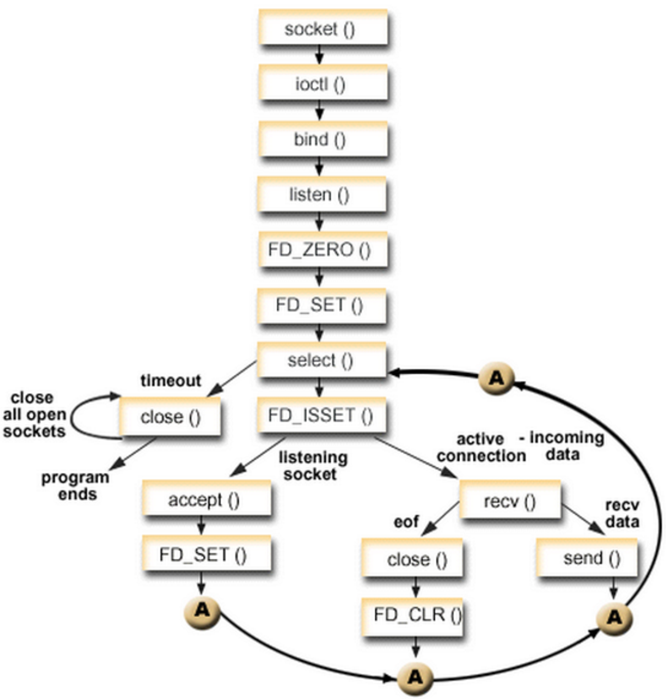

## 一、linux相关


### 1. 常用linux系统调用

系统调用（System Call）是操作系统为在用户态运行的进程与**硬件设备（如CPU、磁盘、打印机等）进行交互**提供的一组接口。当用户进程需要发生系统调用时，CPU 通过软中断切换到内核态开始执行内核系统调用函数

**系统调用在内核里的主要用途**。虽然给出了数种分类，不过总的概括来讲系统调用主要在系统中的用途无非以下几类：

- **控制硬件**——系统调用往往作为硬件资源和用户空间的抽象接口，比如读写文件时用到的write/read调用。

- **设置系统状态或读取内核数据**——因为系统调用是用户空间和内核的唯一通讯手段[2]，所以用户设置系统状态，比如开/关某项内核服务（设置某个内核变量），或读取内核数据都必须通过系统调用。比如getpgid、getpriority、setpriority、sethostname

- **进程管理**——一系列调用接口是用来保证系统中进程能以多任务，在虚拟内存环境下得以运行。比如 fork、clone、execve、exit等

**什么功能应该实现在内核而不是在用户空间**

- 服务必须获得内核数据，比如一些服务必须获得中断或系统时间等内核数据。

- 从安全角度考虑，在内核中提供的服务相比用户空间提供的毫无疑问更安全，很难被非法访问到。

- 从效率考虑，在内核实现服务避免了和用户空间来回传递数据以及保护现场等步骤，因此效率往往要比实现在用户空间高许多。比如,httpd等服务。

- 如果内核和用户空间都需要使用该服务，那么最好实现在内核空间，比如随机数产生。


信号：kill、signal/sigpending/sigsuspend/

管道：pipe

socket控制：socket/bind/connect/accept/send/listen/select/shutdown/setsockopt

用户管理：getuid/setuid/getgid/setgid/

网络管理：gethostname/sethostname/setdomainname/getdomainname/gethostid/sethostid

系统控制：reboot/time/uname/

文件系统控制：open/creat/close/read/write/readv/writev/pread/poll/truncate/access/stat/chown/chmod/chdir/rename/mkdir/mount/unmount/

进程控制：fork/clone/exit/execve/setpgid/getpid/getppid/nice/pause/ptrace/wait/wait3/waitpid/setsid/getsid

#### open

在用户态使用open()时，必须向该函数传入文件路径和打开权限。这两个参数传入内核后，内核首先检查这个文件路径存在的合法性，同时还需检查使用者是否有合法权限打开该文件。如果一切顺利，那么内核将对访问该文件的进程创建一个file结构。

在用户态，通常open()在操作成功时返回的是一个非负整数，即所谓的文件描述符（fd，file descriptor）；并且，用户态后续对文件的读写操作等都是通过fd来完成的。由此可见fd与file结构在内核中有一定的关联。

内核使用进程描述符task_struct来描述一个进程，而该进程所有已打开文件对应的file结构将形成一个数组files（其为files_struct结构），内核向用户返回的fd便是该数组中具体file结构的索引。默认情况下，每个进程创建后都已打开了标准输入文件、标准输出文件、标准错误文件，因此他们的文件描述符依次为0、1和2。


参考连接：https://www.cnblogs.com/shijiaqi1066/p/5749030.html


### 2. 进程、线程、协程


### 3. poll/epoll/select


**不同操作系统中IO多路复用模型介绍**

 

#### 3.1 select机制

 IO多路复用模型得以实现得核心：就是操作系统 监控1个[sk......conn,]列表，不断轮询每1个sk/conn/是否可以accpet/revive，随着监控列表的增加，效率会递减；

select函数监视的文件描述符分为3类，分别是writefds、readfds和exceptfds。调用后select函数会被阻塞，直到有描述符就绪（有数据可读、可写或者有except）、或者超时(timeout可用于指定等待时间，如果想立即返回可设置为null)，函数返回。当select函数返回后，可以通过遍历fdset来找到就绪的描述符。

> 在网络编程中统一的操作顺序是创建socket－>绑定端口－>监听－>accept->write/read,当有客户端连接到来时,select会把该连接的文件描述符放到fd_set（一组文件描述符(fd)的集合）,然后select会循环遍历它所监测的fd_set内的所有文件描述符，当select循环遍历完所有fd_set内指定的文件描述符对应的poll函数后，如果没有一个资源可用(即没有一个文件可供操作)，则select让该进程睡眠，一直等到有资源可用为止，fd_set是一个类似于数组的数据结构，由于它每次都要遍历整个数组，所有她的效率会随着文件描述符的数量增多而明显的变慢，除此之外在每次遍历这些描述符之前，系统还需要把这些描述符集合从内核copy到用户空间，然后再copy回去，如果此时没有一个描述符有事件发生（例如：read和write）这些copy操作和便利操作都是无用功，可见slect随着连接数量的增多，效率大大降低。可见如果在高并发的场景下select并不适用，况且select默认的最大描述符为1024，如果想要更多还要做响应参数的配置。





1. **最大限制**：单个进程能够监视的文件描述符的数量存在最大限制。(基于数组存储的赶脚)一般来说这个数目和系统内存关系很大，具体数目可以cat /proc/sys/fs/file-max察看。它由FD_SETSIZE设置，32位机默认是1024个。64位机默认是2048.
2. **时间复杂度：** 对socket进行扫描时是线性扫描，即采用轮询的方法，效率较低，时间复杂度O(n)。
   当套接字比较多的时候，每次select()都要通过遍历FD_SETSIZE个Socket来完成调度，不管哪个Socket是活跃的，都遍历一遍。这会浪费很多CPU时间。
   它仅仅知道有I/O事件发生了，却并不知道是哪那几个流（可能有一个，多个，甚至全部），我们只能无差别轮询所有流，找出能读出数据，或者写入数据的流，对他们进行操作。所以**select具有O(n)的无差别轮询复杂度**，同时处理的流越多，无差别轮询时间就越长。
3. **内存拷贝：**需要维护一个用来存放大量fd的数据结构，这样会使得用户空间和内核空间在传递该结构时复制开销大。


**支持操作系统**：linux/windows

 

#### 3.2 poll机制

不同于select使用三个位图来表示三个fdset的方式，poll使用一个pollfd指针来实现。pollfd结构包含了要监视的event和发生的event，不再使用select的“参数-值”传递的方式。同时pollfd并没有最大数量限制（但是数量过大后其性能也会降低）。和select函数一样，poll返回后需要轮询pollfd来获取就绪的描述符。

**没有最大连接数的限制**。（基于链表来存储的）

**支持操作系统**：linux

 

#### 3.3 epoll机制

##### epoll原理与流程

1.epoll很高级，epoll不会去再通过操作循环检查监控的socket列表中，那些socket出现了读操作，而是给需要监听的socket 1--1绑定1个回调函数；

2.检测的socket中 有1个soket出现了读操作，直接执行调用那个和该sk/con绑定的回调函数执行sk.accpet() 和conn.receve()

> ###### epoll基本流程
>
> **一棵红黑树，一张准备就绪句柄链表，少量的内核cache，就帮我们解决了大并发下的socket处理问题。**
>
> 1. 执行 epoll_create
>    内核在epoll文件系统中建了个file结点，（使用完，必须调用close()关闭，否则导致fd被耗尽）
>    在内核cache里建了红黑树存储epoll_ctl传来的socket，
>    在内核cache里建了rdllist双向链表存储准备就绪的事件。
> 2. 执行 epoll_ctl
>    如果增加socket句柄，检查红黑树中是否存在，存在立即返回，不存在则添加到树干上，然后向内核注册回调函数，告诉内核如果这个句柄的中断到了，就把它放到准备就绪list链表里。
>    ps：所有添加到epoll中的事件都会与设备（如网卡）驱动程序简历回调关系，相应的事件发生时，会调用回调方法。
> 3. 执行 epoll_wait
>    立刻返回准备就绪表里的数据即可（将内核cache里双向列表中存储的准备就绪的事件 复制到用户态内存）
>    当调用epoll_wait检查是否有事件发生时，只需要检查eventpoll对象中的rdlist双链表中是否有epitem元素即可。
>    如果rdlist不为空，则把发生的事件复制到用户态，同时将事件数量返回给用户。


##### epoll基本特点

1. **边缘触发**，它只告诉进程哪些fd刚刚变为就绪态，并且只会通知一次。
2. **事件驱动，**每个事件关联上fd，使用事件就绪通知方式，通过 epoll_ctl 注册 fd，一旦该fd就绪，内核就会采用 callback 的回调机制来激活该fd，epoll_wait 便可以收到通知。

1. **没有最大连接数的限制**。（基于 红黑树+双链表 来存储的:1G的内存上能监听约10万个端口）
2. **时间复杂度低：** 边缘触发和事件驱动，监听回调，时间复杂度O(1)。
   只有活跃可用的fd才会调用callback函数；即epoll最大的优点就在于它只管“活跃”的连接，而跟连接总数无关，因此实际网络环境中，Epoll的效率就会远远高于select和poll。
3. **内存拷贝：**利用mmap()文件映射内存加速与内核空间的消息传递，减少拷贝开销。


##### epoll两种模式(LT/ET)

epoll对文件描述符的操作有两种模式：LT(level trigger) 和 ET(edge trigger)。LT是默认的模式，ET是“高速”模式。

- LT（水平触发）模式下，只要有数据就触发，缓冲区剩余未读尽的数据会导致 epoll_wait都会返回它的事件；
- ET（边缘触发）模式下，只有新数据到来才触发，不管缓存区中是否还有数据，缓冲区剩余未读尽的数据不会导致epoll_wait返回


##### 适合用epoll的应用场景：

- 对于连接特别多，活跃的连接特别少(大量的idle-connection)
- 典型的应用场景为一个需要处理上万的连接服务器，例如各种app的入口服务器，例如qq

##### 不适合epoll的场景：

- 连接比较少，数据量比较大，例如ssh (没有大量的idle-connection或者dead-connection)
  epoll 的惊群问题：
  因为epoll 多用于多个连接，只有少数活跃的场景，但是万一某一时刻，epoll 等的上千个文件描述符都就绪了，这时候epoll 要进行大量的I/O，此时压力太大。


Python中的selectors模块就是帮我们自动选择最佳IO多路复用代理的；


### 2.1.Event Loop的惊群效应

通过查阅资料发现`Linux`通过`WQ_FLAG_EXCLUSIVE`标记解决了`socket.accept`的惊群问题， 但是现在很多服务通过基于事件循环的方法来提供更高的并发能力。比如我线上运行的服务就是用到了**`Gevent`，而`Gevent`用到的核心事件循环则是`Epoll`**，它与`Select`, `Poll`并称为`Event Loop`。

对于任何工作模式来说， 使用`Event Loop`后，进程调用`socket.accept`后的行为逻辑就不一样了，具体的逻辑步骤如下：

- 1.进程在调用`socket.accept`时，`Event Loop`会把进程挂在`socket`对应的文件描述符的等待队列上。
- 2.当`socket`的文件描述符有事件产生时，对应的驱动就会将等待队列上对应的进程进行唤醒。
- 3.被唤醒的进程会通过`Event Loop`检查事件是否就绪，如果事件就绪就会返回对应的事件给刚才的进程。
- 4.检查`accept`事件是否可调用， 如果可以就执行`accept`操作，并取得该四元组的对应`socket`。

可以看到，之前进程是挂在网络驱动上等着被内核唤醒，而在使用`Event Loop`后进程是挂在对应文件描述符的等待队列上等待被`Event Loop`唤醒，对于`Pre-Worker`模型下的每个工作进程虽然都有自己专属的`Event Loop`，但是他们都是等待着同样的资源，于是当该文件描述符有事件产生时，就会唤醒所有工作进程对应的`Event Loop`来检查事件以及判断是否可以返回事件给工作进程, 而且由于是通过`Event Loop`的逻辑来执行`socket.accept`，这样会绕过上面所说的`WQ_FLAG_EXCLUSIVE`标记的限制，从而又产生了惊群效应。

可以看到，`Event Loop`产生惊群效应的原因跟进程直接调用`sock.accept`十分的像，所以他们的解决思路也很像，首先是给`Event Loop`增加一个名为`EPOLLEXCLUSIVE`的标记， 然后开发者在编程时可以在`Event Loop`实例化后注册对应的标记,当进程在调用`sock.accept`且系统检到`Event Loop`带有该标记时，就会把进程挂在文件描述符的队列尾部，等到事件产生时，**内核会只唤醒该队列的第一个进程来处理对应的事件。**

> 关于标记`EPOLLEXCLUSIVE`的具体内容可见:[Add epoll round robin wakeup mode](https://link.juejin.cn?target=https%3A%2F%2Flwn.net%2FArticles%2F632590%2F)， 通过内容还可以知道还有一个标记`EPOLLROUNDROBIN`用来解决唤醒不均衡的情况，但是在`Python`中似乎没办法使用。


☆☆☆参考连接：https://juejin.cn/post/7082005823328632839


### 4. pre-worker服务模型

包含nginx 、gunicorn/gevent/event loop/惊群现象及解决方法

tcp三种工作模式

负载不均衡问题

（gevent/**asyncio**，）

由于之前一直在使用`Asyncio`，所以我知道`Event Loop`在收到对应文件描述符的事件时，它不是以雨露均沾的方式去唤醒进程/线程/协程，而是**会优先唤醒第一个注册的进程/线程/协程，只有第一个进程/线程/协程繁忙的情况下才会去唤醒后面的进程/线程/协程，造成了唤醒倾斜的问题**，所以我猜测是这个规则引发了负载不均衡的问题。


☆☆☆参考连接：https://juejin.cn/post/7082005823328632839


### 5. nginx的惊群现象

首先，我们先大概梳理一下 Nginx 的网络架构，几个关键步骤为：

1. Nginx 主进程解析配置文件，根据 listen 指令，将监听套接字初始化到全局变量 ngx_cycle 的 listening 数组之中。此时，监听套接字的创建、绑定工作早已完成。
2. Nginx 主进程 fork 出多个子进程。
3. 每个子进程在 ngx_worker_process_init 方法里依次调用各个 Nginx 模块的 init_process 钩子，其中当然也包括 NGX_EVENT_MODULE 类型的 ngx_event_core_module 模块，其 init_process 钩子为 ngx_event_process_init。
4. ngx_event_process_init 函数会初始化 Nginx 内部的连接池，并把 ngx_cycle 里的监听套接字数组通过连接池来获得相应的表示连接的 ngx_connection_t 数据结构，这里关于 Nginx 的连接池先略过。我们主要看 ngx_event_process_init 函数所做的另一个工作：如果在配置文件里**没有**开启 [accept_mutex 锁](http://nginx.org/en/docs/ngx_core_module.html#accept_mutex)，就通过 ngx_add_event 将所有的监听套接字添加到 epoll 中。
5. 每一个 Nginx 子进程在执行完 ngx_worker_process_init 后，会在一个死循环中执行 ngx_process_events_and_timers，这就进入到事件处理的核心逻辑了。
6. 在 ngx_process_events_and_timers 中，如果在配置文件里开启了 accept_mutext 锁，子进程就会去获取 accet_mutext 锁。如果获取成功，则通过 ngx_enable_accept_events 将监听套接字添加到 epoll 中，否则，不会将监听套接字添加到 epoll 中，甚至有可能会调用 ngx_disable_accept_events 将监听套接字从 epoll 中删除（如果在之前的连接中，本worker子进程已经获得过accept_mutex锁)。
7. ngx_process_events_and_timers 继续调用 ngx_process_events，在这个函数里面阻塞调用 epoll_wait。

至此，关于 Nginx 如何处理 fork 后的监听套接字，我们已经差不多理清楚了，当然还有一些细节略过了，比如在每个 Nginx 在获取 accept_mutex 锁前，还会根据当前负载来判断是否参与 accept_mutex 锁的争夺。

把这个过程理清了之后，Nginx 解决惊群问题的方法也就出来了，就是利用 accept_mutex 这把锁。

**如果配置文件中没有开启 accept_mutex，则所有的监听套接字不管三七二十一，都加入到每子个进程的 epoll 中，这样当一个新的连接来到时，所有的 worker 子进程都会惊醒。**

**如果配置文件中开启了 accept_mutex，则只有一个子进程会将监听套接字添加到 epoll 中，这样当一个新的连接来到时，当然就只有一个 worker 子进程会被唤醒了。**


### 6. ifconfig参数解释

```
ifconfig
ens33: flags=4163<UP,BROADCAST,RUNNING,MULTICAST> mtu 1500
inet 192.168.1.63 netmask 255.255.255.0 broadcast 192.168.1.255
inet6 fe80::c09d:975d:89cd:fd3f prefixlen 64 scopeid 0x20
ether 00:0c:29:02:83:db txqueuelen 1000 (Ethernet)
RX packets 3255 bytes 4458479 (4.2 MiB)
RX errors 0 dropped 26 overruns 0 frame 0
TX packets 1130 bytes 81645 (79.7 KiB)
TX errors 0 dropped 0 overruns 0 carrier 0 collisions 0

上图信息大概说明：
第一行：up–>网卡开启状态
RUNNING–>网线处理连接状态
MULTICAST–>支持组播
mtu 1500–>（Maximum Transmission Unit）最大传输单元大小为1500字节
第二行：该网卡的IP地址，子网掩码，广播地址
第三行：IPV6的配置信息
第四行：网卡的MAC地址
ether表示连接类型为以太网
txqueuelen 1000 --》传输队列的长度
第五六行：网卡接收数据包的统计信息和接收错误的统计信息
第七八行：网卡发送数据包的统计信息和发送错误的统计信息
```


常见进程调度算法


操作系统如何申请及管理内存


同步、阻塞、异步、并发、非阻塞、并行


nginx惊群现象 


## 二、网络相关


### 2.1. 三次握手、四次挥手

为什么是三次握手、不是两次握手，

参考-learnning\jike_qutanwangluoxieyi/网络学习


http与https


tcp与udp特点，区别


http网页，从请求到响应。 都走了那些步骤、（dns）


dns


http keepalive 和 tcp  keepalive


syn攻击、半连接


进程间如何通信


python的底层网络交互模块有哪些


OSI七层协议


## 三、数据库相关

##### mysql


mysql引擎，各个引擎之间有什么区别


数据库事务，及其特性


数据库事务隔离级别有哪些、区别与特点


死锁发生的情况，如何解决


索引的原理

mysql  B+索引、优缺点

mysql索引类型

聚簇索引和非聚簇索引

唯一索引和普通索引区别，使用索引有哪些优缺点

myql索引什么情况下会失效


mysql主从同步机制


数据库的ACID


如何开启慢查询日志


数据库的脏读、幻读、幻行的原理、发生场景，及解决方式


serializable 序列化、最好的事务级别


乐观锁、悲观锁


sql注入原理，如何在代码层面防止sql注入


数据库的优化


##### redis

redis单进程？多个客户端是多进程么


```python
补充一点，作为一台web服务器，我们总是需要socket()、bind()、listen()、来创建一个监听描述符sockfd，用来监听到来的http请求，与http请求完成三路握手。然后通过accept()操作来得到一个已连接描述符connectfd。
这里的两个文件描述符，此时都存在于我们的系统中，其中sockfd继续用来执行监听http请求操作。已经连接了的客户端我们则通过connectfd来与其通信。一般都是一个sockfd对多个connectfd。
更多的细节推荐阅读  ——《unix网络编程卷一》中的关于socket编程的几章


作者：weiwenhao
链接：https://juejin.cn/post/6844903507552632840
来源：稀土掘金
著作权归作者所有。商业转载请联系作者获得授权，非商业转载请注明出处。
```


redis如何解决雪崩、缓存击穿、


redis 持久化中rdb和 aof方案的优缺点


## 四、python相关

restfull和rpc区别与联系


xreadlines（底层迭代原理）  readline ()


is 和 ==区别


字典按值排序（sorted(dict.iterms(), key=lambda x: x[1],）


翻转字符串  s = "w3423", s[::-1]


list1中age按由大到小排序（list1=[{"age": 5}, {"age": 67}, {"age": 56}],    sorted(list1, key=lambda x:x['age'], reverse=True)）


lista=[1,2,43,7],  lista[10:]


两个列表，找出相同元素和不同元素

list1= [1,2 ,4,6, 67],  list2=[3, 2, 43, 76]

set1=set(list1) , set2=set(list2), set1&set2,  set1^set2


什么是反射，反射应用场景


深拷贝和浅拷贝


简述`__new__和————init--`的区别


GIL对python性能的影响


双下划线和单下划线的区别


with语句，如何构造，原理


单例模式，优缺点，如何实现


json序列化时，会遇到中文转unicode，想保留中文如何做（json.dumps({"dd", "你好"}， ensure_ascii=False)）


mro


C3算法


判断邮箱合法，re使用


python函数调用时候参数的传递是值传递还是引用传递


递归函数停止的条件


python递归的最大层数


列表推导式和生成器表达式 输出结果分别是什么

```
[i % 2 for i in range(10)]

(i % 2 for i in range(10))
```


什么是闭包


## 五、框架相关（django）


python三大框架各自应用场景


uWSGI 和nginx的理解

uwsgi  区别uWSGI


### 5.1 django


手动删除了表，导致，django迁移失败原因及解决办法

django中 Model    ForeignKey字段的on_delete参数作用


基于django使用ajax发送post请求时，有哪种方法携带csrftoken


django  FBV  CBV


django的request对象是什么时候创建的


django请求的生命周期


django中如何在model保存前做一定的固定操作，比如写一句日志（signal Dispatcher）


django中间件的使用


django  ORM查询中  select_related和prefetch_related的区别


cookie和session的区别


celery分布式队列


## 六、其他


自学python最大的困难


