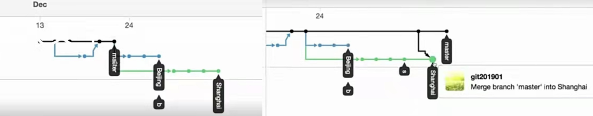
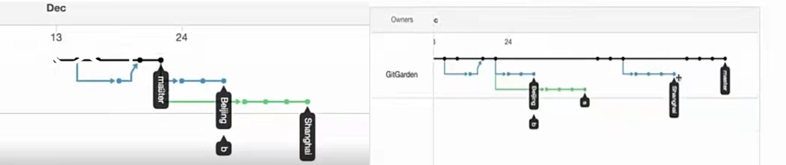

## git使用指北

### 1. 常用命令

GIT HELP -- WEB LOG
git diff  commit1   comit2
git diff  head  head～1
git diff HEAD  HEAD^
git diff HEAD  HEAD^^
git diff  head  head～2

git push origin  dev_yjz:dev
             远端仓库名  本地分支:远端分支


Rebase的使用命令
RESET  REVERT区别

#### 1.1 分离头指针

当拉取的tag代码就是分离头指针，执行commit后，会提示新建分支

此时新建分支

 git branch productcloudv2 0f7d0c93
          新分支名       头指针cmt_id
然后推送到并新建远端分支
git push origin productcloudv2:productcloudv2
                本地分支     远端分支


### 2. 在github上拉master后，切换分支命令

比如远端opensatck  master， 远端分支 statble/stein
git checkout -b stein remotes/origin/stable/stein，这样新分支可以与远端分支关联

### 3. 拉取指定tag或分支代码
命令：git clone --branch [tags标签] [git地址] 或者 git clone --b [tags标签] [git地址]

git clone -b 4.1.4 https://github.com/openstack/octavia.git


### 4. 初始化本地代码到github

```
//初始化本地操作
git init
 
//将工程添加到git
git add .    // 全部文件提交
 
//将工程提交到git
git commit -m '第一次提交，初始化工程'
 
//查看状态 添加 提交 等
git status

在你的github 上创建新的仓库（创建仓库名称为mall）,复制工程地址


//添加本地工程到远程仓库
git remote add origin https://github.com/PenguinAlstron/mall.git

//拉取远程仓库的内容
git pull --rebase origin master

//将本地工程推送到远程仓库
 git push -u origin master
 

```


### 5. git使用 ssh上传代码 设置

```
 git remote set-url origin git@github.com:yungjinzhou/django-myproject.git
```


### 6. git设置代理

```
# 设置指定仓库代理，指定代理地址端口
git config --local http.proxy http://127.0.0.1:50228
git config --local https.proxy socks5:127.0.0.1:50027
git config --local http.proxy socks5:127.0.0.1:50027

# 取消代理
git config --local --unset http.proxy
git config --local --unset https.proxy

```


### 7. github上 三种merge策略与区别

#### 7.1 merge

直接merge后前后对比

把<font color=blue>**当前commit直接合并到目标分支**</font>


#### 7.2 squarsh and merge

通过squarsh后在merge与最初对比

Squash Merge其实很简单，它就是在merge分支的时候<font color=blue>**把分支上的所有commit**</font>合并为一个commit**后再merge到目标分支。





#### 7.3 rebase and merge

通过rebase后在merge与最初对比

rebase就是在merge分支的时候<font color=blue>**把分支上的所有commit都merge到目标分支**</font>。





