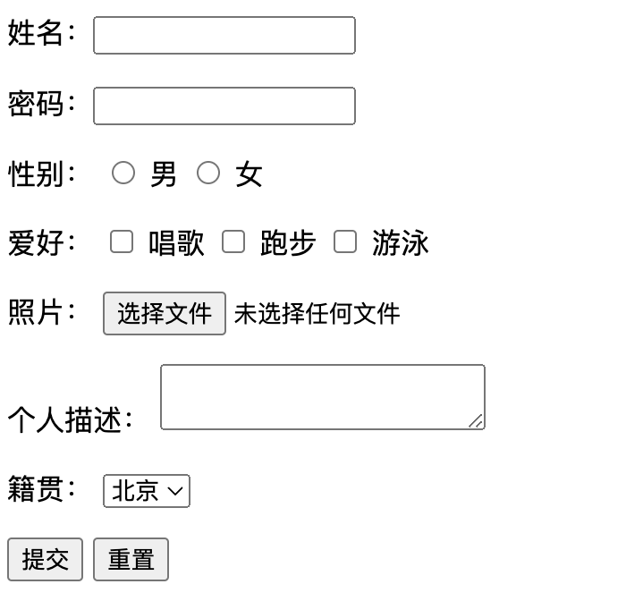
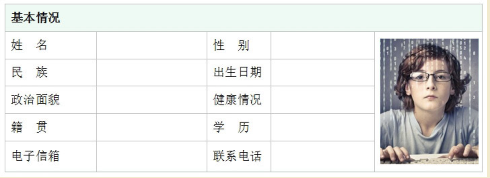

## css学习


### 书写方式

#### 行内式

```html
<!DOCTYPE html>
<html lang="en">
<head>
    <meta charset="UTF-8">
    <meta name="viewport" content="width=device-width, initial-scale=1.0">
    <meta http-equiv="X-UA-Compatible" content="ie=edge">
    <title>11-CSS书写方式之行内式</title>
</head>
<body>
    <!-- 11-CSS书写方式之行内式
        文字颜色  王宝绿
     -->
     <div style="color:green">CSS书写方式之行内式</div>
     
    
    
</body>
</html>
```


#### 嵌入式

在head标签中指定style标签

指定的div，其他标签不受限制

```html
<!DOCTYPE html>
<html lang="en">
<head>
    <meta charset="UTF-8">
    <meta name="viewport" content="width=device-width, initial-scale=1.0">
    <meta http-equiv="X-UA-Compatible" content="ie=edge">
    <title>12-CSS书写方式之嵌入式</title>

    <style>
        div{
            color:green;
        }

    </style>
</head>
<body>
        <!-- 12-CSS书写方式之嵌入式 -->
        <div>
                CSS书写方式之嵌入式
        </div>

        <p>段落</p>
</body>
</html>

```


#### 外链式(生产开发常用)

在head标签中指定link标签

```html
<!DOCTYPE html>
<html lang="en">
<head>
    <meta charset="UTF-8">
    <meta name="viewport" content="width=device-width, initial-scale=1.0">
    <meta http-equiv="X-UA-Compatible" content="ie=edge">
    <title>13-CSS书写方式之外链式</title>

    <!-- 关联文件css  -->
    <link rel="stylesheet" href="css/out.css">

</head>
<body>
    <div>13-CSS书写方式之外链式</div>
</body>
</html>


```

out.css

```css
div{
    color:green
}
```

### 文本属性

```html
<!DOCTYPE html>
<html lang="en">
<head>
    <meta charset="UTF-8">
    <meta name="viewport" content="width=device-width, initial-scale=1.0">
    <meta http-equiv="X-UA-Compatible" content="ie=edge">
    <title>14-文本属性</title>
    <!-- 
        1.字体大小
        2.字体 种类
        3.字体颜色
        4.去掉下划线
        5.行高
     -->
     <style>
         p{
            /* 1.字体大小  浏览器默认是 16px */
            font-size:30px;
            /* 2.字体 种类 */
            font-family: "Microsoft YaHei"; 
            
            /* 3.字体颜色 */
            color:#af4567;

            /* 4.增加掉下划线 */
            text-decoration: underline;

            /* 5.行高  */
            line-height: 50px;
         }

         a{
             text-decoration: none;
         }

     </style>
</head>
<body>
    <a href="#">连接标签</a>
    <p>
            1.字体大小
            2.字体 种类
            3.字体颜色
            4.去掉下划线
            5.行高
    </p>
    

</body>
</html>
```

#### 宽高和边框属性

```html
<!DOCTYPE html>
<html lang="en">
<head>
    <meta charset="UTF-8">
    <meta name="viewport" content="width=
    , initial-scale=1.0">
    <meta http-equiv="X-UA-Compatible" content="ie=edge">
    <title>15-宽高和边框属性</title>

    <style>
        div{
            width: 500px;
            height: 500px;
            
            /* 设置背景颜色
             */
             background-color: red;

             /* 边框 border */
                        /* 粗细  实线  颜色 */
             border-top: 20px solid green;
                                /* 点线 */
             border-bottom: 10px dotted lightblue;
                                /* 虚线 */
             border-left: 20px dashed yellow;
             border-right: 10px double brown;

             /* 四个边 */
             border:10px solid green;
        }
    
    </style>
</head>
<body>
    <div>
            15-宽高和边框属性
    </div>
    
</body>
</html>
```

#### 外边距

```html
<!DOCTYPE html>
<html lang="en">
<head>
    <meta charset="UTF-8">
    <meta name="viewport" content="width=device-width, initial-scale=1.0">
    <meta http-equiv="X-UA-Compatible" content="ie=edge">
    <title>16-外边距margin</title>

    <style>
        div{
            width: 200px;
            height: 200px;

            background-color: red;
            /* 外边距 */
            margin-top: 40px;
            margin-left: 50px;

            margin-right: 100px;
            margin-bottom: 200px;

            /* 连写 */
            margin: 50px;
                  /* 上下  左右 */
            margin:50px 100px;
                    /* 上  左右  下 */
            margin:50px  100px 200px;
                    /* 顺时针 */
            margin:10px 20px 30px 40px;

            /* 使用技巧div  水平居中*/
            /* margin: 0 540px; */
            margin: 0 auto;
        }
    </style>
</head>
<body>
    <div>
        第一个 div
    </div>
    <div>
            第222个 div
    </div>
    
</body>
</html>
```

#### padding(内边距)属性

```html
<!DOCTYPE html>
<html lang="en">
<head>
    <meta charset="UTF-8">
    <meta name="viewport" content="width=device-width, initial-scale=1.0">
    <meta http-equiv="X-UA-Compatible" content="ie=edge">
    <title>17-CSS的属性padding</title>

    <style>
        div{
            width: 230px;
            height: 230px;
            background-color: red;

            /* 内边距 padding  */
            padding-top: 50px;
            padding-left: 50px;

            /* 连写 */
            padding: 30px;
            padding: 30px 50px;
            padding: 30px 50px 100px;
            padding: 30px 50px 100px 40px;
        }
    </style>
</head>
<body>
    <div>div的文字</div>
    <!-- <div>div的文字内容只是一部分div的文字内容只是一部分div的div的文字内容只是一部分div的文字内容只是一部分div的div的文字内容只是一部分div的文字内容只是一部分div的div的文字内容只是一部分div的文字内容只是一部分div的文字内容只是一部分div的文字内容只是一部分div的文字内容只是一部分div的文字内容只是一部分</div> -->
</body>
</html>
```


#### 选择器

```html
<!DOCTYPE html>
<html lang="en">
<head>
    <meta charset="UTF-8">
    <meta name="viewport" content="width=device-width, initial-scale=1.0">
    <meta http-equiv="X-UA-Compatible" content="ie=edge">
    <title>18-选择器</title>
    <!-- 寻找标签  选择器 -->

    <style>
        /* 1.标签选择器  一般不用 */
        /* div{
            color:red;
        } */

        /* 2. 类选择器  实际*/
        /* .first{
           color:red; 
        } */
        
        /* 3.层级选择器 后代选择器 嵌套 */
        
        /* div p{
            color:green;
        } */

        .second p{
            color:blueviolet;
        }
       

    </style>
</head>
<body>

    <div class="first">div的标签111</div>
    <div>div的标签222</div>
    <div>div的标签333</div>

    <div class="second">
        <p>
            嵌套的标签
        </p>
        <div>
            <p>
                孙子标签
            </p>
        </div>
    </div>

    <p>标签</p>
    
</body>
</html>
```


#### 选择器的权重

**选择器的权重**
CSS权重指的是样式的优先级，有两条或多条样式作用于一个元素 ，权重高的那条样式对元素起作用,权重相同的，后写的样式会覆盖前面写的样式.

**权重值的计算** 可以把样式的应用方式分为几个等级，按照等级来计算权重

- !important，加在样式属性值后，权重值为 10000
- 行内样式内联样式，如：style=””，权重值为1000
- ID选择器，权重值为100
- 类，权重值为10
- 标签选择器,权重值为1


#### 无序列表标签

```
<ul>
    <li>列表标题一</li>
    <li>列表标题二</li>
    <li>列表标题三</li>
</ul>


<ul>
    <li><a href="#">列表标题一</a></li>
    <li><a href="#">列表标题二</a></li>
    <li><a href="#">列表标题三</a></li>
</ul>
```


#### 有序列表标签(无)


#### 文本常用样式属性二：

- text-align 设置文字水平对齐方式，如text-align:center 设置文字水平居中
- text-indent 设置文字首行缩进，如：text-indent:24px; 设置文字首行缩进24px

#### display属性

display属性是用来设置元素的类型及隐藏的，常用的属性有：
1、none 元素隐藏且不占位置
2、block 元素以块元素显示

#### css元素溢出

当子元素的尺寸超过父元素的尺寸时，需要设置父元素显示溢出的子元素的方式，设置的方法是通过overflow属性来设置。

**overflow的设置项：**
1、visible 默认值。内容不会被修剪，会呈现在元素框之外。
2、hidden 内容会被修剪，并且其余内容是不可见的。
3、scroll 内容会被修剪，但是浏览器会显示滚动条以便查看其余的内容。
4、auto 如果内容被修剪，则浏览器会显示滚动条以便查看其余的内容。


#### css颜色表示法

css颜色值主要有三种表示方法： 1、颜色名表示，比如：red 红色，gold 金色 2、rgb表示，比如：rgb(255,0,0)表示红色 3、16进制数值表示，比如：#ff0000 表示红色，这种可以简写成 #f00


#### 定位

**文档流**
文档流，是指盒子按照html标签编写的顺序依次从上到下，从左到右排列，块元素占一行，行内元素在一行之内从左到右排列，先写的先排列，后写的排在后面，每个盒子都占据自己的位置。

**关于定位**
我们可以使用css的position属性来设置元素的定位类型，postion的设置项如下：

- relative 生成相对定位元素，一般是将父级设置相对定位，子级设置绝对定位，子级就以父级作为参照来定位，否则子级相对于body来定位。
- absolute 生成绝对定位元素，元素脱离文档流，不占据文档流的位置，可以理解为漂浮在文档流的上方，相对于上一个设置了定位的父级元素来进行定位，如果找不到，则相对于body元素进行定位。
- fixed 生成固定定位元素，元素脱离文档流，不占据文档流的位置，可以理解为漂浮在文档流的上方，相对于浏览器窗口进行定位。

**定位元素的偏移**
定位的元素还需要用left、right、top或者bottom来设置相对于参照元素的偏移值。

**定位元素层级**
定位元素是浮动的正常的文档流之上的，可以用z-index属性来设置元素的层级

伪代码如下:

```
.box01{
    ......
    position:absolute;  /* 设置了绝对定位 */
    left:200px;            /* 相对于参照元素左边向右偏移200px */
    top:100px;          /* 相对于参照元素顶部向下偏移100px */
    z-index:10          /* 将元素层级设置为10 */
}
```


### html表单


表单用于搜集不同类型的用户输入，表单由不同类型的标签组成，相关标签及属性用法如下：

1、<form>标签 定义整体的表单区域

- action属性 定义表单数据提交地址
- method属性 定义表单提交的方式，一般有“get”方式和“post”方式

2、<label>标签 为表单元素定义文字标注

3、<input>标签 定义通用的表单元素

- type属性
  - type="text" 定义单行文本输入框
  - type="password" 定义密码输入框
  - type="radio" 定义单选框
  - type="checkbox" 定义复选框
  - type="file" 定义上传文件
  - type="submit" 定义提交按钮
  - type="reset" 定义重置按钮
  - type="button" 定义一个普通按钮
- value属性 定义表单元素的值
- name属性 定义表单元素的名称，此名称是提交数据时的键名

4、<textarea>标签 定义多行文本输入框

5、<select>标签 定义下拉表单元素

6、<option>标签 与<select>标签配合，定义下拉表单元素中的选项

**注册表单实例：**

```
<form action="http://www..." method="get">
<p>
<label>姓名：</label><input type="text" name="username" />
</p>
<p>
<label>密码：</label><input type="password" name="password" />
</p>
<p>
<label>性别：</label>
<input type="radio" name="gender" value="0" /> 男
<input type="radio" name="gender" value="1" /> 女
</p>
<p>
<label>爱好：</label>
<input type="checkbox" name="like" value="sing" /> 唱歌
<input type="checkbox" name="like" value="run" /> 跑步
<input type="checkbox" name="like" value="swiming" /> 游泳
</p>
<p>
<label>照片：</label>
<input type="file" name="person_pic">
</p>
<p>
<label>个人描述：</label>
<textarea name="about"></textarea>
</p>
<p>
<label>籍贯：</label>
<select name="site">
    <option value="0">北京</option>
    <option value="1">上海</option>
    <option value="2">广州</option>
    <option value="3">深圳</option>
</select>
</p>
<p>
<input type="submit" name="" value="提交">
<input type="reset" name="" value="重置">
</p>
</form>
```





**单行文本框文字提示**

- placeholder 设置input输入框的默认提示文字。


### table的构成




- table表示表格开始表格结束
- tr表示表格中的行标签 一个表格中有多少行就应该书写多少对tr标签 + td表示表格中的单元格标签 一行中有多少个单元格就应该书写多少对td标签
- 表格中所有的内容都必须在放置在td标签里面 也就是说只有td标签才能存放内容
- th表示标题单元格 这个单元格里面的文本会加粗显示并且会居中

#### **table常用属性**

- width height 宽高
- align 对齐:left right center
- valign 用来设置行里面的内容垂直对齐方式
- border 边框 像素
- border-collapse:collapse 合并边框

#### **td th的属性**

- align
- valign
- colspan 横向合并
- rowspan 纵向合并

#### **在实现合并单元格：**

- 一定要明白我们是跨列合并还是跨行合并
- 要明确的知道在哪一个单元格中书写合并单元格的属性
- 要明确的知道要合并多少个单元格 合并多少个单元格 那么就是多少
- 合并后要删除对应的单元格 n-1


