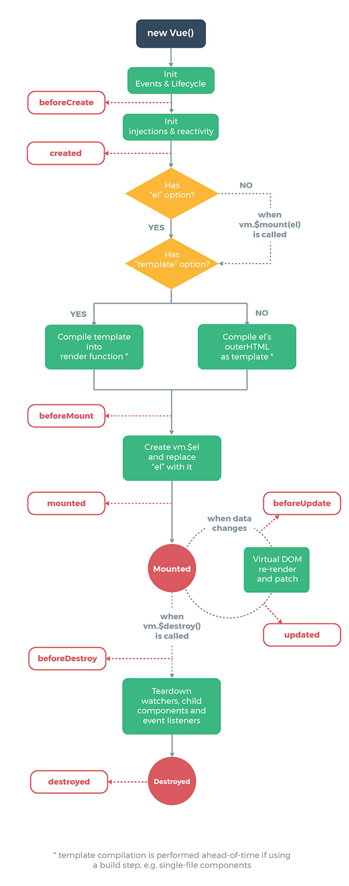

## vue库的使用


### vue简介

Vue.js是前端三大新框架：Angular.js、React.js、Vue.js之一，Vue.js目前的使用和关注程度在三大框架中稍微胜出，并且它的热度还在递增。

Vue.js可以作为一个js库来使用，也可以用它全套的工具来构建系统界面，这些可以根据项目的需要灵活选择，所以说，Vue.js是一套构建用户界面的渐进式框架。

Vue的核心库只关注视图层，Vue的目标是通过尽可能简单的 API 实现响应的数据绑定，在这一点上Vue.js类似于后台的模板语言。

Vue也可以将界面拆分成一个个的组件，通过组件来构建界面，然后用自动化工具来生成单页面(SPA - single page application)系统。

#### Vue.js使用文档及下载Vue.js

Vue.js使用文档已经写的很完备和详细了，通过以下地址可以查看： https://cn.vuejs.org/v2/guide/
vue.js如果当成一个库来使用，可以通过下面地址下载： https://cn.vuejs.org/v2/guide/installation.html


### VUE.js基本概念

首先通过将vue.js作为一个js库来使用，来学习vue的一些基本概念，我们下载了vue.js后，需要在页面上通过script标签引入vue.js，开发中可以使用开发版本vue.js，产品上线要换成vue.min.js。

```
<script type="text/javascript" src="js/vue.min.js"></script>
```

#### Vue实例

每个 Vue 应用都是通过实例化一个新的 Vue对象开始的：

```vue
window.onload = function(){
    var vm = new Vue({
        el:'#app',
        data:{message:'hello world!'}
    });
}    
......

<div id="app">{{ message }}</div>
```

其中，el属性对应一个标签，当vue对象创建后，这个标签内的区域就被vue对象接管，在这个区域内就可以使用vue对象中定义的属性和方法。

#### 数据与方法

当一个 Vue 实例被创建时，它向 Vue 的响应式系统中加入了其data对象中能找到的所有的属性。当这些属性的值发生改变时，视图将会产生“响应”，即匹配更新为新的值。还可以在Vue实例中定义方法，通过方法来改变实例中data对象中的数据，数据改变了，视图中的数据也改变。

```
window.onload = function(){
    var vm = new Vue({
        el:'#app',
        data:{message:'hello world!'},
        methods:{
            fnChangeMsg:function(){
                this.message = 'hello Vue.js!';
            }
        }
    });
}    
......

<div id="app">
    <p>{{ message }}</p>
    <button @click="fnChangeMsg">改变数据和视图</button>
</div>
```


### Vue.js模板语法

模板语法指的是如何将数据放入html中，Vue.js使用了基于 HTML的模板语法，允许开发者声明式地将DOM绑定至底层 Vue 实例的数据。所有 Vue.js的模板都是合法的 HTML ，所以能被遵循规范的浏览器和 HTML 解析器解析。

#### 插入值

数据绑定最常见的形式就是使用“Mustache”语法 (双大括号) 的文本插值：

```
<span>Message: {{ msg }}</span>
```

如果是标签的属性要使用值，就不能使用“Mustache”语法，需要写成使用v-bind指令：

```
<a v-bind:href="url" v-bind:title='tip'>百度网</a>
```

插入的值当中还可以写表达式：

```
{{ number + 1 }}
{{ ok ? 'YES' : 'NO' }}
{{ message.split('').reverse().join('') }}
<a v-bind:href="url">链接文字</a>
```

#### 指令

指令 (Directives) 是带有“v-”前缀的特殊属性。指令属性的值预期是单个JavaScript表达式，指令的职责是，当表达式的值改变时，将其产生的连带影响，响应式地作用于DOM。常见的指令有v-bind、v-if、v-on。

```
<!-- 根据ok的布尔值来插入/移除 <p> 元素 -->
<p v-if="ok">是否显示这一段</p>

<!-- 监听按钮的click事件来执行fnChangeMsg方法 -->
<button v-on:click="fnChangeMsg">按钮</button>
```

#### 缩写

v-bind和v-on事件这两个指令会经常用，所以有简写方式：

```
<!-- 完整语法 -->
<a v-bind:href="url">...</a>

<!-- 缩写 -->
<a :href="url">...</a>


<!-- 完整语法 -->
<button v-on:click="fnChangeMsg">按钮</button>

<!-- 缩写 -->
<button @click="fnChangeMsg">按钮</button>
```


### 计算属性和侦听属性

#### 计算属性

模板内的表达式非常便利，但是设计它们的初衷是用于简单运算的。在模板中放入太多的逻辑会让模板过重且难以维护。例如：

```
<div id="example">
  {{ message.split('').reverse().join('') }}
</div>
```

这个表达式的功能是将message字符串进行反转，这种带有复杂逻辑的表达式，我们可以使用计算属性

```
<div id="example">
  <p>Original message: "{{ message }}"</p>
  <p>Computed reversed message: "{{ reversedMessage }}"</p>
</div>

......

var vm = new Vue({
  el: '#example',
  data: {
    message: 'Hello'
  },
  computed: {
    // 计算属性的 getter
    reversedMessage: function () {
      // `this` 指向 vm 实例
      return this.message.split('').reverse().join('')
    }
  }
})
```

#### 侦听属性

侦听属性的作用是侦听某属性值的变化，从而做相应的操作，侦听属性是一个对象，它的键是要监听的对象或者变量，值一般是函数,当你侦听的元素发生变化时，需要执行的函数，这个函数有两个形参，第一个是当前值，第二个是变化后的值。

```vue
window.onload = function(){
    var vm = new Vue({
        el:'#app',
        data:{
            iNum:1
        },
        watch:{
            iNum:function(newval,oldval){
                console.log(newval + ' | ' + oldval) 
            }
        },
        methods:{
            fnAdd:function(){
                this.iNum += 1;
            }
        }
    });
}
```


### Class 与 Style 绑定

使用v-bind指令来设置元素的class属性或者sytle属性，它们的属性值可以是表达式，vue.js在这一块做了增强，表达式结果除了是字符串之外，还可以是对象或者数组。

#### Class绑定

##### 对象语法

可以给v-bind:class传一个对象，以动态的切换class

```
<div class="static" v-bind:class="{active:isActive,'text-danger':hasError }"></div>
```

data属性值如下：

```
data: {
  isActive: true,
  hasError: false
}
```

最终渲染的效果：

```
<div class="static active"></div>
```

也可以给v-bind:class传一个对象引用

```
<div v-bind:class="classObject"></div>
```

data属性值可以写成：

```
data: {
  classObject: {
    active: true,
    'text-danger': false
  }
}
```

##### 数组语法

可以给v-bind:class传一个数组，以应用一个 class 列表

```
<div v-bind:class="[activeClass, errorClass]"></div>
......

data: {
  activeClass: 'active',
  errorClass: 'text-danger'
}
```

最终渲染为：

```
<div class="active text-danger"></div>
```

如果你也想根据条件切换列表中的 class，可以用三元表达式：

```
<div v-bind:class="[isActive ? activeClass : '', errorClass]"></div>
```

不过，当有多个条件class时这样写有些繁琐。所以在数组语法中也可以使用对象语法：

```
<div v-bind:class="[{ active: isActive }, errorClass]"></div>
```

#### style绑定

##### 对象语法

v-bind:style 的对象语法十分直观——看着非常像 CSS，但其实是一个JavaScript 对象。CSS 属性名可以用驼峰式 (camelCase) 来命名：

```
<div v-bind:style="{color: activeColor, fontSize: fontSize + 'px' }"></div>
```

data数据如下：

```
data: {
  activeColor: 'red',
  fontSize: 30
}
```

也可以给v-bind:style传一个对象引用

```
<div v-bind:style="styleObject"></div>
```

data数据如下：

```
data: {
  styleObject: {
    color: 'red',
    fontSize: '13px'
  }
}
```

##### 数组语法

v-bind:style 的数组语法可以将多个样式对象应用到同一个元素上：

```
<div v-bind:style="[baseStyles, overridingStyles]"></div>
```


### 条件渲染

通过条件指令可以控制元素的创建(显示)或者销毁(隐藏)，常用的条件指令如下：

#### v-if

v-if可以控制元素的创建或者销毁

```
<h1 v-if="ok">Yes</h1>
```

#### v-else

v-else指令来表示 v-if 的“else 块”，v-else 元素必须紧跟在带 v-if 或者 v-else-if 的元素的后面，否则它将不会被识别。

```
<div v-if="Math.random() > 0.5">
  Now you see me
</div>
<div v-else>
  Now you don't
</div>
```

#### v-else-if

v-else-if，顾名思义，充当 v-if 的“else-if 块”，可以连续使用：

```
<div v-if="type === 'A'">
  A
</div>
<div v-else-if="type === 'B'">
  B
</div>
<div v-else-if="type === 'C'">
  C
</div>
<div v-else>
  Not A/B/C
</div>
```

#### v-show

另一个用于根据条件展示元素的选项是 v-show 指令。用法和v-if大致一样，但是它不支持v-else,它和v-if的区别是，它制作元素样式的显示和隐藏，元素一直是存在的：

```
<h1 v-show="ok">Hello!</h1>
```


### 列表渲染

通过v-for指令可以将一组数据渲染到页面中，数据可以是数组或者对象，v-for 指令需要使用 item in items 形式的特殊语法，items 是源数据数组并且 item 是数组元素迭代的别名。

#### 遍历数组

```
<ul id="example-1">
  <li v-for="item in items">
    {{ item}}
  </li>
</ul>
```

vue对象创建如下：

```
var example1 = new Vue({
  el: '#example-1',
  data: {
    items: ['foo','bar']
  }
})
```

如果想加上索引值，可以加上第二个参数

```
<ul id="example-2">
  <li v-for="(item, index) in items">
    {{ index }} - {{ item.message }}
  </li>
</ul>
```

#### 遍历对象

也可以用 v-for 通过一个对象的属性来迭代

```
<ul id="v-for-object">
  <li v-for="value in object">
    {{ value }}
  </li>
</ul>
```

如果想加上对象属性名，可以加上第二个参数

```
<ul id="v-for-object">
  <li v-for="(value,key) in object">
    {{ key }}-{{ value }}
  </li>
</ul>
```


### 事件处理

#### 事件绑定方法

可以用 v-on 指令监听 DOM 事件，并在触发时运行一些 JavaScript 代码，事件的处理，简单的逻辑可以写在指令中，复杂的需要在vue对象的methods属性中指定处理函数。

```
<div id="example-1">
  <!-- 在指令中写处理逻辑 -->
  <button v-on:click="counter += 1">Add 1</button>
  <p>The button above has been clicked {{ counter }} times.</p>
</div>
......
var example1 = new Vue({
  el: '#example-1',
  data: {
    counter: 0
  }
})
```

methods属性中指定处理函数：

```
<div id="example-2">
  <!-- greet 是在下面定义的方法名 -->
  <button v-on:click="greet">Greet</button>
</div>
......

var example2 = new Vue({
  el: '#example-2',
  data: {
    name: 'Vue.js'
  },
  // 在 `methods` 对象中定义方法
  methods: {
    greet: function () {
      // `this` 在方法里指向当前 Vue 实例
      alert('Hello ' + this.name + '!')
    }
  }
})
```

#### 事件修饰符

实际开发中，事件绑定有时候牵涉到阻止事件冒泡以及阻止默认行为，在vue.js可以加上事件修饰符

```
<!-- 阻止单击事件继续传播 -->
<a v-on:click.stop="doThis"></a>

<!-- 提交事件不再重载页面 -->
<form v-on:submit.prevent="onSubmit"></form>

<!-- 修饰符可以串联 -->
<a v-on:click.stop.prevent="doThat"></a>

<!-- 只有修饰符 -->
<form v-on:submit.prevent></form>
```


### 表单输入绑定

可以用 v-model 指令在表单 <input> 及 <textarea> 元素上创建双向数据绑定。它会根据控件类型自动选取正确的方法来更新元素

#### 单行文本框

```
<input v-model="message" placeholder="edit me">
<p>Message is: {{ message }}</p>
```

#### 多行文本框

```
<span>Multiline message is:</span>
<p>{{ message }}</p>
<textarea v-model="message" placeholder="add multiple lines"></textarea>
```

#### 复选框

单个复选框，绑定到布尔值：

```
<input type="checkbox" id="checkbox" v-model="checked">
<label for="checkbox">{{ checked }}</label>
```

多个复选框，绑定到同一个数组：

```
<div id='example-3'>
  <input type="checkbox" id="jack" value="Jack" v-model="checkedNames">
  <label for="jack">Jack</label>
  <input type="checkbox" id="john" value="John" v-model="checkedNames">
  <label for="john">John</label>
  <input type="checkbox" id="mike" value="Mike" v-model="checkedNames">
  <label for="mike">Mike</label>
  <br>
  <span>Checked names: {{ checkedNames }}</span>
</div>

......

new Vue({
  el: '#example-3',
  data: {
    checkedNames: []
  }
})
```

#### 单选框

```
<div id="example-4">
  <input type="radio" id="one" value="One" v-model="picked">
  <label for="one">One</label>
  <br>
  <input type="radio" id="two" value="Two" v-model="picked">
  <label for="two">Two</label>
  <br>
  <span>Picked: {{ picked }}</span>
</div>

......
new Vue({
  el: '#example-4',
  data: {
    picked: ''
  }
})
```

#### 下拉框

```
<div id="example-5">
  <select v-model="selected">
    <option disabled value="">请选择</option>
    <option>A</option>
    <option>B</option>
    <option>C</option>
  </select>
  <span>Selected: {{ selected }}</span>
</div>
......

new Vue({
  el: '...',
  data: {
    selected:''
  }
})
```


### 过滤器

Vue.js允许你自定义过滤器，可被用于一些常见的文本格式化。过滤器可以用在两个地方：双花括号插值和 v-bind 表达式

```
<!-- 在双花括号中 -->
{{ prize | RMB }}

<!-- 在v-bind中 -->
<div v-bind:id="rawId | formatId"></div>
```

过滤器实际上是一个函数，可以在一个组件的选项中定义组件内部过滤器：

```
filters:{
  RMB:function(value){
    if(value=='')
    {
      return;
    }
    return '¥ '+value;
  }
}
```

或者在创建 Vue 实例之前全局定义过滤器：

```
Vue.filter('Yuan',function(value){
  if(value=='')
  {
    return;
  }
  return value+'元';
});
```

此时过滤器'RMB'只能在定义它的对象接管标签内使用，而'Yuan'可以全局使用


## 实例生命周期

每个Vue实例在被创建时都要经过一系列的初始化过程——例如，需要设置数据监听、编译模板、将实例挂载到DOM并在数据变化时更新 DOM 等。同时在这个过程中会自动运行一些叫做生命周期钩子的函数，我们可以使用这些函数，在实例的不同阶段加上我们需要的代码，实现特定的功能。

#### beforeCreate

在实例初始化之后，数据观测 (data observer) 和 event/watcher 事件配置之前被调用。

#### created

在实例创建完成后被立即调用。在这一步，实例已完成以下的配置：数据观测 (data observer)，属性和方法的运算，watch/event 事件回调。然而，挂载阶段还没开始

#### beforeMount

在挂载开始之前被调用：相关的 render 函数首次被调用。

#### mounted

实例挂载到dom之后被调用，可以当成是vue对象的ready方法来使用，一般用它来做dom的初始化操作。

#### beforeUpdate

数据发生变化前调用

#### updated

数据发生变化后调用




### 数据交互

vue.js没有集成ajax功能，要使用ajax功能，可以使用vue官方推荐的axios.js库来做ajax的交互。 axios库的下载地址：https://github.com/axios/axios/releases

#### axios完整写法：

```
axios({
  method: 'post',
  url: '/user/12345',
  data: {
    firstName: 'Fred',
    lastName: 'Flintstone'
  }
});
```

axios请求的写法也写成get方式后post方式。

#### 执行get请求

```
// 为给定 ID 的 user 创建请求
// then是请求成功时的响应，catch是请求失败时的响应

axios.get('/user?ID=12345')
.then(function (response) {
  console.log(response);
})
.catch(function (error) {
  console.log(error);
});


// 可选地，上面的请求可以这样做
axios.get('/user', {
  params: {
    ID: 12345
  }
})
.then(function (response) {
  console.log(response);
})
.catch(function (error) {
  console.log(error);
});
```

#### 执行post请求

```
axios.post('/user', {
  firstName: 'Fred',
  lastName: 'Flintstone'
})
.then(function (response) {
  console.log(response);
})
.catch(function (error) {
  console.log(error);
});
```


