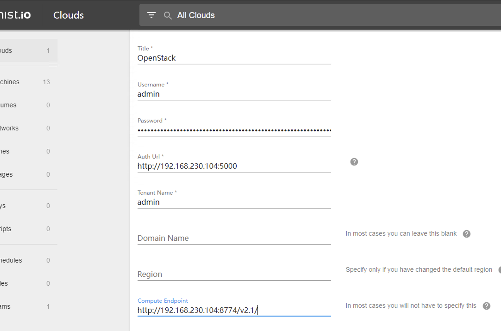

# 多云管理mistio部署


### 1. 部署测试环境：

centos7 x86_64

4cpu ,8G内存，20G磁盘

### 2.基本配置

配置ip地址，dns，ssh远程连接

```
# 配置ip
vim /etc/sysconfig/network-script/ifcfg-etho

# 配置dns
vim /etc/resolv.conf

# 配置ssh
vim /etc/ssh/sshd_config

```


配置基本软件环境

```
yum install -y wget vim 
```


### 3.设置aliyun源

```
# 备份
mv /etc/yum.repos.d/CentOS-Base.repo /etc/yum.repos.d/CentOS-Base.repo.backup

# 下载
wget -O /etc/yum.repos.d/CentOS-Base.repo http://mirrors.aliyun.com/repo/Centos-7.repo
或
curl -o /etc/yum.repos.d/CentOS-Base.repo http://mirrors.aliyun.com/repo/Centos-7.repo

mv /etc/yum.repos.d/Centos-7.repo /etc/yum.repos.d/CentOS-Base.repo 
# 编辑，将文件中的所有http开头的地址更改为https
vim CentOS-Base.repo
将文件中的所有http开头的地址更改为https
:%s/http/https/g
```


### 4、更新镜像源

清除缓存：yum clean all
生成缓存：yum makecache

### 5.安装docker-ce

```
# 安装必要的一些系统工具
$ sudo yum install -y yum-utils device-mapper-persistent-data lvm2

# 添加软件源信息
$ sudo yum-config-manager --add-repo https://mirrors.aliyun.com/docker-ce/linux/centos/docker-ce.repo

# 更新并安装 docker-ce 以及 compose 插件
$ sudo yum makecache fast
$ sudo yum -y install docker-ce docker-ce-cli docker-compose-plugin

# 开启 docker 服务
$ sudo systemctl enable --now docker
```


### 6.下载mist docker-compose

wget https://github.com/mistio/mist-ce/releases/download/v4.7.1/docker-compose.yml

见附件

### 7.启动服务

```
docker compose up -d
```


### 8.设置用户密码


创建用户和设置密码、

```
docker-compose exec api sh

./bin/adduser --admin admin@example.com


./bin/adduser --admin admin@123 -p
添加用户admin@123，并且角色设置为admin，同时设置密码
```


### 9.添加openstack云

登录后，添加openstack 云




参考链接：https://github.com/mistio/mist-ce#single-host


Docker-compose.yml

```
# Docker compose definition to run mist.io in production mode, so no mounted
# code, no dev containers etc. Only this single file is required.

version: '2.0'

services:


  mongodb:
    image: mongo:3.2
    restart: on-failure:5
    volumes:
      - mongodb:/data/db:rw

  rabbitmq:
    image: mist/rabbitmq
    restart: on-failure:5

  memcached:
    image: memcached:1.6.9
    restart: on-failure:5

  elasticsearch:
    image: elasticsearch:5.6.16
    restart: on-failure:5
    volumes:
      - elasticsearch:/usr/share/elasticsearch/data:rw
    environment:
      ES_JAVA_OPTS: "-Dlog4j2.formatMsgNoLookups=true"

  logstash:
    image: mistce/logstash:v4-7-1
    restart: on-failure:5
    depends_on:
      - elasticsearch
      - rabbitmq

  elasticsearch-manage:
    image: mistce/elasticsearch-manage:v4-7-1
    command: ./scripts/add_templates.py
    restart: on-failure:5
    depends_on:
      - elasticsearch
      - rabbitmq

  kibana:
    image: kibana:5.6.10
    environment:
      ELASTICSEARCH_URL: http://elasticsearch:9200
    restart: on-failure:5
    depends_on:
      - elasticsearch

  socat:
    image: mist/docker-socat
    restart: on-failure:5
    volumes:
      - /var/run/docker.sock:/var/run/docker.sock:rw

  mailmock:
    image: mist/mailmock
    restart: on-failure:5

  swagger:
    image: mist/swagger-ui
    environment:
      API_URL: /api/v1/spec
    restart: on-failure:5


  scheduler: &backend
    image: mistce/api:v4-7-1
    depends_on:
      - mongodb
      - elasticsearch
      - rabbitmq
    volumes:
      - ./settings:/etc/mist/settings
    environment:
      SETTINGS_FILE: /etc/mist/settings/settings.py
    stdin_open: true
    tty: true
    restart: on-failure:5
    command: bin/wait-all bin/scheduler

  hubshell:
    <<: *backend
    command: bin/wait-all bin/hubshell
  
  api:
    <<: *backend
    command: bin/wait-all bin/uwsgi
    expose:
      - 80

  api-v2:
    <<: *backend
    command: uwsgi --http 0.0.0.0:8080 --wsgi-file v2/mist_api_v2/__main__.py --callable application --master --processes 8 --max-requests 100 --honour-stdin --enable-threads
    expose:
      - 8080

  sockjs:
    <<: *backend
    command: bin/wait-all bin/sockjs
    expose:
      - 8081

  apply-migrations:
    <<: *backend
    command: bin/wait-all bin/migrate

  dramatiq:
    <<: *backend
    command: bin/wait-all bin/dramatiq

  ui:
    image: mistce/ui:v4-7-1
    command: sh /entry.sh
    stdin_open: true
    tty: true
    restart: on-failure:5
    expose:
      - 80

  landing:
    image: mistce/landing:v4-7-1
    command: sh /entry.sh
    stdin_open: true
    tty: true
    restart: on-failure:5
    expose:
      - 80

  nginx:
    image: mistce/nginx:v4-7-1
    restart: on-failure:5
    ports:
      - 80:80
    depends_on:
      - api
      - sockjs
      - landing
      - ui

  vminsert:
    image: victoriametrics/vminsert:v1.60.0-cluster
    command:
      - '--influxTrimTimestamp=1s'
      - '--storageNode=vmstorage:8400'
    ports:
      - 8480

  vmstorage:
    image: victoriametrics/vmstorage:v1.60.0-cluster
    command:
      - '--retentionPeriod=12'
      - '--storageDataPath=/var/lib/victoria-metrics-data'
    ports:
      - 8400
      - 8401
      - 8482
    volumes:
      - victoria-metrics:/var/lib/victoria-metrics-data

  vmselect:
    image: victoriametrics/vmselect:v1.60.0-cluster
    command:
      - '--search.latencyOffset=0s'
      - '--search.cacheTimestampOffset=15m'
      - '--storageNode=vmstorage:8401'
      - '--search.maxQueryLen=1GiB'
    ports:
      - 8481

  influxdb:
    image: influxdb:1.8.4
    environment:
      INFLUXDB_DB: telegraf
      INFLUXDB_BIND_ADDRESS: "0.0.0.0:8088"
    ports:
      - 8083:8083
      - 8086:8086
    volumes:
      - influxdb:/var/lib/influxdb

  gocky:
    image: mistce/gocky:v4-7-1
    command: -config /etc/gocky/config.toml
    ports:
      - 9096:9096
      - 9097:9097
    depends_on:
      - rabbitmq

  traefik:
    image: traefik:v1.5
    command:
      # - --logLevel=INFO
      - --accesslog
      # - --accesslog.format=json
      - --api
      - --api.entrypoint=traefik
      - --rest
      - --rest.entrypoint=traefik
      - --defaultentrypoints=http
      - --entrypoints=Name:http Address::80
      - --entrypoints=Name:traefik Address::8080
    ports:
      - 8040:80
      - 8041:8080

  huproxy:
    image: mistce/huproxy:v4-7-1
    command: /app --listen 0.0.0.0:8086
    environment:
      MONGO_URI: mongodb://mongodb:27017
    expose:
      - 8086

  wsproxy:
    image: mistce/wsproxy:v4-7-1
    expose:
      - 8764


volumes:
  elasticsearch: {}
  influxdb: {}
  mongodb: {}
  victoria-metrics: {}

```


## mist-ce源码中使用的技术


### logstash

Logstash 是一个流行的开源数据处理工具，用于收集、解析和转换各种类型的日志和事件数据，并将其发送到目标位置。它是 ELK（Elasticsearch、Logstash 和 Kibana）技术栈中的一个组件，常用于实时处理大规模、分散的数据，如 Web 服务器日志、应用程序日志、系统日志等。

Logstash 的功能十分强大和灵活，其中包括：

1.输入插件：支持多种数据源，如文件（本地或远程）、网络（TCP、UDP、HTTP、WebSocket 等）、消息队列（Kafka、RabbitMQ 等）、数据库（MySQL、PostgreSQL 等）等。

2.过滤插件：提供多个内置和自定义的过滤器，如 grok、mutate、geoip、xml、json 等，用于解析、转换、过滤和修改数据。

3.输出插件：支持多种目标位置，如 Elasticsearch、MongoDB、Redis、Amazon S3、Splunk 等，还可以使用 HTTP、SMTP、FTP 等协议将数据发送到其他系统。

4.插件管理：Logstash 提供了强大的插件系统，开发者可以通过插件扩展 Logstash 的功能，也可以自己编写插件满足特定需求。

在 ELK 技术栈中，Logstash 通常作为数据处理的前置组件，负责将采集的数据格式化和转换成 Elasticsearch 所需的格式，然后通过 Elasticsearch 进行存储和检索。同时，Logstash 支持与 Kibana 集成，将处理后的数据可视化呈现。

总之，Logstash 是一款功能强大的日志和事件数据处理工具，可以帮助用户快速、高效地处理海量数据，实时监控和分析应用程序和系统的状态。


### dramatiq

Dramatiq 是一个用于 Python 的快速、可靠的分布式任务队列模块。它支持异步任务处理、消息传递和事件处理，可应用于多种场景，如 Web 应用、机器学习、数据处理等。

Dramatiq 的主要特点如下：

1. 简单易用：Dramatiq 提供了一组简洁灵活的 API，开发者可以轻松创建和管理任务队列，实现任务的异步执行。
2. 高性能：Dramatiq 基于 Python 3，采用 asyncio 和 uvloop 技术，能够轻松处理高并发任务。
3. 可靠性：Dramatiq 支持任务重试、失败通知、死信队列等功能，确保任务的高可靠性和稳定性。
4. 分布式：Dramatiq 支持消息传递和事件处理，可应用于分布式系统中，帮助开发者构建可伸缩的分布式应用程序。
5. 扩展性：Dramatiq 提供了插件机制，用户可以根据具体需求扩展其功能，例如监控、调度、日志等。

使用 Dramatiq 进行任务处理十分简单，只需定义任务函数，将其注册到队列中，然后执行即可。Dramatiq 还提供了多种执行器（Worker）选项，可根据需求选择单进程、多进程、多线程等不同模式。

总之，Dramatiq 是一个功能强大的 Python 分布式任务队列模块，可以帮助开发者轻松实现异步任务处理、消息传递和事件处理等功能，提高应用程序的性能和可靠性。


### Pyramid

Pyramid 是一款基于 Python 编写的开源 Web 应用框架，旨在提供灵活性和可扩展性。其设计理念是 "成为一个小型库，而不是一整套令人头疼的、强制性的框架"。

Pyramid 的主要特点包括：

1. 灵活性：Pyramid 提供了一组简单、精确的 API，通过插件机制，可以根据需要灵活构建 Web 应用程序。
2. 可扩展性：Pyramid 支持多种数据存储、模板引擎等插件，可应用于各种场景，如 CMS、社交网络、电子商务等。
3. 可重用性：Pyramid 提供了一组通用的中间件和 Python 扩展模块（如 SQLAlchemy、Jinja2 等），可以实现代码复用，加速项目开发。
4. 文档完备：Pyramid 的官方文档非常齐全，以及 PyPI 上的周边工具都很完善，方便开发者使用和维护。
5. 轻量级：Pyramid 的核心代码非常小，不依赖其他第三方库，运行速度较快。

使用 Pyramid 开发 Web 应用程序的基本流程如下：

1. 安装 Pyramid

使用 pip 工具安装 Pyramid：`pip install pyramid`

1. 创建项目

使用 pcreate 工具快速创建一个 Pyramid 项目：`pcreate -s starter your_project_name`


### uwsgidecorators

uWSGI Decorators 是用于 Python 的一组装饰器，它们可以让开发者在 uWSGI 运行的应用程序中使用高级功能，例如异步和并发处理。

uWSGI Decorators 包含以下装饰器：

1. `@uwsgi.route(route, options={})`

用于将 HTTP 请求映射到 Python 函数。例如：

```
pythonCopy Codeimport uwsgi

@uwsgi.route("/hello")
def hello(request):
    return "Hello, world!"
```

1. `@uwsgi.spooler(name="", workers=1, limit=None)`

用于创建一个任务队列，并将任务添加到队列中。例如：

```
pythonCopy Codeimport uwsgi

@uwsgi.spooler
def task(data):
    # 任务处理逻辑
    pass
```

1. `@uwsgi.timer(interval, target="")`

用于周期性触发 Python 函数。例如：

```
pythonCopy Codeimport uwsgi

@uwsgi.timer(5)
def my_function(signum):
    print("Doing something every 5 seconds")
```

1. `@uwsgi.filemon(filename, interval=1)`

用于监控文件的变化，并触发 Python 函数。例如：

```
pythonCopy Codeimport uwsgi

@uwsgi.filemon("my_file.txt")
def reload_my_file(signum):
    # 重新加载 my_file.txt 文件
    pass
```

1. `@uwsgi.websocket(route)`

用于创建 WebSocket 连接。例如：

```
pythonCopy Codeimport uwsgi

@uwsgi.websocket("/ws")
def my_websocket(env, start_response):
    # WebSocket 处理逻辑
    pass
```

这些装饰器可以让开发者在 uWSGI 应用程序中使用高级功能，例如异步处理、任务队列、周期性触发和 WebSocket 连接等。同时，uWSGI Decorators 的文档也非常完备，可以帮助开发者更好地使用 uWSGI。


`from uwsgidecorators import postfork` 是 Python 中从 `uwsgidecorators` 模块中导入 `postfork` 函数的语法。

在 uWSGI 应用程序中，`uwsgidecorators` 模块提供了一组装饰器，它们可以让开发者在 uWSGI 运行的应用程序中使用高级功能，例如异步和并发处理。其中，`postfork` 装饰器用于注册一个函数，在子进程初始化时执行。

例如，我们可以使用 `uwsgidecorators` 模块中的 `postfork` 装饰器来注册一个 postfork 函数：

```
pythonCopy Codefrom uwsgidecorators import postfork

@postfork
def my_postfork():
    # 在fork()之后，子进程初始化时调用
    pass
```

当父进程调用 `fork()` 创建子进程后，子进程在初始化时将会执行 `my_postfork()` 函数。在这个函数中，可以进行一些需要在初始化时执行的操作，比如重新加载配置文件、连接数据库等。

需要注意的是，postfork 函数只在第一次 `fork()` 时执行。在 uWSGI 中，常见的情况是先通过 `uwsgi.worker_processes` 配置项指定要创建的 worker 进程数，然后在 fork 出多个 worker 进程时，每个 worker 进程都会执行一遍 postfork 函数。

因此，使用 `uwsgidecorators` 模块中的 `postfork` 装饰器可以更方便地注册 postfork 函数，并让开发者更加专注于应用程序的核心逻辑。


### sentry_sdk

sentry_sdk 是一个用于 Python 应用程序的开源错误跟踪工具，可以帮助开发者快速定位和修复应用程序中的 bug 和错误。它支持多种平台和框架，包括 Django、Flask、Bottle 等。

使用 sentry_sdk 可以很容易地将应用程序的错误信息上传至 Sentry 服务器，并提供各种有用的信息，如错误发生时的上下文、堆栈跟踪等。当出现错误时，Sentry 可以及时通知开发者，使其能够快速响应并修复问题。

下面是使用 sentry_sdk 的简单示例：

```
pythonCopy Codeimport sentry_sdk

sentry_sdk.init("your-sentry-dsn")

def main():
    try:
        # some code here
    except Exception as e:
        sentry_sdk.capture_exception(e)
```

在这个示例中，我们首先通过 `sentry_sdk.init()` 函数初始化 sentry_sdk，其中 `your-sentry-dsn` 是 Sentry 项目的 DSN（Data Source Name）。然后，在代码发生异常时，我们调用 `sentry_sdk.capture_exception()` 函数捕获异常，并将其发送到 Sentry 服务器。

使用 sentry_sdk 可以帮助开发者更好地管理和维护 Python 应用程序，并加速问题诊断和修复的速度。
