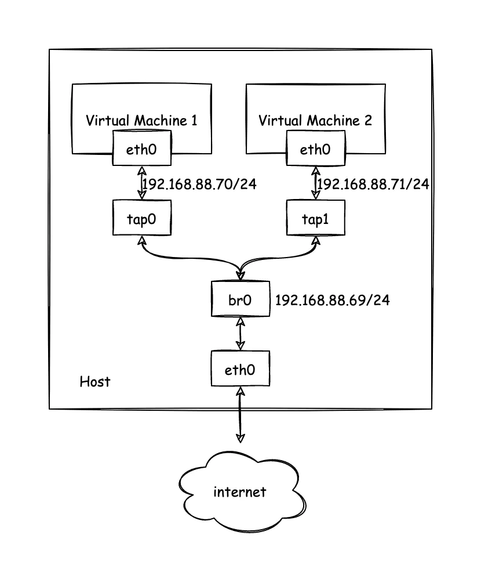

#### 路由route

route -n 查看路由表

ci-info: +--------+------+-----------------+---------------+-------+-------------------+
ci-info: +++++++++++++++++++++++++++++++++Route IPv4 info+++++++++++++++++++++++++++++++++
ci-info: +-------+-----------------+---------------+-----------------+-----------+-------+
ci-info: | Route |   Destination   |    Gateway    |     Genmask     | Interface | Flags |
ci-info: +-------+-----------------+---------------+-----------------+-----------+-------+
ci-info: |   0   |     0.0.0.0     | 192.168.234.1 |     0.0.0.0     |    eth0   |   UG  |
ci-info: |   1   | 169.254.169.254 | 192.168.234.2 | 255.255.255.255 |    eth0   |  UGH  |
ci-info: |   2   |  192.168.234.0  |    0.0.0.0    |  255.255.255.0  |    eth0   |   U   |
ci-info: +-------+-----------------+---------------+-----------------+-----------+-------+


U：  route is up

H:  target is a host

G:  use gateway


常用命令

定位网络命令

Tracert  ip


#### dns解析定位过程

vmware虚拟机上启动的dokcer服务80端口访问，报错502, 

虚拟机上/var/log/messages    报错：114.114.114.114:53 网关超时

排查

虚拟机和宿主机是否通

tcpdump  -i eth0 -nnvvv port 80

虚拟机是否可以联网

ping baidu.com

找到80端端口的容器，查看网卡

tcpdump  -i targetwagnka -nnvvv port 80 查看是否有流量

如果有流量，查看服务的问题


#### bridge+tap 网络实现nat

使用 TAP Network 配合 Bridge 实现的 NAT 网络拓扑如下，这种网络模式是我个人比较喜欢的方式，在该网络中，虚拟机拥有自己的 IP 宿主机可以直接访问虚拟机，虚拟机也能够直接访问宿主机。虚拟机访问外网时宿主机充当网关，实现 NAT 功能。物理网络中其他主机无法直接访问该虚拟机，不过可以在宿主机上使用 iptables 配置端口转发实现暴露虚拟机到物理网络。


创建名字为br0的网桥

```shell
ip link add name br0 type bridge
```

这之前需要做些准备工作，首先我们为之前创建的 bridge 配置 IP 地址，并启动 bridge。然后需要配置 Linux ip forwarding 以及 NAT 功能

```bash
ip addr add 192.168.100.1/24 brd + dev br0
ip link set br0 up
# 开启 ip_forward
sysctl -w net.ipv4.ip_forward=1
# 允许对从 br0 流入的数据包进行 FORWARD
iptables -t filter -A FORWARD -i br0 -j ACCEPT
iptables -t filter -A FORWARD -o br0 -j ACCEPT
# 也可以直接将 filter FORWARD 策略直接设置为 ACCEPT
# iptables -t filter -P FORWARD ACCEPT
# 开启 NAT
iptables -t nat -A POSTROUTING -o enp4s0 -j MASQUERADE
```

现在我们就可以使用 br0 实现 NAT 网络了，这里我们启动一个简单的 archlinux 的 live cd 作为测试

```bash
# 启动虚拟机
qemu-system-x86_64 -enable-kvm -m 2048 -boot order=d -cdrom archlinux-2021.10.01-x86_64.iso -nic bridge,br=br0,model=virtio-net-pci,mac=02:76:7d:d7:1e:3f
# 进入虚拟机后配置网卡
ip addr add 192.168.100.2/24 brd + dev ens3
ip route add default via 192.168.100.1 dev ens3
# 按需修改 /etc/resolv.conf 配置 DNS 服务器
```


#### TAP+Bridge 实现物理桥接

使用 TAP 配合 Bridge 也可以实现桥接物理，网络的拓扑如下，这个网络模式下，虚拟机作为和宿主机对等的关系接入物理网络。虚拟机，宿主机与网络中的其他主机均可相互访问。



这个模式与上面的 NAT 模式比较类似，不过不需要对宿主机进行特别的配置，只需要将物理机网卡加入 br0 中即可，这个时候 br0 相当于一个交换机，宿主机和虚拟机都连在这个交换机上。使用 `ip link set eth0 master bridge_name` 可以将物理网卡加入 bridge 中。


#### 网卡启动、停止Ifconfig


```
ifconfig eth0 down
ifconfig eth0 up

```

**ifconfig eth0来设置或者是修改了网络接口后，就无法再以ifdown eth0的方式来关闭了。**因为ifdown会分析比较目前的网络参数与ifcfg-eth0是否相符，不符的话，就会放弃这次操作。因此，使用ifconfig修改完毕后，应该要以ifconfig eth0 down才能够关闭该接口。

#### ifdown 和 ifup

ifup与ifdown两个程序其实是script而已，它会直接到 /etc/ sysconfig/network-scripts目录下搜索对应的配置文件，例如ifup eth0，它会找出ifcfg-eth0这个文件的内容，然后加以设置。关于ifcfg-eth0的设置请参考前一章连上Internet的说明。

​    ifdown 命令用来停用系统上指定的网卡，而 ifup 命令用来启动系统上指定的网卡。这两个命令的语法格式都非常简单，只要在命令之后空一格加上要停止或启动的网卡名（逻辑名）就可以了。

```
ifup eth0

ifdown eth0
```


#### brctl查看linux上网桥

```
brctl show 

```


ovn


#### iptables使用


```


iptables 是 Linux 系统中的一种用于控制网络数据包流动的工具。其中，net 表是 iptables 中的一个重要表，它可以用于在 IP 层面上对数据包进行过滤和修改，例如限制 IP 地址、端口、协议等。下面是查看 net 表的相关命令：

查看当前系统中已有的 iptables 规则及其对应表：
sudo iptables -L -n -v
其中，-L 参数用于列出规则，-n 参数用于不将 IP 地址和端口号解析为主机名和服务名，-v 参数用于显示更详细的信息。

仅查看 net 表中的规则：
sudo iptables -L -n -v -t mangle
通过加上 -t mangle 参数可以选择只显示 net 表中的规则。mangle 表是 iptables 中的一个附加表，用于实现更细粒度的数据包操作。

显示每条规则对应的详细信息：
sudo iptables -S -t mangle
-S 参数用于列出具体的规则，包括规则链的名称、匹配条件、动作等信息。这样可以更方便地理解和修改每条规则的含义和作用。

总之，通过使用上述命令可以查看系统中当前生效的 net 表规则，帮助用户更好地了解系统的网络配置和安全策略。


iptables -L -n -t nat
因此，执行 iptables -L -n -t nat 命令可以列出当前系统中生效的 nat 表规则，并显示每条规则对应的源 IP、源端口、目标 IP、目标端口等信息

```


