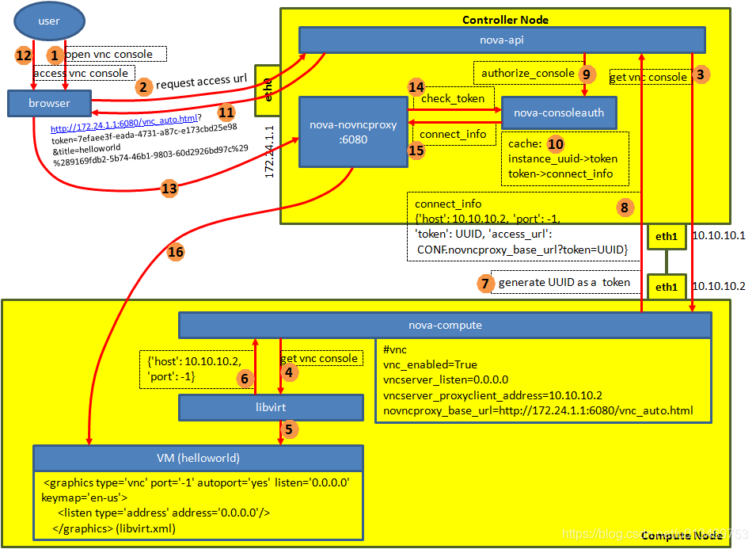

## vnc配置(密码)


### 一、vnc配置

#### 控制节点


yum install -y openstack-nova-novncproxy 


配置nova.conf

```
[DEFAULT]
my_ip = 192.168.230.173
use_neutron = true
vnc_enabled=true
novnc_enalbed=true
ssl_only=false
[vnc]
enabled = true
server_listen = $my_ip
server_proxyclient_address = $my_ip
#password=123456

```


启动

```
systemctl start openstack-nova-spicehtml5proxy.service
systemctl enable openstack-nova-spicehtml5proxy.service
systemctl restart openstack-nova-*
```

重启nova服务


#### 计算节点

```
[DEFAULT]
my_ip = 192.168.230.174
vnc_enabled=true
novnc_enabled=true
resize_confirm_window=30

[vnc]
enabled = true
server_listen = 0.0.0.0
server_proxyclient_address = $my_ip
#novncproxy_base_url = http://192.168.230.173:6080/vnc_auto.html
novncproxy_base_url = http://192.168.230.173:6080/vnc.html
password=123456

```

#### vnc访问流程




### 二、vnc密码配置

参考链接：

https://blog.csdn.net/u013469753/article/details/106692758

https://segmentfault.com/a/1190000040482153


#### 2.1 修改配置文件

计算节点  /etc/nova/nova.conf
```
...
[vnc]  
...
# 待优化，更改成vnc_auto，云管界面上自动输入密码
novncproxy_base_url=http://127.0.0.1:6080/vnc.html
...
```


#### 2.2 修改代码 

##### 控制节点

新增nova/console/rfb/authvnc.py

```

from nova.console.rfb import auth


class RFBAuthSchemeVnc(auth.RFBAuthScheme):

    def security_type(self):
        return auth.AuthType.VNC

    def security_handshake(self, compute_sock):
        return compute_sock

```


nova/conf/vnc.py

```
    ......
    cfg.PortOpt(
        'password',
        default=123456,
        deprecated_group='DEFAULT',
        help="""
        set vnc password
"""),
	.......
    cfg.ListOpt(
        'auth_schemes',
        item_type=types.String(choices=(
            ('none', 'Allow connection without authentication'),
            ('vencrypt', 'Use VeNCrypt authentication scheme'),
            ('vnc', 'Use VNC with password authentication scheme'),
        )),
        default=['none'],
        help="""
```


nova/console/rfb/auths

```
# 增加代码

from nova.console.rfb import authvnc


class RFBAuthSchemeList(object):

    AUTH_SCHEME_MAP = {
		......
        "vnc": authvnc.RFBAuthScheme
    }


```

nova/console/securityproxy/rfb.py

```

from oslo_config import cfg
CONF = cfg.CONF


    def connect(self, tenant_sock, compute_sock):
		......
        if CONF.vnc.auth_schemes[0] in "none":
            tenant_sock.sendall(auth.AUTH_STATUS_PASS + six.int2byte(auth.AuthType.NONE))
            client_auth = six.byte2int(recv(tenant_sock, 1))

            if client_auth != auth.AuthType.NONE:
                self._fail(tenant_sock, compute_sock,
                       _("Only the security type None (%d) is supported") %
                       auth.AuthType.NONE)

                reason = _("Client requested a security type other than None "
                           "(%(none_code)d): %(auth_type)s") % {
                               'auth_type': client_auth,
                               'none_code': auth.AuthType.NONE}
                raise exception.SecurityProxyNegotiationFailed(reason=reason)
        elif CONF.vnc.auth_schemes[0] in "vnc":
            tenant_sock.sendall(auth.AUTH_STATUS_PASS + six.int2byte(auth.AuthType.VNC))
            client_auth = six.byte2int(recv(tenant_sock, 1))
            if client_auth != auth.AuthType.VNC:
                self._fail(tenant_sock, compute_sock,
                           _("Only the security type Vnc (%d) is supported") %
                           auth.AuthType.VNC)
                reason = _("Client requested a security type other than VNC "
                           "(%(vnc_code)d): %(auth_type)s") % {
                             'auth_type': client_auth,
                             'vnc_code': auth.AuthType.VNC}
                raise exception.SecurityProxyNegotiationFailed(reason=reason)

		......
```


##### 计算节点

nova/virt/libvirt/config.py

```
from olso_config import cfg

CONF = cfg.CONF


class LibvirtConfigGuestGraphics(LibvirtConfigGuestDevice):
    ...
    def format_dom(self):
 		......
        if self.listen:
            dev.set("listen", self.listen)
        if CONF.vnc.vnc_password:
            dev.set("passwd", CONF.vnc.vnc_password)
        return dev


```

nova/conf/vnc.py

```
    ......
    cfg.PortOpt(
        'password',
        default=123456,
        deprecated_group='DEFAULT',
        help="""
        set vnc password
"""),
	.......
    cfg.ListOpt(
        'auth_schemes',
        item_type=types.String(choices=(
            ('none', 'Allow connection without authentication'),
            ('vencrypt', 'Use VeNCrypt authentication scheme'),
            ('vnc', 'Use VNC with password authentication scheme'),
        )),
        default=['none'],
        help="""
```


