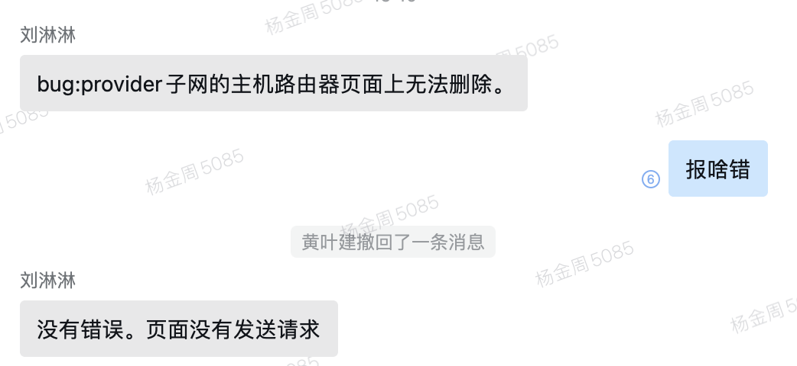

### todo


api/home_page/usage_rank?type=host接口异常(数据不准确)

如果不用模块，请求api，返回空（比如ironic）

节点网络数据，首页

告警数据不一致

云管配置文件cpu/disk/memory超分，接口方式获取， placement

云管归一逻辑，统一增加sid逻辑


node_info(网卡列表)优化

1号工程部署调试


##### ☆☆☆☆鹤壁

Octavia/ironic-------api（done）

21/22-------node-info-----disk-num/disk_name(done)

26--node-info---------cpu_num-----------未能区分(done)

26---ceilometer-----network detail-----ceilometrer没有metric(增加了bond)

21-----ceilometer-----ascii error (done)

236.22   ceilometer    fdisk(done)

确认各个节点时间是否一致


 openstack server create hebi-ft-execotor- \
   --image 480d2922-b13f-4daf-a55b-670f77c579e4  \
   --flavor c453122c-df9e-459b-a4ec-b5e90d51132b \
   --availability-zone ft-nova:ft-compute-1\
   --nic net-id=98faabb3-571f-44f4-8e6d-8ccd64676de7,v4-fixed-ip=192.168.231.55 --wait


##### 定位网络问题的命令

```javascript
tracert ip
route -n
ip netns 
ip route
ip  a
brctl show
ovs-vsctl
bridge fdb # bridge fdb展示的是隧道信息
bridge fdb shwo dev vxlan-3
tcpdump -i eth0 -nnvvv
tcpdump -i dev icmp -nnvvv
vrish edit domain-id  # 查看虚拟机xml信息，有网卡信息
virsh dumpxml domain-id
```


##### 本周任务

1. 
2. 
3. 


##### 待处理

horizon拟态部署问题，检测运行情况，优化部署环节，测试方法

容器网络，两个子网报错问题（调研）

云主机、云硬盘（底层支持并发）


##### [新环境下部署]() horizon

mysqlclient 需要先安装yum install python3-devel

cryptography==3.4.7需要先升级pip3到21版本以上

环境需要安装crontabs (yum install crontabs -y)


##### 云主机 实例删除，日志报错，找不到实例id 

```
 File "/usr/lib/python2.7/site-packages/nova/db/sqlalchemy/api.py", line 1904, in _instance_get_by_uuid
  raise exception.InstanceNotFound(instance_id=uuid)

InstanceNotFound: Instance 654720ca-3b17-41a2-9abf-d6fd4d9ccee3 could not be found.
: InstanceNotFound_Remote: Instance 654720ca-3b17-41a2-9abf-d6fd4d9ccee3 could not be found.
```

操作如下：

```python
import pymysql


HOST = '192.168.230.107'
PORT = 3306
USER = "root"
PASSWORD = "comleader@123"
db = "nova"

db = pymysql.connect(host=HOST, port=PORT, user=USER, password=PASSWORD, database=db)


def execute_sql(sql_code, action="execute"):
    global db
    while True:
        try:
            cursor = db.cursor(cursor=pymysql.cursors.DictCursor)
            cursor.execute(sql_code)
            if action == "query":
                data = cursor.fetchall()
                return data
            else:
                print(sql_code)
                excute_ret = db.commit()
                print(excute_ret)
                return
        except Exception as e:
            print(str(e))
            try:
                db = pymysql.connect(host=HOST, port=PORT, user=USER, password=PASSWORD, database=db)

                db.ping(reconnect=True)
            except Exception as e:
                print(str(e))
                break


def clean_nova_instance_from_db(target_uuid):
    sql1 = f'select id from instance_actions where instance_uuid="{target_uuid}";'
    sql = ''
    action_ids = execute_sql(sql1, action="query")
    for action_id_item in action_ids:
        action_id = action_id_item.get("id")
        tmp_sql = f"delete from instance_actions_events where action_id='{action_id}';"
        sql += tmp_sql
        print(action_id)

    total_sqls = f"{sql}delete from block_device_mapping where instance_uuid='{target_uuid}';delete from instance_actions where instance_uuid='{target_uuid}';delete from instance_extra where instance_uuid='{target_uuid}';delete from instance_faults where instance_uuid='{target_uuid}';delete from instance_groups where uuid='{target_uuid}';delete from instance_id_mappings where uuid='{target_uuid}';delete from instance_info_caches where instance_uuid='{target_uuid}';delete from instance_metadata where instance_uuid='{target_uuid}';delete from instance_system_metadata where instance_uuid='{target_uuid}';delete from migrations where instance_uuid='{target_uuid}';delete from virtual_interfaces where instance_uuid='{target_uuid}';delete from instances where uuid='{target_uuid}';"

    sql_list = total_sqls.split(";")[:-1]
    for sql in sql_list:
        execute_sql(sql)


target_uuid = "9c3b7959-0154-4ab7-a86b-8623e2a15b75"
clean_nova_instance_from_db(target_uuid)


db = pymysql.connect(host=HOST, port=PORT, user=USER, password=PASSWORD, database="nova_api")


execute_sql(f"delete from instance_mappings where instance_uuid='{target_uuid}';")
execute_sql(f"delete from request_specs where instance_uuid='{target_uuid}';")
execute_sql(f"delete from instance_group_member where instance_uuid='{target_uuid}';")


db = pymysql.connect(host=HOST, port=PORT, user=USER, password=PASSWORD, database="nova_cell0")
execute_sql(f'delete from instances where uuid="{target_uuid}";')
execute_sql(f'delete from block_device_mapping where instance_uuid="{target_uuid}";')
execute_sql(f'delete from instance_actions where instance_uuid="{target_uuid}";')
execute_sql(f'delete from instance_id_mappings where uuid="{target_uuid}";')
execute_sql(f'delete from instance_system_metadate where instance_uuid="{target_uuid}";')


```


##### 删除僵尸卷

```


# 更改状态后删除


# 删除本地或者远端实际的卷
rbd rm volumes/volume-01fe7a5c-df4b-42c0-9b22-f4004d99235c


# 删除数据库卷相关数据


```


master执行脚本时命令及错误

```


+ _prefix=192.168.66.29:80/openstack_magnum/
+ atomic install --storage ostree --system --system-package no --set REQUESTS_CA_BUNDLE=/etc/pki/tls/certs/ca-bundle.crt --name heat-container-agent 192.168.66.29:80/openstack_magnum/heat-container-agent:stein-dev
time="2022-04-28T02:03:24Z" level=fatal msg="Error determining manifest MIME type for docker://192.168.66.29:80/openstack_magnum/heat-container-agent:stein-dev: pinging docker registry returned: Get https://192.168.66.29:80/v2/: http: server gave HTTP response to HTTPS client" 


```


##### tolearn

aiohttp/asyncio/webserver
rpc服务构建/aysncio/aiohttp
network analysis
go/k8s
vue/html/css


##### 部署修改部分

gnocchi-api、gnocchi-metricd、控制节点、计算节点都需要安装
gnocchi.conf配置文件更新
gnocchi-api/..monitor-cache/alarm.....uwsgi启动的，增加gevent模块
openstack-node-info，部署(nova免密登录、python3）
gnocchi/ceilometer/包更新

日志切割处理

/etc/logrotate.d/gnocchi；/etc/logrotate.d/ceilometer；/etc/logrotate.d/gnocchi；/etc/logrotate.d/monitor-cache ;/etc/logrotate.d/alarm (部分可以打到rpm包里执行)

ngiix配置，/api/aodh/,/api/ceilometer/,等配置

kp节点 sysstat安装


##### 监控拟态分离设计与优化

```python
/api/monitor要迁移接口
url(r'^instances/system_resources$', csrf_exempt(views.InstanceSystemResourceView.as_view()), name='获取vm实例'),(已用缓存处理，暂时不用修改)
    url(r'^instances/system_resources/vm_hardware_name$', csrf_exempt(views.VmHardwareNameApi.as_view()), name='获取云主机网卡/硬盘名称'),


```


前端需要改的

```
1、插件式前端页面部署
2、部门详情页面、项目详情页面
3、云主机、容器、云硬盘状态，限制条件、云物理机在某种状态下可进行操作的逻辑修改（看他们方案是否已经出来）
4、容器、镜像仓库页面（贺印啥时候可以处理，）
5. 缓存问题，比如修改编辑安全组，更换另一个实例，还是会出现问题
6. 页面项目切换，显示项目切换成功，但是实际内容比如实例列表还是没有切换
7. 监控拟态分离，接口变更
8. admin项目下，某些资源项不允许创建（云主机/容器/网络/负载均衡器/路由器/安全组/）

```


bug记录处理


1. 




2. 修改项目配额，云硬盘容量不生效，安全组规则不生效


