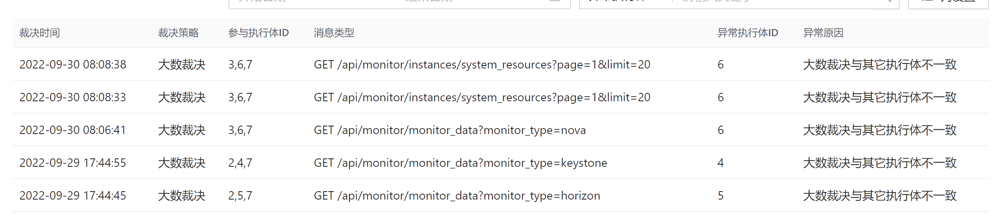

## todo


### 定位网络问题的命令

```javascript
tracert ip
route -n
ip netns 
ip route
ip  a
brctl show
ovs-vsctl
bridge fdb # bridge fdb展示的是隧道信息
bridge fdb shwo dev vxlan-3
tcpdump -i eth0 -nnvvv
tcpdump -i dev icmp -nnvvv
vrish edit domain-id  # 查看虚拟机xml信息，有网卡信息
virsh dumpxml domain-id
```


### 本周任务


- 


### 脚本处理僵尸云主机、云硬盘

#### 云主机 实例删除，日志报错，找不到实例id 

```
 File "/usr/lib/python2.7/site-packages/nova/db/sqlalchemy/api.py", line 1904, in _instance_get_by_uuid
  raise exception.InstanceNotFound(instance_id=uuid)

InstanceNotFound: Instance 654720ca-3b17-41a2-9abf-d6fd4d9ccee3 could not be found.
: InstanceNotFound_Remote: Instance 654720ca-3b17-41a2-9abf-d6fd4d9ccee3 could not be found.
```

操作如下：

```python
import pymysql


HOST = '192.168.230.107'
PORT = 3306
USER = "root"
PASSWORD = "comleader@123"
db = "nova"

db = pymysql.connect(host=HOST, port=PORT, user=USER, password=PASSWORD, database=db)


def execute_sql(sql_code, action="execute"):
    global db
    while True:
        try:
            cursor = db.cursor(cursor=pymysql.cursors.DictCursor)
            cursor.execute(sql_code)
            if action == "query":
                data = cursor.fetchall()
                return data
            else:
                print(sql_code)
                excute_ret = db.commit()
                print(excute_ret)
                return
        except Exception as e:
            print(str(e))
            try:
                db = pymysql.connect(host=HOST, port=PORT, user=USER, password=PASSWORD, database=db)

                db.ping(reconnect=True)
            except Exception as e:
                print(str(e))
                break


def clean_nova_instance_from_db(target_uuid):
    sql1 = f'select id from instance_actions where instance_uuid="{target_uuid}";'
    sql = ''
    action_ids = execute_sql(sql1, action="query")
    for action_id_item in action_ids:
        action_id = action_id_item.get("id")
        tmp_sql = f"delete from instance_actions_events where action_id='{action_id}';"
        sql += tmp_sql
        print(action_id)

    total_sqls = f"{sql}delete from block_device_mapping where instance_uuid='{target_uuid}';delete from instance_actions where instance_uuid='{target_uuid}';delete from instance_extra where instance_uuid='{target_uuid}';delete from instance_faults where instance_uuid='{target_uuid}';delete from instance_groups where uuid='{target_uuid}';delete from instance_id_mappings where uuid='{target_uuid}';delete from instance_info_caches where instance_uuid='{target_uuid}';delete from instance_metadata where instance_uuid='{target_uuid}';delete from instance_system_metadata where instance_uuid='{target_uuid}';delete from migrations where instance_uuid='{target_uuid}';delete from virtual_interfaces where instance_uuid='{target_uuid}';delete from instances where uuid='{target_uuid}';"

    sql_list = total_sqls.split(";")[:-1]
    for sql in sql_list:
        execute_sql(sql)


target_uuid = "9c3b7959-0154-4ab7-a86b-8623e2a15b75"
clean_nova_instance_from_db(target_uuid)


db = pymysql.connect(host=HOST, port=PORT, user=USER, password=PASSWORD, database="nova_api")


execute_sql(f"delete from instance_mappings where instance_uuid='{target_uuid}';")
execute_sql(f"delete from request_specs where instance_uuid='{target_uuid}';")
execute_sql(f"delete from instance_group_member where instance_uuid='{target_uuid}';")


db = pymysql.connect(host=HOST, port=PORT, user=USER, password=PASSWORD, database="nova_cell0")
execute_sql(f'delete from instances where uuid="{target_uuid}";')
execute_sql(f'delete from block_device_mapping where instance_uuid="{target_uuid}";')
execute_sql(f'delete from instance_actions where instance_uuid="{target_uuid}";')
execute_sql(f'delete from instance_id_mappings where uuid="{target_uuid}";')
execute_sql(f'delete from instance_system_metadate where instance_uuid="{target_uuid}";')


```


#### 删除僵尸卷

```


# 更改状态后删除


# 删除本地或者远端实际的卷
rbd rm volumes/volume-01fe7a5c-df4b-42c0-9b22-f4004d99235c


# 删除数据库卷相关数据


```


master执行脚本时命令及错误

```


+ _prefix=192.168.66.29:80/openstack_magnum/
+ atomic install --storage ostree --system --system-package no --set REQUESTS_CA_BUNDLE=/etc/pki/tls/certs/ca-bundle.crt --name heat-container-agent 192.168.66.29:80/openstack_magnum/heat-container-agent:stein-dev
time="2022-04-28T02:03:24Z" level=fatal msg="Error determining manifest MIME type for docker://192.168.66.29:80/openstack_magnum/heat-container-agent:stein-dev: pinging docker registry returned: Get https://192.168.66.29:80/v2/: http: server gave HTTP response to HTTPS client" 


```


### tolearn

aiohttp/asyncio/webserver
rpc服务构建/aysncio/aiohttp
network analysis
go/k8s
vue/html/css


### 修改

#### 部署修改部分

gnocchi-api、gnocchi-metricd、控制节点、计算节点都需要安装
gnocchi.conf配置文件更新

日志切割处理

/etc/logrotate.d/gnocchi；/etc/logrotate.d/ceilometer； (部分可以打到rpm包里执行)

ngiix配置，/api/aodh/,/api/ceilometer/,等配置

kp节点 sysstat安装

Node_info服务  ，日志切割，日志位置更换 /var/log/host_info/host_info.log  

gnocchi负载均衡，gnocchi-api启动，用gnocchi用户

gnocchi负载均衡，nginx监听8047 ，其他所有节点走8041看是否有问题


#### 前端需要改的

```
已处理：
1、插件式前端页面部署（包括创建、编辑项目时候界面的参数）---已处理
2、部门详情页面、项目详情页面---已处理
5. 缓存问题或后端未归一（志宣定位nova归一问题），修改编辑安全组，---已处理
6. 页面项目切换，显示项目切换成功，但是实际内容比如实例列表还是没有切换---已处理
7. 监控拟态分离，接口变更（）---已处理
8. admin项目下，某些资源项不允许创建（云主机/容器/网络/负载均衡器/路由器/安全组/）---已处理
10. 云主机规格、部门、项目页面，内存、硬盘有G、T选项---已处理
11. 架构配置写成接口的形式---已处理
12. 网络路由器设置删除接口，是否发送请求---已处理
13. 监控设置，修改后，弹出数值为变动的弹窗---已处理
14. 大屏展示，告警top统计，告警状态改成 告警---已处理
15. 云主机列表，chagne_project，返回值没有显示---不显示，已处理
16. 项目详情，组件化部署时，负载均衡已经禁止，但是详情里有
17. 分配浮动ip后，绑定浮动ip接口，传参数，可用域，现在只有nova（ports_list）?unusedxxxxxx
18. 登录自动退出后，再次登录，有问题
19. 登录后不操作退出的时机，前端是如何控制的（后端接口，get   api/auth/logout，会返回一个时间，不手动操作后，一定时间强制退出

a. 调整云主机规格---过滤优化
b. iso镜像创建实例时，禁止创建云硬盘，
c. 可用状态云硬盘，增加创建镜像的接口（增加一个接口，页面参考创建镜像的页面，没有  架构，最小内存，操作系统，）
d. 禅道上分配的前端相关问题
e. 浮动ip绑定、解绑后，页面刷新缓慢，要等一会儿才能看到（后端网络处理完成需要的时间）
f. 云硬盘备份--隐藏，组件接口标识 cinder-backup
g. 大屏展示，不受限制，可以一直展示
h. 裸金属组件不显示，但是云物理机还显示；
i. default部门，禁止编辑
j. 项目详情，显示项目id
k. 项目状态：启动/禁用
l. 部门详情里，负载均衡还有显示，没显示部门id
m. 点击编辑项目，显示创建项目
n. docker镜像，架构必选，上传镜像格式指定
o. heat编排，云管理员可以看到编排模块（登录对应用户可看到）
q.  docker磁盘大小显示，0改成不限制
r. 路由器，创建时，网络非必选，可以不传或者外部网络，不传网络时，snat也不需要设置
s. 编辑镜像，可见性，第一次登录，点击编辑镜像，可见性那里没有返回的默认显示


未处理：
3、云主机、容器、云硬盘状态，限制条件、云物理机在某种状态下可进行操作的逻辑修改（）
4、容器、镜像仓库页面（）
9. 增强型快照接口

新发现：
p. 插件式部署，创建项目、编辑项目、创建部门、编辑部门里组件参数没有同步显示或隐藏
t. admin项目详情，-1改成不限制
1. 云硬盘-更多操作，点击更改状态，显示in-use
2. 容器镜像，增加接口
3. 容器镜像创建、编辑、增加tag标签
4. 创建容器，增加挂载已有云硬盘
5. 项目详情，没有已用信息

```


#### bug

- 部署问题优化 
  - 有时候执行体启动不了，是created的状态
  - 执行体离线原因，清洗后也启动不了的原因(跟鹏辉定位，网络没有删除成功，导致容器启动失败，鹏辉那儿清洗脚本优化了，后续继续观察)
  - 裁决日志，大数不一致，处理方法
  - 主机监控，详情，首次点进去，网络监控数据获取为空，多切换几次网卡后，有数据返回
  - 
  
  
  
- 2新bug
  
  - 处理删除项目后，云主机等冗余资源
  - 云主机列表、路由列表（已处理）、项目列表、操作日志、接口  时间超过1s
  - 镜像列表，接口，需要优化
  - 云主机，软删除，恢复，软删除，恢复，然后对该云主机创建原生快照，提示状态为soft_delete，无发创建
  - 首次登录，发现页面上有屏蔽的组件还是显示
  - node_info做成rpm包
  - ceilometer打包 entry_points.txt打进去，用官方的spec试试
  
  


镜像处理

容器镜像列表--------镜像仓库列表

容器镜像上传(上传到镜像仓库)----在容器-更多操作-

容器镜像下载(pull)  ，创建容器时，使用的镜像

容器镜像修改---通过habor

容器镜像 tag修改--通过harbor

容器镜像删除--通过harbor

创建容器，增加已有卷，挂载


优化权限问题，尽量取消sudoers那里的配置

2022-10-27 10:08:15.123 16314 ERROR ceilometer.hardware.inspector.snmp [-] converter is int or float and value is empty str (EndOfMibView()), handle this value to zero, please check the reason: Exception: exec command failed. ret_code: 1, command: sudo fdisk -l | grep Disk|grep /dev/sd, stdout: , stderr: 


vim  /etc/sudoers

```
ceilometer ALL= (root) NOPASSWD:ALL

```


分片上传

断点续传

大镜像上传

1.容器创建接口修改，增加创建容器时挂载已有硬盘的情况；
2.大镜像上传问题调研，目前根据搜集的资料有三种方案（可行性需要调研与测试）；
 2.1 nginx接收切片，利用nginx的handler处理或合并请求，然后上传后调用glanceapi上传（可能需要开发nginx模块或者适配，调研中）；
 2.2 改造glance接口，前端处理切片，glance接收后合并，然后调用glanceapi上传（改动代码量大，另外glanceapi改造后需要测试是否影响其他功能）；
 2.3 前端分片上传，在控制节点写一个服务，接收分片，重组后，调用glanceapi上传镜像（增加了服务组件）；
 2.4 基于ftp服务，上传到ftp等服务器，然后控制节点拉取镜像然后上传(需要控制节点写服务)。


1. nginx负责切片功能，保证上传成功，上传后调用glanceapi上传；
2. 改造glance，前端切片，glance接收，然后合并后调用glanceapi上传；
3. 前端分片上传，在控制节点写一个服务，接收分片，重组后，调用glanceapi上传镜像；
4. 

监控  console使用


232环境，云主机列表刷新报错问题定位，项目管理列表报错定位

编排创建实例报错问题定位

珠海云 列表刷新错误问题定位，增加日志查问题

232环境网关超时

云硬盘列表，空的时候报错

修改项目配额，云硬盘大小不能小于1（前端转换后未反应过来）


