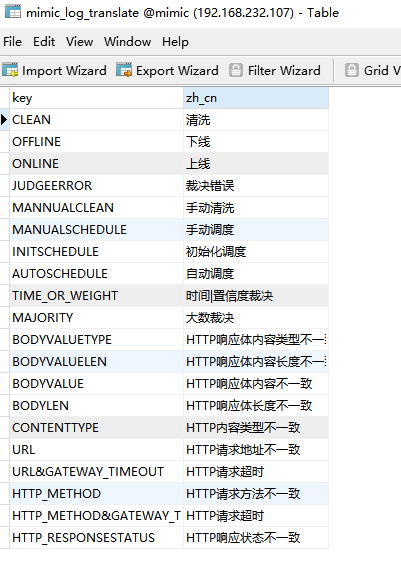
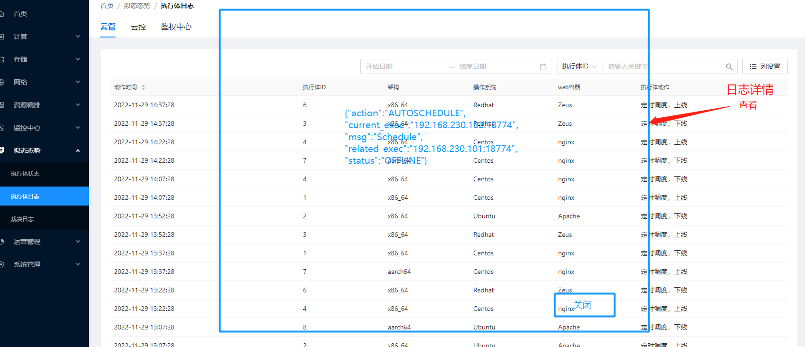
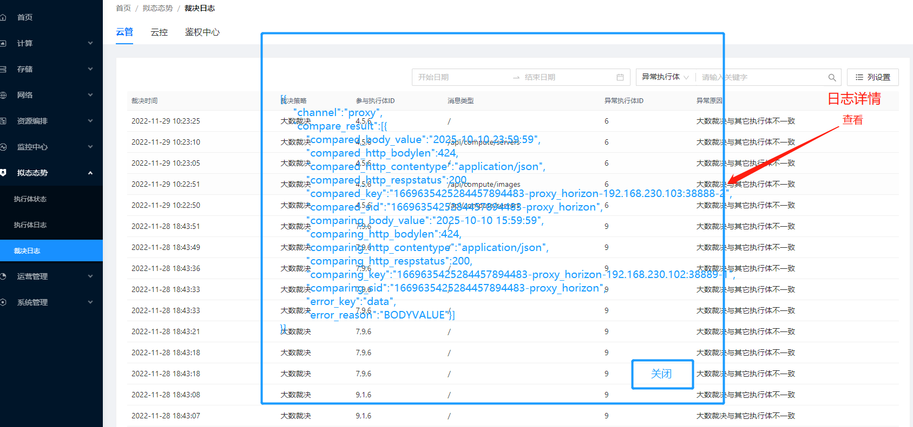

## todo


### 本季度任务

- 告警接口测试
- 云管相关接口总耗时情况，及处理速度优化
  - 项目列表、操作日志、接口  时间超过1s（已处理）
  - 镜像列表（已处理）
  - 项目操作、项目用户操作相关接口优化（已处理）
- 
- 网卡状态监控设计，前后端对接
- goncchi接口测试，pool is closed如何复现问题
- 计算节点适配（gnocchi/snmp/ceilometer/redis）
- 计算节点，gnocchi/ceilometer打包（rpm包）
- 平台适配（ubuntu执行体节点适配）
- 原生快照、增强型快照设计、开发、优化
- 网络拓扑图配合前端开发与测试
- 接口中文化
- Node_info做成rpm包
- 


#### 原生快照接口

1. 原生接口快照改动设计；
    1.1 原来云主机页面的创建快照更换后端接口为增强型快照的接口；
    1.2 原来云主机页面更多里增加 创建备份，后端接口是原生快照的接口生接口；
    1.3 原来云主机快照模块，等底层nova开发完成后，作为实际的云主机快照页面；
    1.4 在计算模块，增加云主机备份，后端对接的是原生快照接口；
2. 增强型快照接口页面与云管设计开发（由于底层nova未开发完成，等底层完成后开发）；


#### 网卡状态监控

1.网卡状态设计初步方案;
  1.1 前端显示：在主机监控主机详情中，增加网卡状态信息的显示
  1.2 前端显示：可以过滤，默认只显示在线状态的网卡（过滤规则：全部物理网卡、在线物理网卡）
  1.3 后端处理：node_info收集所有物理网卡信息(已处理)（node_info中，放开限制，获取所有物理机上的网卡，同时过滤掉虚拟机的；）
  1.4 底层处理：ceilometer处理所有物理网卡信息，收集和获取网卡状态（已处理）（  ceilometer源码中修改判断网卡状态逻辑，之前通过改动metric，及snmp.yaml里的oid来区分，data_process代码里过滤了物理网卡，现在放开限制，但是过滤掉虚拟机的nic进行测试；）
  1.5 后端处理：提供前端显示逻辑所需要的接口及数据（已完成）
  1.6 后端处理：修改原来接口


### 新增任务

- 处理删除项目/部门后，云主机等冗余资源

  - 删除前判断是否还有其他资源（已处理）

- 大镜像上传问题处理 

- 新调度策略下，license/celery运行情况（新处理登录时要同步一次，只靠beat有时间间隔）

- 新调度策略下，云管执行体展示、拟态处理修改（已处理）

- 云主机，软删除，恢复，软删除，恢复，然后对该云主机创建原生快照，提示状态为soft_delete，无发创建

- 常用接口压测

- sw适配：主机监控、云主机监控、ceilometer/gnocchi/snmp组件、nova/cinder/neutron组件

- 调研

  - consule监控使用

  - 大镜像上传问题

- 珠海云
  - 修改项目的代码需要更新，否则报错（2022/11/23发现的问题）已经修改并挂在到珠海云代码中
  - 
  
- 日志info总是两条

- node_info改造

- 负载均衡配额（所有配额使用的地方都要修改），返回数据没有已使用，修改源码或云管代码增加已使用

- 普通用户没有申请云硬盘的操作或者删除的操作，没有删除自己创建容器的按钮，云主机只有软删除，考虑加上云主机回收站

- 新需求评估（新云平台）

- Nova、cinder (neutron)并发创建资源（）

- libvirt获取磁盘利用率(可靠性)

- 应用中心（编排模板）（先定设计，制定步骤，按照步骤深入研究）

  - 含有nginx的虚拟机编排
  - 能修改nginx配置并启动服务的虚拟机编排
  - 指定网络(网络-子网-dhcp-静态ip地址)的虚拟机编排
  - 含有mysql服务的虚拟机编排
  - 能修改mysql配置并可控制服务启动的虚拟机编排
  - 含有redis服务的虚拟机编排
  - 可修改redis配置并控制服务的虚拟机编排
  - 其他常用服务（先单独研究）
  - 固定组合（nginx-mysql、等）编排
  - 

- 兼容超融合（多云管理）、vmware、华为云（在上层，设计，可选云或者超融合等）（多云管理，云的相互用）
  
- magnum容器编排
  
- rpm包打包(node_info/ceilometer/gnocchi)
  
- openstack tacker
  
- nova主机管理，底层不支持向上分页
  
- nova云主机，查询参数ip，设置
  
- 
  
  
  
  
  
  
  
  


#### 大镜像上传问题


分片上传

断点续传

大镜像上传

1.容器创建接口修改，增加创建容器时挂载已有硬盘的情况；
2.大镜像上传问题调研，目前根据搜集的资料有三种方案（可行性需要调研与测试）；
 2.1 nginx接收切片，利用nginx的handler处理或合并请求，然后上传后调用glanceapi上传（可能需要开发nginx模块或者适配，调研中）；
 2.2 改造glance接口，前端处理切片，glance接收后合并，然后调用glanceapi上传（改动代码量大，另外glanceapi改造后需要测试是否影响其他功能）；
 2.3 前端分片上传，在控制节点写一个服务，接收分片，重组后，调用glanceapi上传镜像（增加了服务组件）；
 2.4 基于ftp服务，上传到ftp等服务器，然后控制节点拉取镜像然后上传(需要控制节点写服务)。


1. nginx负责切片功能，保证上传成功，上传后调用glanceapi上传；
2. 改造glance，前端切片，glance接收，然后合并后调用glanceapi上传；
3. 前端分片上传，在控制节点写一个服务，接收分片，重组后，调用glanceapi上传镜像；
4. 


#### 总耗时长的请求日志


```
# 接口增删改查都要确认下
[2022-11-25 09:43:52,004] - [task_id:api] - [base.py:222] - [INFO][request: /api/auth/change_project -method: POST -total time consuming: 4] (只有登录接口请求)

[2022-11-25 09:44:30,776] - [task_id:api] - [base.py:222] - [INFO][request: /api/project_manager/domain_users -method: PUT -total time consuming: 3] (串联请求改成并发)


[2022-11-25 09:56:03,298] - [task_id:api] - [base.py:222] - [INFO][request: /api/auth/change_domain -method: GET -total time consuming: 2] （有删除后重试查询的逻辑，）


[2022-11-25 10:37:45,232] - [task_id:api] - [base.py:222] - [INFO][request: /api/operate/order_async -method: POST -total time consuming: 3]  (创建资源)

[2022-11-25 10:54:17,579] - [task_id:api] - [base.py:222] - [INFO][request: /api/compute/servers -method: GET -total time consuming: 2]


[2022-11-25 13:46:41,119] - [task_id:api] - [base.py:222] - [INFO][request: /api/project_manager/projects -method: PUT -total time consuming: 3]

```


#### 拟态开关

1、mimic数据库configurable_mimic_config表增加一条拟态开关配置项 mimic_switch，
配置默认为on，即拟态开关打开状态，需在部署阶段初始化为默认值
sql语句如下：
INSERT INTO configurable_mimic_config (`conf_key`, `conf_value`) VALUES ('mimic_switch', 'on');

2、前端页面拟态态势页面增加一个按钮，全局管理云管、云控、keystone拟态是否开启

3、拟态开关关闭状态，即非拟态状态，前端拟态态势页面上下线清洗操作需要置灰不能操作，上下线清洗只针对拟态开关打开状态有效

4、拟态开关配置接口
POST https://192.168.232.107/api/manual
header头增加
manual: config_mimic_switch

请求body如下：
{"mimic_switch": "off"}

mimic_switch只有两个值，on/off，代表拟态开关的打开/关闭状态

返回值：
{
    "code": 200,
    "msg": "",
    "success": true,
    "data": {}
}

5、拟态开关状态查询接口
GET https://192.168.232.107/api/manual
header头增加
manual: get_mimic_switch

返回值如下：

{
    "code": 200,
    "msg": "",
    "success": true,
    "data": {
        "mimic_switch": "on"
    }
}

mimic_switch只有两个值，on/off，代表拟态开关的打开/关闭状态


#### 裁决日志详情


- 页面需要修改的地方：
  执行体日志:
  1，执行体动作列，需从translate接口获取，根据当前列字段和接口字段进行替换，可为多个，逗号分隔；
  2，新增日志详情列，用于查看日志详情，每个条目有查看按钮；
  3，详情弹出一个模式框，内容为json，框体设定一定大小，可上下滑动。
  裁决日志：
  1，裁决策略列，需从translate接口获取，根据当前列字段和接口字段进行替换；
  2，异常原因列，需从translate接口获取，根据当前列字段和接口字段进行替换，可为多个，逗号分隔
  3，详情弹出一个模式框，内容为json，框体设定一定大小，可上下滑动。

- 弹出json内容，要根据用户角色过滤，只有云管理员可以显示所有详情，其他用户，找需要的显示就行

- 云管需要修改：
  新增一个mimic_log_translate表，新增一个translate接口，返回mimic_log_translate表英文中文对照表

  









### 本周任务

- 前端对接

- 普通用户创建实例，安全组多选问题处理

- 拟态态势，日志详情处理，对接、

- 

  

- 非拟态前端改造

- - 首页报错问题（去掉请求拟态接口）
  - 首页请求拟态接口
  - 首页执行体等页面设计
  - cinder_type 组件化显示
  - 拟态态势组件化显示
  
- 非拟态云管改造

- - 主机管理-分页处理
  - 云主机，增加ip查询的方式
<<<<<<< Updated upstream
  - 网络列表分页处理，网络列表（名称、ip查询）暂不处理
- 云管打docke镜像（dockerfile从陈凯那儿拿）
- 网络类型接口化
=======
  - 网络列表分页处理，网络列表（名称、ip查询）
  
- 网卡状态（kp-compute在线没有网卡）

- 

>>>>>>> Stashed changes
- 四方达

- 


### docker配置代理

```
docker服务配代理的方法，配上代理后就可以下载dockerhub镜像：
mkdir -p /etc/systemd/system/docker.service.d
cat >   /etc/systemd/system/docker.service.d/http-proxy.conf << eof
[Service]
Environment="HTTP_PROXY=192.168.66.77:3128"
Environment="HTTPS_PROXY=192.168.66.77:3128"
Environment="NO_PROXY=192.168.*.*,*.local,localhost,127.0.0.1"
eof

systemctl daemon-reload
systemctl restart docker
```


centos配置代理


```
export proxy="http://192.168.66.77:3128"
export http_proxy=$proxy
export https_proxy=$proxy
export ftp_proxy=$proxy
export no_proxy="localhost, 127.0.0.1, ::1"
```


### 脚本处理僵尸云主机、云硬盘

#### 云主机 实例删除，日志报错，找不到实例id 

```
 File "/usr/lib/python2.7/site-packages/nova/db/sqlalchemy/api.py", line 1904, in _instance_get_by_uuid
  raise exception.InstanceNotFound(instance_id=uuid)

InstanceNotFound: Instance 654720ca-3b17-41a2-9abf-d6fd4d9ccee3 could not be found.
: InstanceNotFound_Remote: Instance 654720ca-3b17-41a2-9abf-d6fd4d9ccee3 could not be found.
```

操作如下：

```python
import pymysql


HOST = '192.168.232.107'
PORT = 3306
USER = "root"
PASSWORD = "comleader@123"
db = "nova"

db = pymysql.connect(host=HOST, port=PORT, user=USER, password=PASSWORD, database=db)


def execute_sql(sql_code, action="execute"):
    global db
    while True:
        try:
            cursor = db.cursor(cursor=pymysql.cursors.DictCursor)
            cursor.execute(sql_code)
            if action == "query":
                data = cursor.fetchall()
                return data
            else:
                print(sql_code)
                excute_ret = db.commit()
                print(excute_ret)
                return
        except Exception as e:
            print(str(e))
            try:
                db = pymysql.connect(host=HOST, port=PORT, user=USER, password=PASSWORD, database=db)

                db.ping(reconnect=True)
            except Exception as e:
                print(str(e))
                break


def clean_nova_instance_from_db(target_uuid):
    sql1 = f'select id from instance_actions where instance_uuid="{target_uuid}";'
    sql = ''
    action_ids = execute_sql(sql1, action="query")
    for action_id_item in action_ids:
        action_id = action_id_item.get("id")
        tmp_sql = f"delete from instance_actions_events where action_id='{action_id}';"
        sql += tmp_sql
        print(action_id)

    total_sqls = f"{sql}delete from block_device_mapping where instance_uuid='{target_uuid}';delete from instance_actions where instance_uuid='{target_uuid}';delete from instance_extra where instance_uuid='{target_uuid}';delete from instance_faults where instance_uuid='{target_uuid}';delete from instance_groups where uuid='{target_uuid}';delete from instance_id_mappings where uuid='{target_uuid}';delete from instance_info_caches where instance_uuid='{target_uuid}';delete from instance_metadata where instance_uuid='{target_uuid}';delete from instance_system_metadata where instance_uuid='{target_uuid}';delete from migrations where instance_uuid='{target_uuid}';delete from virtual_interfaces where instance_uuid='{target_uuid}';delete from instances where uuid='{target_uuid}';"

    sql_list = total_sqls.split(";")[:-1]
    for sql in sql_list:
        execute_sql(sql)


target_uuid = "955a2154-75b6-4910-ac49-5b14d02c2a10
"
clean_nova_instance_from_db(target_uuid)


db = pymysql.connect(host=HOST, port=PORT, user=USER, password=PASSWORD, database="nova_api")


execute_sql(f"delete from instance_mappings where instance_uuid='{target_uuid}';")
execute_sql(f"delete from request_specs where instance_uuid='{target_uuid}';")
execute_sql(f"delete from instance_group_member where instance_uuid='{target_uuid}';")


db = pymysql.connect(host=HOST, port=PORT, user=USER, password=PASSWORD, database="nova_cell0")
execute_sql(f'delete from instances where uuid="{target_uuid}";')
execute_sql(f'delete from block_device_mapping where instance_uuid="{target_uuid}";')
execute_sql(f'delete from instance_actions where instance_uuid="{target_uuid}";')
execute_sql(f'delete from instance_id_mappings where uuid="{target_uuid}";')
execute_sql(f'delete from instance_system_metadata where instance_uuid="{target_uuid}";')


```


#### 删除僵尸卷

```


# 更改状态后删除


# 删除本地或者远端实际的卷
rbd rm volumes/volume-01fe7a5c-df4b-42c0-9b22-f4004d99235c


# 删除数据库卷相关数据


```


master执行脚本时命令及错误

```


+ _prefix=192.168.66.29:80/openstack_magnum/
+ atomic install --storage ostree --system --system-package no --set REQUESTS_CA_BUNDLE=/etc/pki/tls/certs/ca-bundle.crt --name heat-container-agent 192.168.66.29:80/openstack_magnum/heat-container-agent:stein-dev
time="2022-04-28T02:03:24Z" level=fatal msg="Error determining manifest MIME type for docker://192.168.66.29:80/openstack_magnum/heat-container-agent:stein-dev: pinging docker registry returned: Get https://192.168.66.29:80/v2/: http: server gave HTTP response to HTTPS client" 


```


#### Node info 服务，nova配置免密

```
 su nova -s /bin/bash -c "ssh-keygen -m PEM -t rsa -b 2048 -N '' -q -f /var/lib/nova/.ssh/id_rsa"
    log_info "Put nova's public key to controller and compute node"
    for node in `cat /etc/hosts | grep -E "controller|compute" | awk '{print $1}'`
    do
        su nova -s /usr/bin/expect -c "spawn ssh-copy-id root@$node
            expect {
                \"*yes/no\" { send \"yes\r\"; exp_continue }
                \"*password:\" { send \"comleader@123\r\" }
            }
            expect eof"
    done
```


### tolearn

aiohttp/asyncio/webserver
rpc服务构建/aysncio/aiohttp
network analysis
go/k8s
vue/html/css


### 修改

#### 监控部署修改部分

控制节点

gnocchi-api、gnocchi-metricd（gnocchi服务在控制节点可以不启动，只做负载均衡）；ceilometer-notification、ceilometer-central，snmp

计算节点

gnocchi-api、gnocchi-metricd、ceilometer-notification、ceilometer-central、ceilometer-compute/snmp，libguestfs

gnocchi.conf配置文件更新

日志切割处理

/etc/logrotate.d/gnocchi；/etc/logrotate.d/ceilometer； (部分可以打到rpm包里执行)

ngiix配置，/api/aodh/,/api/ceilometer/,等配置

kp节点 sysstat安装

Node_info服务  ，日志切割，日志位置更换 /var/log/host_info/host_info.log  

gnocchi负载均衡，


#### 前端需要改的

```
未处理：
3、云主机，限制条件、云物理机在某种状态下可进行操作的逻辑修改（）
7. 网络拓扑图（已处理）
9. 增强型快照接口
10. 原生快照接口修改
11. 网卡状态显示问题（已处理）
12. 普通用户创建容器，当没有部门流程或项目流程时，申请提示操作成功，实际接口返回400报错，（msg
: "对应部门和项目的审批流程未创建或未启用"）（已处理）
13. 放开普通用户容器删除接口，容器强制删除接口，（已处理）
14. 放开普通用户删除卷接口
15. 放开普通用户云主机回收站页面，用户可以恢复或者删除（已处理）
16. 云主机详情，切换时间维度，传输参数不对（半小时-1m,24小时-5m, 一周-30m，一个月-2h）
17. 容器挂载卷，只有已有云硬盘，（已处理）
18. 删除容器，没有选择删除卷的选项，不删除
19。 拟态开关设置
20. 裁决日志详情、执行体详情处理
21. 云硬盘类型，改成插件式的
22. 容器错误状态，修改，需要贺印提供新的状态信息
23. 跟之前的一样，有这个参数的话，
    1.拟态态势不显示，
    2.首页不显示右上角（云管、云控、鉴权中心这些）
    3. 首页不请求manual接口
24. 云主机列表，过滤字段增加ip
25. 主机管理-主机列表(个数)，名字过滤字段
27. 网络类型，走接口（已处理）


新发现：

1. 在新部门下的，新项目，修改时，默认值是1(需要确认修改)， 提示云因盘大小不能小于1，切换成TB，也是错误
2. 修改其他部门下的admin项目，里面有container_number和containers两个字段，（后端以containers数据为准，赋值给了container_number）
3. 删除部门、删除项目，不更改字段，传参限制1个，就是不批量删除了，界面限制用户选多个，向后端传参列表中一个就行
4. 创建项目，直接点确定，容器没有默认的个数导致报错（已处理）
5. 另外有个页面功能需要优化一下，创建主机时，选择安全组现在只能单选，建议改成可多选的形式。（已处理）


已处理：
1、插件式前端页面部署（包括创建、编辑项目时候界面的参数）---已处理
2、部门详情页面、项目详情页面---已处理
5. 缓存问题或后端未归一（志宣定位nova归一问题），修改编辑安全组，---已处理
6. 页面项目切换，显示项目切换成功，但是实际内容比如实例列表还是没有切换---已处理
7. 监控拟态分离，接口变更（）---已处理
8. admin项目下，某些资源项不允许创建（云主机/容器/网络/负载均衡器/路由器/安全组/）---已处理
10. 云主机规格、部门、项目页面，内存、硬盘有G、T选项---已处理
11. 架构配置写成接口的形式---已处理
12. 网络路由器设置删除接口，是否发送请求---已处理
13. 监控设置，修改后，弹出数值为变动的弹窗---已处理
14. 大屏展示，告警top统计，告警状态改成 告警---已处理
15. 云主机列表，chagne_project，返回值没有显示---不显示，已处理
16. 项目详情，组件化部署时，负载均衡已经禁止，但是详情里有
17. 分配浮动ip后，绑定浮动ip接口，传参数，可用域，现在只有nova（ports_list）?unusedxxxxxx
18. 登录自动退出后，再次登录，有问题
19. 登录后不操作退出的时机，前端是如何控制的（后端接口，get   api/auth/logout，会返回一个时间，不手动操作后，一定时间强制退出

a. 调整云主机规格---过滤优化
b. iso镜像创建实例时，禁止创建云硬盘，
c. 可用状态云硬盘，增加创建镜像的接口（增加一个接口，页面参考创建镜像的页面，没有  架构，最小内存，操作系统，）
d. 禅道上分配的前端相关问题
e. 浮动ip绑定、解绑后，页面刷新缓慢，要等一会儿才能看到（后端网络处理完成需要的时间）
f. 云硬盘备份--隐藏，组件接口标识 cinder-backup
g. 大屏展示，不受限制，可以一直展示
h. 裸金属组件不显示，但是云物理机还显示；
i. default部门，禁止编辑
j. 项目详情，显示项目id
k. 项目状态：启动/禁用
l. 部门详情里，负载均衡还有显示，没显示部门id
m. 点击编辑项目，显示创建项目
n. docker镜像，架构必选，上传镜像格式指定
o. heat编排，云管理员可以看到编排模块（登录对应用户可看到）
q.  docker磁盘大小显示，0改成不限制
r. 路由器，创建时，网络非必选，可以不传或者外部网络，不传网络时，snat也不需要设置
s. 编辑镜像，可见性，第一次登录，点击编辑镜像，可见性那里没有返回的默认显示
p. 插件式部署，创建项目、编辑项目、创建部门、编辑部门里组件参数没有同步显示或隐藏（已修改）
t. admin项目详情，-1改成不限制（已修改）
1. 云硬盘-更多操作，点击更改状态，显示in-use（暂未复现）
2. 容器镜像，增加接口（已修改）
3. 容器镜像创建、编辑、增加tag标签（已修改）
4. 创建容器，增加挂载已有云硬盘（已修改）
5. 项目详情，没有已用信息（已修改）
6. 首页执行体，增加策略，执行体修改（已修改）
7. 网络拓扑图
8. 拟态态势，列表获取策略信息（已修改）
9. admin修改权限（已修改）
10. 云硬盘快照-编辑的限制（已修改）
11. 容器的状态字段（已修改）
```


### 定位网络问题的命令

```javascript
tracert ip
route -n
ip netns 
ip route
ip  a
brctl show
ovs-vsctl
bridge fdb # bridge fdb展示的是隧道信息
bridge fdb shwo dev vxlan-3
tcpdump -i eth0 -nnvvv
tcpdump -i dev icmp -nnvvv
vrish edit domain-id  # 查看虚拟机xml信息，有网卡信息
virsh dumpxml domain-id
```


```
openstack endpoint create --region RegionOne share public http://192.168.232.107:8786/v1/%\(tenant_id\)s
openstack endpoint create --region RegionOne   share internal http://192.168.232.107:8786/v1/%\(tenant_id\)s
openstack endpoint create --region RegionOne   share admin http://192.168.232.107:8786/v1/%\(tenant_id\)s
openstack endpoint create --region RegionOne   sharev2 public http://192.168.232.107:8786/v2/%\(tenant_id\)s
openstack endpoint create --region RegionOne   sharev2 internal http://192.168.232.107:8786/v2/%\(tenant_id\)s
openstack endpoint create --region RegionOne   sharev2 admin http://192.168.232.107:8786/v2/%\(tenant_id\
```


### manum相关问题


```
$ atomic --debug pull --storage ostree http:internal-url/namespace/image:tag
```


atomic install --system-package no --system --storage docker--name=etcd 192.168.66.29:80/openstack_magnum/etcd:v3.2.7


atomic --debug install --system-package no --system --storage docker  --name=etcd 192.168.66.29:80/openstack_magnum/etcd:v3.2.7


docker run -id  --name=etcd 192.168.66.29:80/openstack_magnum/etcd:v3.2.7


http://192.168.66.33/guoqiuxia/MCS-horizon/-/archive/master/MCS-horizon-master.tar.gz


生产云上有这两个虚拟机，之前用来制作执行体镜像的，gitlab-runner调试好了，可以迁上去，x86:192.168.67.45  arm：192.168.67.146


